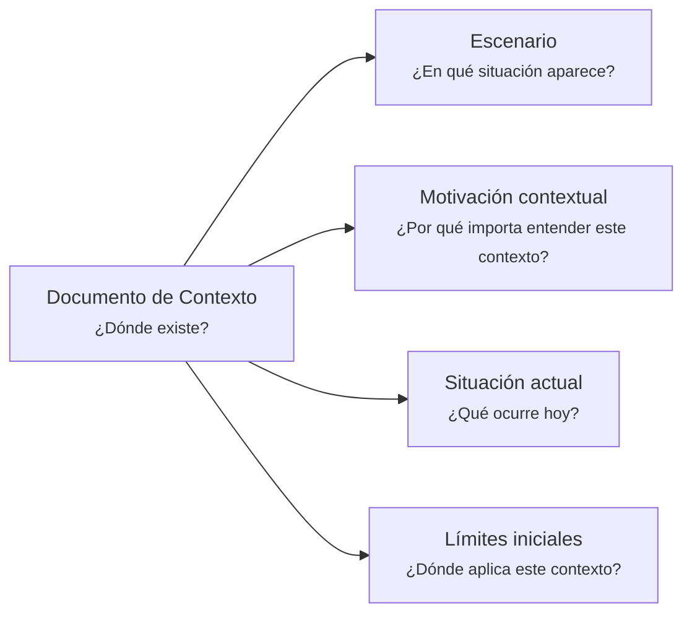

# Documento de Contexto - <tema>

## Organización

## Escenario

<!--
¿En qué situación aparece este concepto, problema, sistema, capacidad, decisión o artifact?
-->

## Motivación contextual

<!--
¿Por qué importa entender este contexto?

Explicar qué se pierde, confunde o dificulta si este contexto no se preserva.
-->

## Situación actual

<!--
¿Qué ocurre hoy?

Describir el estado actual de la situación sin entrar todavía en solución detallada.
-->

## Límites iniciales

<!--
¿Dónde aplica este contexto?

Indicar los límites iniciales del contexto sin convertir esta sección en un Documento de Alcance completo.
-->
