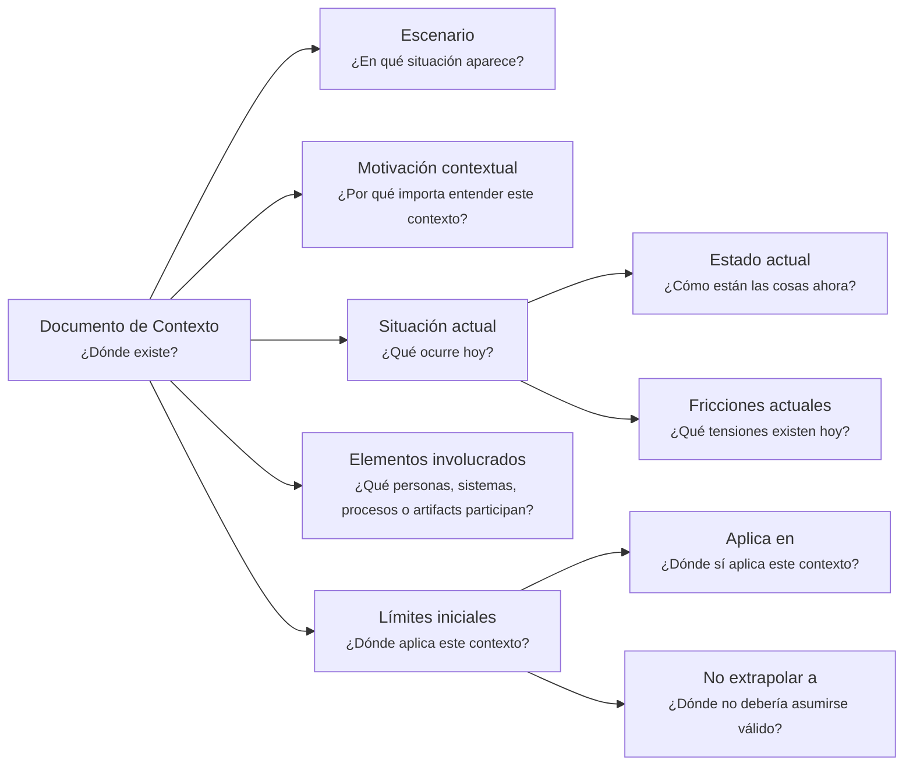

---
artifact:
  kind: document
  type: context
  scope: <concept|process|flow|feature|capability|initiative|product|service|project|organization|domain-context|handoff>
  target: <target-name>
  language: es

metadata:
  status: <draft|candidate|active|deprecated|superseded>
  relates: 
    - relation: <references|referenced-by|complements|depends-on|owned-by|derived-from|updates|supersedes|superseded-by>
      target: <artifact-id>

document:
  question: ¿Dónde existe?

tooling:
  schema:
    version: 0.1.0
  template:
    name: context.document
    version: 0.1.0
---

# Documento de Contexto - <tema>

## Organización

## Escenario

<!--
¿En qué situación aparece este concepto, problema, sistema, capacidad, decisión o artifact?
-->

## Motivación contextual

<!--
¿Por qué importa entender este contexto?

Explicar qué se pierde, confunde o dificulta si este contexto no se preserva.
-->

## Situación actual

<!--
¿Qué ocurre hoy?
- ¿Cómo están las cosas ahora?
- ¿Qué tensiones existen hoy?
-->

### Estado actual

<!--
¿Cómo están las cosas ahora?
-->

### Fricciones actuales

<!--
¿Qué tensiones existen hoy?
-->

## Elementos involucrados

<!--
¿Qué personas, sistemas, procesos o artifacts participan en este contexto?

No describir todavía estructura completa, ownership detallado ni responsabilidades formales.
-->

| Tipo | Elemento | Participación en el contexto |
| --- | --- | --- |
| <actor, sistema, proceso o artifact> | <nombre> | <cómo participa o por qué importa> |

## Límites iniciales

<!--
¿Dónde aplica este contexto?
- ¿Dónde sí aplica este contexto?
- ¿Dónde no debería asumirse válido?

Indicar los límites iniciales del contexto sin convertir esta sección en un Documento de Alcance completo.
-->

### Aplica en

<!--
¿Dónde sí aplica este contexto?
-->

### No extrapolar a

<!--
¿Dónde no debería asumirse válido?
-->
