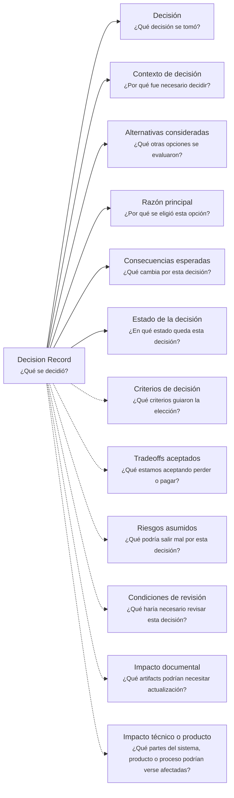

---
artifact:
  kind: document
  type: decision-record
  scope: <concept|domain-context|feature|capability|initiative|product|service|project|architecture|scope|viability|ownership|handoff>
  target: <decision-name>
  language: es

metadata:
  status: <draft|candidate|active|deprecated|superseded>
  relates: 
    - relation: <references|referenced-by|complements|depends-on|owned-by|derived-from|updates|supersedes|superseded-by>
      target: <artifact-id>

document:
  question: ¿Qué se decidió?
  decision:
    status: <proposed|accepted|active|rejected|superseded|archived>

tooling:
  schema:
    version: 0.1.0
  template:
    name: decision-record.document
    version: 0.1.0
---

# Decision Record - <tema>

## Organización

## Decisión

<!--
¿Qué decisión se tomó?

Declarar la decisión de forma directa.
-->

## Contexto de decisión

<!--
¿Por qué fue necesario decidir?

Explicar el contexto mínimo que hizo necesaria esta decisión.
No convertir esta sección en un Documento de Contexto completo.
-->

## Alternativas consideradas

<!--
¿Qué otras opciones se evaluaron?

Registrar alternativas relevantes sin hacer un análisis exhaustivo innecesario.
-->

| Alternativa | Motivo para no elegirla |
| --- | --- |
| <alternativa> | <por qué no fue elegida> |

## Razón principal

<!--
¿Por qué se eligió esta opción?

Explicar el criterio central que justificó la decisión.
-->

## Consecuencias esperadas

<!--
¿Qué cambia por esta decisión?

Describir efectos esperados, ajustes o consecuencias relevantes sin convertir esta sección en planificación completa.
-->

- <consecuencia esperada>

## Estado de la decisión

<!--
¿En qué estado queda esta decisión?

Indicar si la decisión está propuesta, aceptada, activa, reemplazada, descartada o archivada.
-->

## Criterios de decisión

<!--
¿Qué criterios guiaron la elección?

Registrar los criterios usados para comparar alternativas o justificar la decisión.
-->

- <criterio de decisión>

## Tradeoffs aceptados

<!--
¿Qué estamos aceptando perder o pagar?

Explicar costos, limitaciones o renuncias aceptadas al tomar esta decisión.
-->

| Tradeoff | Motivo |
| --- | --- |
| <tradeoff aceptado> | <por qué se acepta> |

## Riesgos asumidos

<!--
¿Qué podría salir mal por esta decisión?

Registrar riesgos conocidos sin convertir esta sección en análisis completo de riesgo.
-->

| Riesgo | Posible consecuencia |
| --- | --- |
| <riesgo asumido> | <qué podría causar> |

## Condiciones de revisión

<!--
¿Qué haría necesario revisar esta decisión?

Indicar cambios, evidencia o condiciones futuras que podrían volver esta decisión inválida o insuficiente.
-->

- <condición de revisión>

## Impacto documental

<!--
¿Qué artifacts podrían necesitar actualización?

Registrar posibles documentos, diagramas, notas, templates o artifacts afectados.
-->

| Artifact afectado | Posible actualización |
| --- | --- |
| <artifact> | <qué podría requerir actualización> |

## Impacto técnico o producto

<!--
¿Qué partes del sistema, producto o proceso podrían verse afectadas?

Explorar posibles efectos sobre implementación, arquitectura, producto, operación o proceso.
-->

| Elemento afectado | Posible impacto |
| --- | --- |
| <elemento> | <cómo podría verse afectado> |