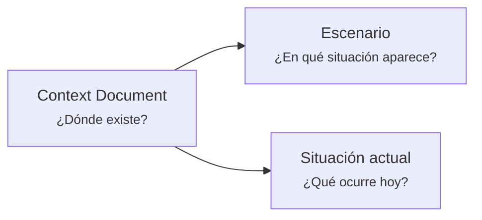

# Document artifacts y ramificación de preguntas

## Propósito

Este documento introduce la familia **Document** de VSlices Docs Standard.

Su objetivo es explicar cómo diseñamos tipos documentales mediante:

* una pregunta principal
* preguntas derivadas
* diagramas de ramificación
* segmentos documentales
* un punto de partida recomendado

No busca imponer plantillas rígidas.

Busca preservar intención documental mientras cada artifact incorpora únicamente la complejidad que necesita.

## Idea central

Un Document artifact explica conocimiento desde una pregunta documental principal.

La pregunta principal define la identidad del tipo documental.

Las preguntas derivadas organizan las distintas aristas que pueden necesitar explicación.

Por ejemplo:

| Tipo                 | Pregunta principal              |
| -------------------- | ------------------------------- |
| Navigation Document  | ¿Cómo exploramos?               |
| Domain Vocabulary    | ¿Cómo hablamos?                 |
| Context Document     | ¿Dónde existe?                  |
| Structure Document   | ¿Cómo se organiza?              |
| Behavior Document    | ¿Qué debe ocurrir?              |
| Consistency Document | ¿Qué debe respetar?             |
| Scope Document       | ¿Hasta dónde llega?             |
| Viability Document   | ¿Es viable?                     |
| Update Document      | ¿Qué se actualizará?            |
| Feedback Document    | ¿Qué recibimos al aplicar algo? |
| Decision Record      | ¿Qué se decidió?                |

## Límites de la familia

Un Document artifact explica.

No reemplaza otras familias:

* Support Note apoya, registra o referencia conocimiento auxiliar.
* Nexus compone artifacts alrededor de un elemento compuesto.
* Continuity Path conecta y orienta continuidad.
* Diagram muestra relaciones o estructuras.
* Mockup representa una experiencia o superficie.

Si una necesidad no consiste principalmente en explicar una pregunta documental, probablemente pertenece a otra familia.

## Diagrama de ramificación

Un Diagrama de ramificación organiza preguntas derivadas desde la pregunta principal de un tipo documental.

Su objetivo es mostrar el espacio de preguntas conocido.

No prescribe el formato final del artifact.

Una rama puede materializarse como:

* heading
* tabla
* lista
* metadata
* diagrama
* comentario HTML
* callout
* ejemplo
* sección narrativa
* placeholder
* referencia
* omisión consciente

> La ramificación organiza preguntas.
> No impone formato documental.

Una rama no debe convertirse automáticamente en heading.

## Formato visual

La representación inicial usa Mermaid `flowchart LR`.

La raíz representa el tipo documental y su pregunta principal.



Cada nodo puede incluir:

* un nombre organizacional
* la pregunta que responde

## Semántica de relaciones

Las líneas indican relevancia o naturaleza de la rama.

| Relación | Significado                                      |
| -------- | ------------------------------------------------ |
| `-->`    | Rama principal                                   |
| `-.->`   | Rama auxiliar, contextual, secundaria u opcional |

Esta semántica es candidata y puede evolucionar con evidencia real.

## Mapa completo y segmentos

Cada tipo documental puede tener un mapa completo de preguntas conocidas.

Ese mapa no representa un documento que deba completarse.

Representa el espacio que hoy sabemos que podría ser relevante.

Cada pregunta o agrupación de preguntas constituye un segmento documental candidato.

Un artifact concreto activa únicamente los segmentos que necesita.

## Punto de partida recomendado

Cada tipo puede definir un conjunto inicial de segmentos recomendados.

Este punto de partida busca:

* alto valor documental
* bajo esfuerzo razonable
* baja ceremonia
* claridad para humanos
* utilidad para Tooling e IA
* bajo riesgo de sobreingeniería

El punto de partida recomendado no es un nivel.

Tampoco es un tipo distinto de template.

Es la selección inicial de segmentos que normalmente entrega suficiente valor.

## Full como mapa de investigación

Full representa el mapa amplio de preguntas conocidas para un tipo documental.

Sirve para:

* explorar aristas posibles
* descubrir responsabilidades documentales
* detectar solapamientos entre tipos
* identificar necesidades futuras de Tooling
* observar preguntas todavía no validadas
* evaluar qué segmentos podrían incorporarse más adelante

Full no representa un artifact final obligatorio.

No debe convertirse automáticamente en estándar.

## Representación progresiva

Tooling podrá generar un único diagrama por tipo documental.

En ese diagrama:

* los segmentos recomendados aparecen sólidos
* las preguntas Full no activadas aparecen translúcidas
* los segmentos adicionales aparecen sólidos cuando el caso los incorpora
* las preguntas compartidas entre el punto recomendado y Full conservan una sola representación

El artifact no evoluciona desde MVP hacia Full.

Evoluciona incorporando los segmentos que necesita.

## Sobre `v0`, `v1` y `v2`

Las etiquetas `v0`, `v1` y `v2` identifican iteraciones de investigación del mapa o de sus propuestas.

No representan:

* niveles documentales
* etapas obligatorias
* versiones por las que deba pasar un artifact
* una progresión universal de profundidad

Pueden representar cambios en:

* preguntas conocidas
* agrupación de segmentos
* punto de partida recomendado
* convenciones visuales
* aprendizaje obtenido mediante validación

Estas etiquetas pertenecen al trabajo de investigación.

No deberían filtrarse como obligación al artifact generado.

## Materialización del artifact

El artifact final materializa solo los segmentos necesarios para su target.

La selección puede depender de:

* `artifact.type`
* `artifact.scope`
* naturaleza del target
* pregunta actual
* riesgo de ambigüedad
* evidencia disponible
* necesidad de continuidad
* costo documental

Una rama puede permanecer translúcida indefinidamente.

Eso no significa que el artifact esté incompleto.

Significa que esa pregunta no necesita respuesta en el caso actual.

## Front-matter y cuerpo

No todo conocimiento pertenece al cuerpo.

Regla práctica:

* Si clasifica el artifact, pertenece a `artifact`.
* Si expresa estado o relaciones generales, pertenece a `metadata`.
* Si declara la pregunta principal, pertenece a `document.question`.
* Si agrega metadata específica del tipo, pertenece a `document.<categoría>`.
* Si explica conocimiento, pertenece al cuerpo.
* Si compone artifacts, pertenece a un Nexus.
* Si conecta continuidad, pertenece a un Continuity Path.
* Si apoya conocimiento auxiliar, puede pertenecer a una Support Note.

No debemos duplicar fuentes de verdad entre front-matter y cuerpo.

## Scope

`artifact.scope` identifica la clase, naturaleza o escala de `artifact.target`.

No define:

* profundidad documental
* nivel de detalle
* cantidad de segmentos activos
* límite temático del contenido

El tipo documental define la pregunta principal.

El scope ayuda a interpretar sobre qué clase de elemento se responde.

## Relación con Support Note

Support Note no es un tipo de Document.

Es una familia separada para conocimiento auxiliar.

Puede registrar:

* `draft`
* `result`
* `validation`
* `testing-spec`
* `risk`
* `external`

Si una Support Note crece hasta responder una pregunta documental principal, puede promoverse a Document.

## Result, Validation, Feedback y Testing Spec

Estos conceptos separan responsabilidades.

| Concepto     | Responsabilidad                                             |
| ------------ | ----------------------------------------------------------- |
| Result       | Registrar lo ocurrido                                       |
| Validation   | Interpretar un resultado frente a un criterio               |
| Feedback     | Preservar una respuesta externa                             |
| Testing Spec | Traducir comportamiento esperado hacia escenarios de prueba |

Cadena posible:

```text
Behavior Document
  -> Support Note type: testing-spec
  -> Support Note type: result
  -> Support Note type: validation
  -> Feedback Document
```

Esta cadena no es obligatoria.

Solo muestra una continuidad posible entre comportamiento, prueba, resultado, interpretación y respuesta externa.

## Reglas para extender un Document

Al incorporar un segmento:

1. Identificar la pregunta principal del tipo.
2. Verificar que la nueva pregunta siga perteneciendo a esa responsabilidad.
3. Revisar si invade otro tipo o familia.
4. Decidir dónde debe materializarse.
5. Evaluar valor contra costo documental.
6. Incorporar solo lo necesario para el caso.
7. Evitar duplicar información ya preservada.
8. Mantener visibles las preguntas no activadas sin convertirlas en deuda.
9. Validar la nueva rama mediante uso real.
10. Actualizar el mapa de investigación solo si el aprendizaje es reutilizable.

## Señales de sobreingeniería

Existe complejidad prematura cuando una propuesta:

* obliga a completar todo el mapa
* transforma cada pregunta en heading
* confunde Full con artifact final
* introduce niveles documentales
* duplica metadata en el cuerpo
* mezcla comportamiento con testing
* mezcla contexto con alcance
* mezcla estructura con implementación
* mezcla feedback con decisión
* convierte soporte auxiliar en Document
* crea segmentos sin una necesidad observada

La complejidad debe aparecer cuando el caso la requiere.

No antes.

## Utilidad para VSlices Tooling e IA

La ramificación permite:

* generar diagramas con segmentos sólidos y translúcidos
* recomendar un punto de partida
* detectar preguntas respondidas o pendientes
* activar segmentos sin cambiar la identidad del template
* cambiar la representación sin perder intención
* preservar la relación entre preguntas y contenido
* distinguir conocimiento principal de soporte auxiliar
* conectar Documents con Nexus y Continuity Paths
* orientar revisiones asistidas por IA

La potencia no está en imponer un formato único.

Está en preservar la intención de cada segmento aunque su representación cambie.

## Regla de cierre

Esta familia no existe para producir más documentación.

Existe para explicar conocimiento mediante preguntas claras.

Todo segmento nuevo debe preguntarse:

* ¿Resuelve una necesidad actual?
* ¿Sigue perteneciendo a la pregunta principal?
* ¿Fue observado en un caso real?
* ¿Existe una forma más pequeña de incorporarlo?
* ¿Preserva continuidad o agrega ceremonia?

Si una selección menor de segmentos preserva suficiente intención, preferimos esa selección.
