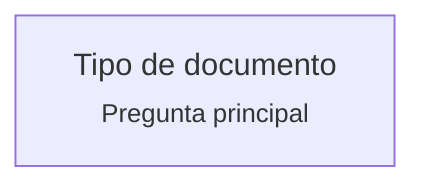
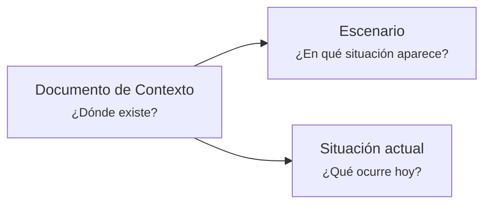

# Artifacts documentales y ramificación de preguntas

## Propósito

Este documento introduce la sección de VSlices Docs Standard dedicada al diseño de artifacts documentales mediante preguntas principales, ramificación de preguntas y propuestas de materialización.

Su objetivo es entregar el contexto necesario para entender, analizar y extender los documentos definidos en esta sección sin perder la intención original del modelo.

Esta sección no busca imponer plantillas rígidas.

Busca definir una forma progresiva de diseñar artifacts documentales que preserven conocimiento útil sin agregar ceremonia innecesaria.

## Idea central

VSlices Docs Standard define estructuras de explicación.

Un artifact es la materialización concreta de una estructura de explicación.

Cada documento existe porque responde una pregunta documental principal.

Por ejemplo:

* Un Documento de Contexto responde: ¿Dónde existe?
* Un Documento de Estructura responde: ¿Cómo se organiza?
* Un Documento de Comportamiento responde: ¿Qué debe ocurrir?
* Un Documento de Consistencia responde: ¿Qué debe respetar?
* Un Documento de Alcance responde: ¿Hasta dónde llega?
* Un Documento de Navegación responde: ¿Cómo exploramos?
* Un Documento de Feedback responde: ¿Qué recibimos al aplicar algo?
* Un Documento de Actualización responde: ¿Qué se actualizará?
* Un Decision Record responde: ¿Qué se decidió?
* Una Nota de Soporte responde: ¿Qué se necesita?

La pregunta principal define la identidad del documento.

Las preguntas derivadas ayudan a organizarlo.

## Modelo base

VSlices Docs Standard distingue entre:

* **Concepto**: unidad de significado que puede ser explicada, conectada, mostrada, representada, organizada o trazada.
* **Estructura de explicación**: forma propuesta para explicar, conectar, mostrar, representar u ordenar conocimiento.
* **Artifact**: materialización concreta de una estructura de explicación.
* **Documento**: estructura textual que explica conocimiento desde una pregunta documental principal.
* **Continuity Path**: estructura que conecta un concepto a través de perspectivas, artifacts o superficies.
* **Diagrama**: estructura visual que muestra relaciones, estructuras, flujos o caminos.
* **Mockup**: estructura visual que representa una experiencia, vista o superficie de producto.
* **Organización documental**: estructura de orden según pertenencia, secuencia, estado, etapa, colección o narrativa mayor.

Regla base:

> Los documentos explican.
> Los paths conectan.
> Los diagramas muestran.
> Los mockups representan.
> La organización documental ordena.

## Diagrama de ramificación

El Diagrama de ramificación organiza preguntas derivadas desde una pregunta documental principal.

Su objetivo es orientar cómo puede organizarse un artifact.

No prescribe obligatoriamente su formato.

Una rama puede materializarse como:

* heading
* tabla
* lista
* metadata
* diagrama
* comentario HTML
* callout
* ejemplo
* sección narrativa
* placeholder
* referencia
* cualquier otra forma adecuada

Regla central:

> La ramificación organiza conocimiento.
> No impone formato documental.

Por lo tanto, no se debe asumir que cada rama del diagrama debe convertirse automáticamente en un heading.

## Formato visual recomendado

Usamos Mermaid `flowchart LR`.

La raíz representa el tipo de documento y su pregunta principal.

Formato base:



Cada nodo puede contener:

* nombre organizacional
* pregunta que responde

Ejemplo:



## Semántica inicial de líneas

La línea indica relevancia o naturaleza de la relación.

* `-->`: rama principal de contenido.
* `-.->`: rama de apoyo, gobernanza, mantenimiento, contexto auxiliar o exploración secundaria.

Esta semántica puede evolucionar si el uso real lo justifica.

## Esfuerzo y costo

La forma del nodo puede indicar esfuerzo o costo de incorporación.

Esta convención todavía es candidata.

La regla conceptual es:

> La línea expresa relevancia o naturaleza.
> La forma expresa esfuerzo o costo de incorporación.

Una rama puede ser importante pero costosa.

Una rama puede ser simple pero secundaria.

Una rama puede ser útil para Full pero no razonable para MVP.

Importancia no significa incorporación inmediata.

## MVP, Full y propuestas de materialización

Para cada tipo documental se pueden proponer materializaciones MVP y Full.

### MVP

El MVP representa una materialización seria, mínima y publicable.

Debe buscar:

* alto valor documental
* bajo esfuerzo razonable
* baja ceremonia
* claridad para humanos
* utilidad para IA y tooling
* bajo riesgo de sobreingeniería

El MVP debe evitar absorber todas las preguntas posibles.

Debe seleccionar solo las preguntas que entregan mayor valor para el caso actual.

### Full

El Full explora el espacio amplio del artifact.

Sirve para:

* descubrir aristas posibles
* entender profundidad documental potencial
* detectar necesidades futuras de VSlices Tooling
* explorar soporte para IA
* analizar cómo podría evolucionar el artifact
* encontrar preguntas candidatas para futuras materializaciones

Full no es necesariamente publicable.

Full no debe convertirse automáticamente en estándar.

## Sobre v0, v1 y v2

Las etiquetas `v0`, `v1` y `v2` no deben entenderse como versionado obligatorio del documento.

No significan que todos los artifacts deban pasar por las mismas versiones.

No significan que la ramificación documental sea fija.

Estas etiquetas funcionan como propuestas de materialización pensadas en balance valor-tiempo.

La ramificación puede cambiar según la necesidad documental.

La selección de preguntas puede cambiar según:

* tipo de artifact
* scope definido en metadata
* uso real
* costo documental
* riesgo de ambigüedad
* necesidad de continuidad
* madurez del concepto
* evidencia disponible

Por lo tanto:

* `v0` puede representar una materialización mínima útil.
* `v1` puede representar una mejora de precisión o valor.
* `v2` puede representar una materialización más completa cuando el uso lo justifica.
* Ninguna etiqueta es una obligación metodológica.
* Ninguna propuesta reemplaza el juicio de diseño documental.

## Relación entre ramificación y artifact final

La ramificación muestra preguntas posibles.

El artifact final materializa solo las preguntas necesarias.

Una pregunta puede materializarse como:

* sección visible
* tabla
* columna
* comentario guía
* metadata
* placeholder
* ejemplo
* referencia
* diagrama
* omisión consciente

Una pregunta también puede quedar solo en Full, sin entrar al MVP.

Esto es válido si su costo es alto o si todavía no existe evidencia suficiente para hacerla parte del artifact recomendado.

## Regla sobre metadata y cuerpo del documento

No todo debe vivir en el cuerpo del documento.

Algunas relaciones, estados o clasificaciones pertenecen mejor a front matter o metadata.

Regla práctica:

* Si algo clasifica el artifact, probablemente pertenece a metadata.
* Si algo explica conocimiento, probablemente pertenece al cuerpo.
* Si algo conecta artifacts, probablemente pertenece a metadata o referencias.
* Si algo orienta una lectura humana, puede vivir en un Documento de Navegación.
* Si algo define un recorrido conceptual, puede vivir en un Continuity Path.

Evitar duplicar fuentes de verdad entre metadata y cuerpo.

## Scope

El `scope` en metadata no cambia la identidad del tipo documental.

Cambia la escala desde la cual se interpreta el contenido.

Por ejemplo, un Documento de Contexto siempre responde:

> ¿Dónde existe?

Pero el contenido cambia si el scope es:

* stage
* iteration
* service
* product
* bounded-context
* project
* organization

Regla:

> El tipo documental define la pregunta principal.
> El scope define la escala de interpretación.

## Documentos trabajados en esta sección

Esta sección cubre los documentos principales de VSlices Docs Standard:

* Documento de Navegación
* Vocabulario de Dominio
* Documento de Contexto
* Documento de Estructura
* Documento de Comportamiento
* Documento de Consistencia
* Documento de Alcance
* Documento de Actualización
* Documento de Feedback
* Decision Record
* Nota de Soporte

Cada documento debe entenderse desde:

* su pregunta principal
* sus preguntas derivadas
* su posible ramificación
* su materialización MVP
* su exploración Full cuando aporte valor
* su relación con otros artifacts
* sus límites para no invadir responsabilidades ajenas

## Nota de Soporte y kind

Nota de Soporte es un documento liviano.

Su propósito es capturar conocimiento auxiliar sin forzar la creación prematura de documentos más estables o específicos.

Kinds iniciales:

* `draft`: ¿Qué estamos esbozando?
* `result`: ¿Qué obtuvimos?
* `validation`: ¿Qué significa lo obtenido frente a un criterio?
* `testing-spec`: ¿Cómo probaremos este comportamiento?

En Nota de Soporte, el `kind` cambia la intención interna del artifact, pero no convierte cada kind en un documento formal separado.

Regla:

> Support Note evita sobreingeniería documental temprana.

## Relación entre Result, Validation, Feedback y Testing Spec

Estos artifacts separan responsabilidades:

* `result` registra lo ocurrido.
* `validation` interpreta lo ocurrido frente a un criterio.
* `feedback` registra una respuesta externa recibida.
* `testing-spec` traduce criterios de comportamiento hacia escenarios de prueba, normalmente BDD.

Cadena posible:

```text
Behavior Document
  -> Support Note kind: testing-spec
  -> Support Note kind: result
  -> Support Note kind: validation
  -> Feedback Document
```

Esta cadena no es obligatoria.

Solo muestra una posible continuidad entre comportamiento, prueba, resultado, interpretación y respuesta externa.

## Reglas para extender documentos

Al extender un documento:

1. Identificar la pregunta principal.
2. Verificar que la nueva rama siga respondiendo esa pregunta.
3. Revisar si la rama invade otro tipo documental.
4. Decidir si la pregunta pertenece al cuerpo, metadata, navegación, path o soporte.
5. Evaluar valor contra costo documental.
6. Separar lo útil ahora de lo útil después.
7. Mantener MVP pequeño.
8. Usar Full como laboratorio, no como estándar automático.
9. Evitar duplicar relaciones que ya viven en front matter.
10. Evitar convertir dudas futuras en estructura obligatoria.

## Señales de sobreingeniería

Una propuesta probablemente está agregando complejidad prematura si:

* exige completar información que rara vez se tiene
* transforma toda pregunta en heading obligatorio
* duplica metadata en el cuerpo
* mezcla comportamiento con testing
* mezcla contexto con alcance
* mezcla estructura con implementación
* mezcla feedback con decisión
* mezcla update con patch automático
* convierte una nota liviana en documento formal
* obliga a usar todos los artifacts para casos simples

La complejidad debe aparecer cuando el dominio o el uso real la requieran.

No antes.

## Utilidad para VSlices Tooling e IA

La ramificación de preguntas abre una posibilidad importante para VSlices Tooling e integraciones con IA.

Permite:

* sugerir upgrades de materialización
* cambiar formato sin perder intención
* centralizar contenido con formatos custom
* detectar preguntas no respondidas
* proponer migraciones entre templates
* generar Navigation Documents
* conectar artifacts con Continuity Paths
* traducir Behavior Documents hacia testing-spec
* distinguir contenido principal de contenido auxiliar
* ayudar a IA a navegar conocimiento sin inferirlo todo desde texto libre

La potencia no está en imponer un formato único.

La potencia está en preservar la intención de cada segmento, incluso cuando la materialización cambia.

## Regla de cierre

Esta sección no define documentos para producir más documentación.

Define artifacts para preservar continuidad.

El objetivo es reducir pérdida de intención entre:

* descubrimiento del dominio
* documentación
* arquitectura
* implementación
* validación
* evolución

Toda extensión debe preguntarse:

* ¿Esto resuelve un problema actual?
* ¿Esto fue observado o anticipado con evidencia suficiente?
* ¿Estamos agregando complejidad demasiado pronto?
* ¿Existe una versión más pequeña que podamos validar primero?
* ¿Esta rama preserva continuidad o solo agrega ceremonia?

Si una solución más pequeña preserva suficiente intención, preferimos la solución más pequeña.
