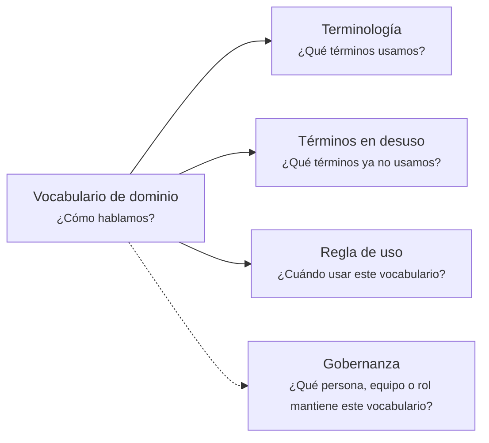

# Vocabulario de dominio: <tema>

## Organización

## Terminología

<!-- 
¿Qué términos usamos? 
-->

- <término 1>
- <término 2>
- <término 3>

## Términos en desuso

<!-- 
¿Qué términos ya no usamos?
-->

- <término 1>
- <término 2>

## Regla de uso

<!-- 
¿Cuándo usar este vocabulario? 

Explicar cuándo este vocabulario debe usarse como referencia común dentro del dominio, contexto, proyecto o línea de trabajo.
-->

## Gobernanza

<!-- 
¿Qué persona, equipo o rol mantiene este vocabulario?
-->