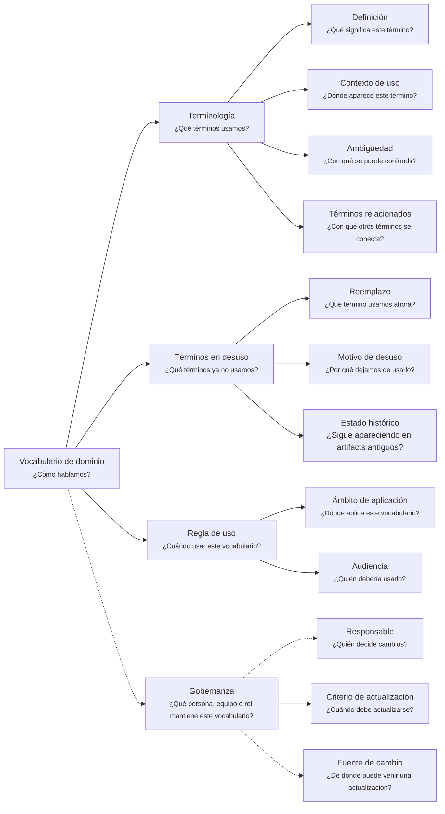

---
artifact:
  kind: document
  type: domain-vocabulary
  scope: <domain-context|business-scenario|project|product|service|organization>
  target: <vocabulary-target-name>
  language: es

metadata:
  status: <draft|candidate|active|deprecated|superseded>
  relates: 
    - relation: <references|referenced-by|complements|depends-on|owned-by|derived-from|updates|supersedes|superseded-by>
      target: <artifact-id>

document:
  question: ¿Cómo hablamos?

tooling:
  schema:
    version: 0.1.0
  template:
    name: domain-vocabulary.document
    version: 0.1.0
---

# Vocabulario de dominio - <tema>

## Organización

## Terminología

<!-- 
¿Qué términos usamos? 
- ¿Qué significa este término?
- ¿Dónde aparece este término?
- ¿Con qué se puede confundir?
- ¿Con qué otros términos se conecta?
-->

| Término   | Definición                   | Contexto de uso                 | Ambigüedad                   | Términos relacionados |
| --------- | ---------------------------- | ------------------------------- | ---------------------------- | --------------------- |
| <término> | <qué significa este término> | <dónde aparece o cuándo aplica> | <con qué podría confundirse> | <términos conectados> |

## Términos en desuso

<!-- 
¿Qué términos ya no usamos?
- ¿Qué término usamos ahora?
- ¿Por qué dejamos de usarlo?
- ¿Sigue apareciendo en artifacts antiguos?
-->

| Término en desuso  | Reemplazo        | Motivo de desuso            | Estado histórico                     |
| ------------------ | ---------------- | --------------------------- | --- |
| <término anterior> | <término actual> | <por qué dejamos de usarlo> | <dónde sigue apareciendo, si aplica> |

## Regla de uso

<!-- 
¿Cuándo usar este vocabulario? 
-->

### Ámbito de aplicación

<!-- 
¿Dónde aplica este vocabulario? 

Explicar en qué dominio, bounded context, proyecto, producto, equipo o línea de trabajo aplica este vocabulario.
-->

### Audiencia

<!-- 
¿Quién debería usarlo? 

Indicar qué personas, roles o equipos deberían usar este vocabulario como referencia.
-->

## Gobernanza

<!-- 
¿Qué persona, equipo o rol mantiene este vocabulario? 
-->

### Responsable

<!-- 
¿Quién decide cambios? 

Indicar quién puede proponer, revisar, aprobar o mantener cambios sobre este vocabulario.
-->

### Criterio de actualización

<!-- 
¿Cuándo debe actualizarse? 

Explicar cuándo este vocabulario debería revisarse o actualizarse.
-->

### Fuente de cambio

<!--
¿De dónde puede venir una actualización?

Indicar si los cambios pueden venir de conversaciones de dominio, feedback, decisiones, implementación, investigación, uso real u otros artifacts.
-->
