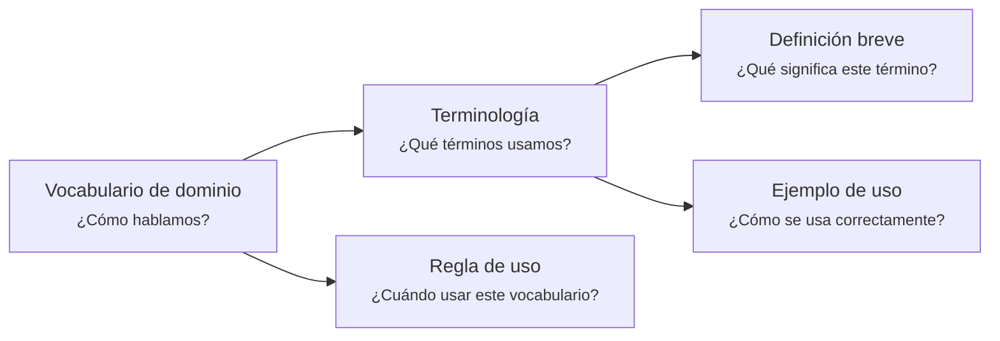

---
artifact:
  kind: document
  type: domain-vocabulary
  scope: <domain-context|business-scenario|project|product|service|organization>
  target: <vocabulary-target-name>
  language: es

metadata:
  status: <draft|candidate|active|deprecated|superseded>
  relates: 
    - relation: <references|referenced-by|complements|depends-on|owned-by|derived-from|updates|supersedes|superseded-by>
      target: <artifact-id>

document:
  question: ¿Cómo hablamos?

tooling:
  schema:
    version: 0.1.0
  template:
    name: domain-vocabulary.document
    version: 0.1.0
---

# Vocabulario de dominio - <tema>

## Organización

## Terminología

<!--
¿Qué términos usamos?
- ¿Qué significa este término?
- ¿Cómo se usa correctamente?
-->

| Término   | Definición breve                                                 | Ejemplo de uso              |
| --------- | ---------------------------------------------------------------- | --------------------------- |
| <término> | <definición breve del término dentro de este dominio o contexto> | <cómo se usa correctamente> |

## Regla de uso

<!--
¿Cuándo usar este vocabulario?

Explicar cuándo este vocabulario debe usarse como referencia común dentro del dominio, contexto, proyecto o línea de trabajo.
-->
