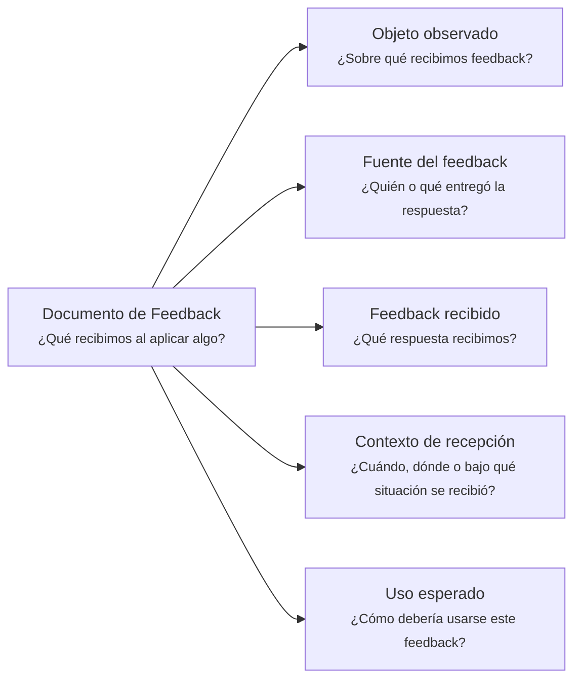

---
artifact:
  kind: document
  type: feedback
  scope: <artifact|document|behavior|feature|product|service|initiative|experiment|decision|flow>
  target: <target-name>
  language: <es>

metadata:
  status: <draft|candidate|active|deprecated|superseded>
  relates: 
    - relation: <references/referenced-by|complements|depends-on|owned-by|derived-from|updates|supersedes/superseded-by>
      target: <artifact-id>

document:
  question: ¿Qué recibimos al aplicar algo?
  feedback:
    source: <user|stakeholder|team|client|system|reviewer|ai|community|operation|usage>

tooling:
  schema:
    version: 0.1.0
  template:
    name: feedback.document
    version: 0.1.0
---

# Documento de Feedback - <tema>

## Organización

## Objeto observado

<!--
¿Sobre qué recibimos feedback?

Indicar el artifact, documento, comportamiento, producto, feature, experimento, decisión o elemento sobre el que se recibió feedback.
-->

## Fuente del feedback

<!--
¿Quién o qué entregó la respuesta?

Indicar usuario, stakeholder, equipo, cliente, sistema, reviewer, IA, comunidad u otra fuente externa.
-->

## Feedback recibido

<!--
¿Qué respuesta recibimos?

Registrar el feedback recibido sin convertirlo todavía en decisión, actualización o validación.
-->

## Contexto de recepción

<!--
¿Cuándo, dónde o bajo qué situación se recibió?

Preservar las condiciones mínimas necesarias para entender el feedback.
-->

## Uso esperado

<!--
¿Cómo debería usarse este feedback?

Indicar si este feedback debería alimentar una decisión, actualización documental, validación, investigación o iteración futura.
-->