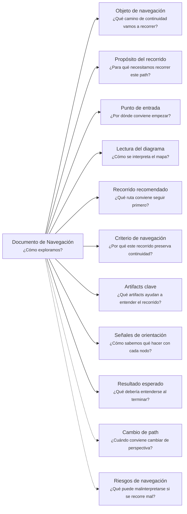

# Documento de Navegación - Continuity Paths - <tema>

## Organización

## Objeto de navegación

<!--
¿Qué camino de continuidad vamos a recorrer?

Indicar el Continuity Path, diagrama, colección de paths o conjunto de artifacts que este documento ayuda a explorar.
-->

## Propósito del recorrido

<!--
¿Para qué necesitamos recorrer este path?

Explicar qué continuidad se busca preservar al recorrer este camino.
No explicar todavía el contenido detallado de los artifacts conectados.
-->

## Punto de entrada

<!--
¿Por dónde conviene empezar?

Indicar el concepto raíz, pregunta inicial, artifact principal o perspectiva desde donde conviene comenzar la lectura.
-->

## Lectura del diagrama

<!--
¿Cómo se interpreta el mapa?

Explicar brevemente cómo leer la semántica visual del Diagrama de Camino de Continuidad.
-->

| Forma       | Significado                                           | Qué hacer al encontrarla                                                      |
| ----------- | ----------------------------------------------------- | ----------------------------------------------------------------------------- |
| `[[texto]]` | Concepto documentado                                  | Revisar los artifacts asociados si son relevantes para el objetivo de lectura |
| `[texto]`   | Pregunta orientadora u orientación definida           | Usarla para decidir qué ruta seguir                                           |
| `>texto]`   | Concepto identificado sin necesidad documental actual | Mantenerlo visible sin documentarlo todavía                                   |
| `{{texto}}` | Concepto identificado con necesidad documental        | Evaluar si debe documentarse ahora según alcance, riesgo y prioridad          |

## Camino de continuidad

<!-- 
Adjunta el diagrama de camino continuidad asociado acá
-->

## Recorrido recomendado

<!--
¿Qué ruta conviene seguir primero?

Describir el recorrido principal recomendado para entender el path sin duplicar el contenido de los artifacts conectados.
-->

| Orden   | Nodo, artifact o concepto   | Por qué revisarlo      |
| ------- | --------------------------- | ---------------------- |
| <orden> | <nodo, artifact o concepto> | <motivo de navegación> |

## Criterio de navegación

<!--
¿Por qué este recorrido preserva continuidad?

Explicar la lógica del recorrido recomendado y qué pérdida de intención ayuda a evitar.
-->

## Artifacts clave

<!--
¿Qué artifacts ayudan a entender el recorrido?

Identificar documentos, diagramas, mockups, notas, decisiones u otros paths que conviene revisar.
No repetir su contenido.
-->

| Artifact clave | Tipo                                                                     | Por qué importa                    |
| -------------- | ------------------------------------------------------------------------ | ---------------------------------- |
| <artifact>     | <documento, diagrama, mockup, decision record, support note, path, etc.> | <por qué ayuda a recorrer el path> |

## Señales de orientación

<!--
¿Cómo sabemos qué hacer con cada nodo?

Registrar señales que ayudan a decidir si conviene seguir, detenerse, documentar, ignorar temporalmente o cambiar de path.
-->

| Señal                                | Acción sugerida                                                            |
| ------------------------------------ | -------------------------------------------------------------------------- |
| Un concepto aparece como `[[texto]]` | Revisar documentación existente solo si aporta al objetivo actual          |
| Un concepto aparece como `{{texto}}` | Evaluar necesidad documental antes de avanzar                              |
| Un concepto aparece como `>texto]`   | No documentar todavía salvo que aumente su impacto o aparezca en más paths |
| Una ruta aparece como `-->`          | Tratarla como recorrido principal o relación directa                       |
| Una ruta aparece como `-.->`         | Tratarla como apoyo, contexto o recorrido secundario                       |

## Cambio de path

<!--
¿Cuándo conviene cambiar de perspectiva?

Indicar señales que sugieren que otro Continuity Path podría preservar mejor la continuidad buscada.
-->

| Señal                                                                              | Path sugerido      |
| ---------------------------------------------------------------------------------- | ------------------ |
| El problema principal es entender dolor, necesidad u oportunidad                   | Business Scenario  |
| El problema principal es entender lenguaje, reglas o límites conceptuales          | Domain Context     |
| El problema principal es entender arquitectura, implementación o evolución técnica | Software Project   |
| El problema principal es entender experiencia visible o valor percibido            | Client Product     |
| El problema principal es entender contratos, consumidores o garantías de servicio  | Consumable Service |
| El problema principal es entender responsabilidad, mantenimiento o validación      | Ownership          |
| El problema principal es entender efectos sobre otros elementos                    | Impact             |
| El problema principal es entender origen y materialización del concepto            | Traceability       |

## Resultado esperado

<!--
¿Qué debería entenderse al terminar?

Indicar qué claridad, orientación o comprensión debería obtenerse después de recorrer el path.
-->

Al terminar este recorrido debería entenderse:

* qué concepto se está siguiendo
* desde qué perspectiva se está observando
* qué continuidad se intenta preservar
* qué artifacts ayudan a recorrerlo
* qué conceptos ya están documentados
* qué conceptos requieren documentación
* qué conceptos fueron identificados pero no requieren documentación todavía
* cuándo conviene detenerse o cambiar de path

## Riesgos de navegación

<!--
¿Qué puede malinterpretarse si se recorre mal?

Registrar riesgos de usar el path como documento detallado, leer nodos como obligaciones, documentar demasiado pronto o asumir trazabilidad formal innecesaria.
-->

| Riesgo de navegación                                   | Consecuencia                                                    |
| ------------------------------------------------------ | --------------------------------------------------------------- |
| Tratar el diagrama como documento explicativo completo | Se duplica contenido que debería vivir en artifacts específicos |
| Interpretar `{{texto}}` como obligación inmediata      | Se genera documentación prematura                               |
| Interpretar `>texto]` como deuda documental            | Se burocratizan conceptos que solo necesitaban visibilidad      |
| Recorrer todas las rutas como obligatorias             | Se pierde foco y aumenta la carga documental                    |
| Confundir ruta auxiliar con ruta principal             | Se prioriza contexto secundario sobre continuidad central       |
| Usar el path como trazabilidad formal completa         | Se agrega complejidad antes de que exista necesidad real        |
