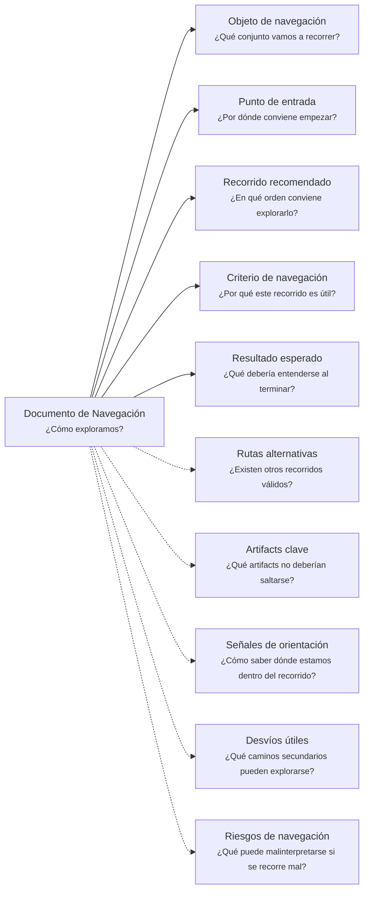

# Documento de Navegación - <tema>

## Organización

## Objeto de navegación

<!--
¿Qué conjunto vamos a recorrer?

Indicar si este documento orienta la navegación de una organización documental, camino de continuidad, colección de artifacts, iteración, proyecto, concepto o caso de investigación.
-->

## Punto de entrada

<!--
¿Por dónde conviene empezar?

Indicar el primer artifact, documento, path, carpeta, sección o concepto recomendado para iniciar la exploración.
-->

## Recorrido recomendado

<!--
¿En qué orden conviene explorarlo?

Describir la secuencia recomendada de navegación sin duplicar el contenido de los artifacts conectados.
-->

| Orden | Artifact o elemento | Por qué revisarlo |
| --- | --- | --- |
| <orden> | <artifact, documento, path o elemento> | <motivo de navegación> |

## Criterio de navegación

<!--
¿Por qué este recorrido es útil?

Explicar la lógica del recorrido recomendado.
-->

## Resultado esperado

<!--
¿Qué debería entenderse al terminar?

Indicar qué claridad, orientación o comprensión debería obtenerse después de seguir este recorrido.
-->

## Rutas alternativas

<!--
¿Existen otros recorridos válidos?

Registrar recorridos alternativos cuando distintas personas, roles o necesidades puedan explorar el conjunto de otra forma.
-->

| Ruta alternativa | Cuándo usarla |
| --- | --- |
| <ruta alternativa> | <situación donde conviene usarla> |

## Artifacts clave

<!--
¿Qué artifacts no deberían saltarse?

Identificar artifacts esenciales para entender correctamente el conjunto navegado.
-->

| Artifact clave | Por qué es importante |
| --- | --- |
| <artifact> | <por qué no debería saltarse> |

## Señales de orientación

<!--
¿Cómo saber dónde estamos dentro del recorrido?

Indicar señales, estados, carpetas, nombres, metadata, paths o marcas que ayuden a ubicarse durante la navegación.
-->

- <señal de orientación>

## Desvíos útiles

<!--
¿Qué caminos secundarios pueden explorarse?

Registrar caminos secundarios, continuity paths, artifacts o colecciones relacionadas que pueden explorarse si aportan contexto adicional.
-->

| Desvío útil | Cuándo explorarlo |
| --- | --- |
| <camino secundario, path o artifact> | <cuándo aporta valor> |

## Riesgos de navegación

<!--
¿Qué puede malinterpretarse si se recorre mal?

Registrar riesgos de leer artifacts fuera de orden, saltarse contexto, confundir versiones o asumir relaciones que no existen.
-->

| Riesgo de navegación | Consecuencia |
| --- | --- |
| <riesgo> | <qué podría malinterpretarse> |