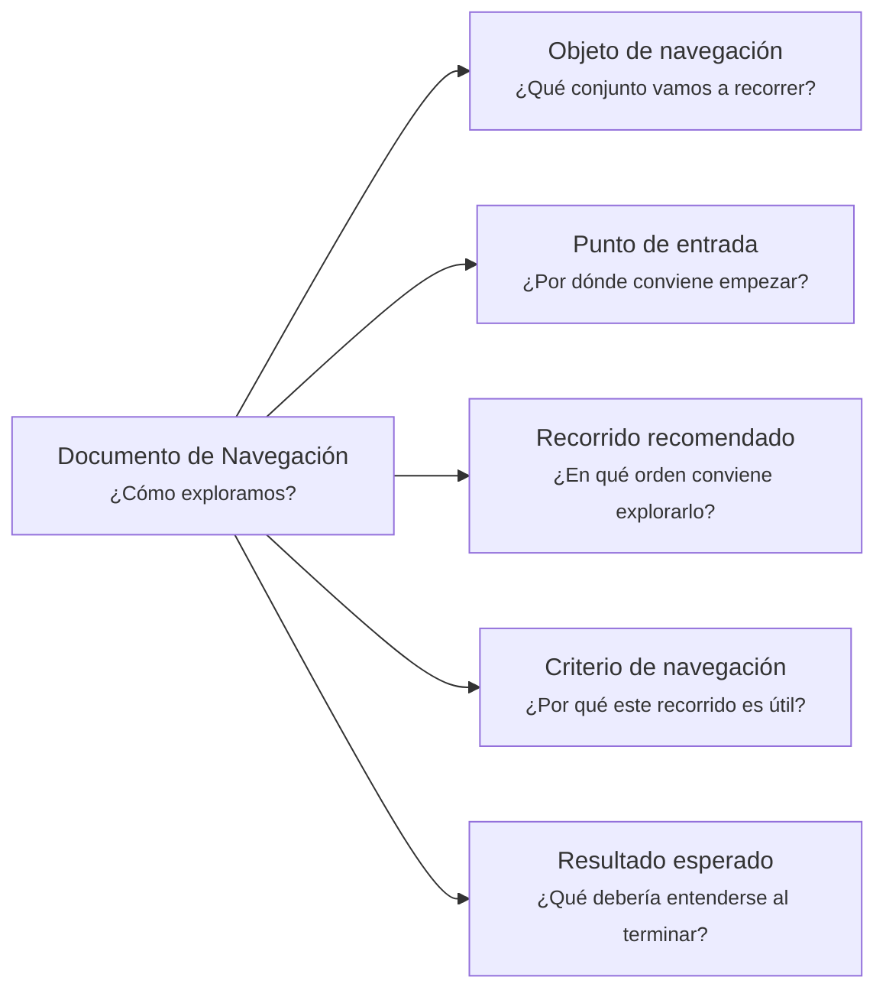

---
artifact:
  kind: document
  type: navigation
  scope: <artifact-set|collection|path|project|iteration|handoff|organization|domain-context|research-case>
  target: <navigation-target-name>
  language: <es|en>

metadata:
  status: <draft|candidate|active|deprecated|superseded>
  relates: 
    - relation: <references/referenced-by|complements|depends-on|owned-by|derived-from|updates|supersedes/superseded-by>
      target: <artifact-id>

document:
  question: ¿Cómo exploramos?
  mode: <reading-path|index|map|handoff-route|artifact-set|orientation>

tooling:
  schema:
    version: 0.1.0
  template:
    name: navigation.document
    version: 0.1.0
---

# Documento de Navegación - <tema>

## Organización

## Objeto de navegación

<!--
¿Qué conjunto vamos a recorrer?

Indicar si este documento orienta la navegación de una organización documental, camino de continuidad, colección de artifacts, iteración, proyecto, concepto o caso de investigación.
-->

## Punto de entrada

<!--
¿Por dónde conviene empezar?

Indicar el primer artifact, documento, path, carpeta, sección o concepto recomendado para iniciar la exploración.
-->

## Recorrido recomendado

<!--
¿En qué orden conviene explorarlo?

Describir la secuencia recomendada de navegación sin duplicar el contenido de los artifacts conectados.
-->

| Orden | Artifact o elemento | Por qué revisarlo |
| --- | --- | --- |
| <orden> | <artifact, documento, path o elemento> | <motivo de navegación> |

## Criterio de navegación

<!--
¿Por qué este recorrido es útil?

Explicar la lógica del recorrido recomendado.
-->

## Resultado esperado

<!--
¿Qué debería entenderse al terminar?

Indicar qué claridad, orientación o comprensión debería obtenerse después de seguir este recorrido.
-->