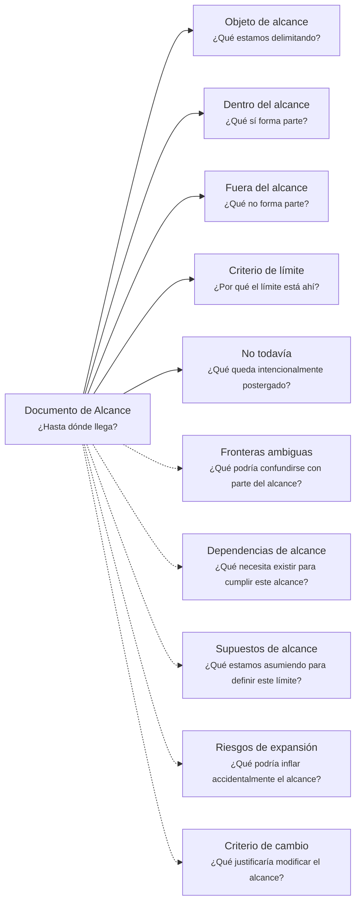

---
artifact:
  kind: document
  type: scope
  scope: <concept|feature|capability|initiative|product|service|project|iteration|handoff|change|artifact>
  target: <target-name>
  language: es

metadata:
  status: <draft|candidate|active|deprecated|superseded>
  relates: 
    - relation: <references|referenced-by|complements|depends-on|owned-by|derived-from|updates|supersedes|superseded-by>
      target: <artifact-id>

document:
  question: ¿Hasta dónde llega?

tooling:
  schema:
    version: 0.1.0
  template:
    name: scope.document
    version: 0.1.0
---

# Documento de Alcance - <tema>

## Organización

## Objeto de alcance

<!--
¿Qué estamos delimitando?

Explicar qué concepto, iniciativa, feature, cambio, iteración, producto, servicio o artifact será delimitado.
-->

## Dentro del alcance

<!--
¿Qué sí forma parte?

Listar elementos, comportamientos, responsabilidades, artifacts o resultados que forman parte del alcance actual.
-->

- <elemento dentro del alcance>

## Fuera del alcance

<!--
¿Qué no forma parte?

Listar elementos, comportamientos, responsabilidades, artifacts o resultados que no forman parte de este alcance.
-->

- <elemento fuera del alcance>

## Criterio de límite

<!--
¿Por qué el límite está ahí?

Explicar la razón usada para decidir qué entra y qué queda fuera.
-->

## No todavía

<!--
¿Qué queda intencionalmente postergado?

Registrar elementos que podrían ser relevantes en el futuro, pero que no forman parte del alcance actual.
-->

- <elemento postergado>

## Fronteras ambiguas

<!--
¿Qué podría confundirse con parte del alcance?

Registrar zonas, elementos o responsabilidades que podrían parecer dentro del alcance, pero todavía requieren aclaración.
-->

| Frontera ambigua | Por qué genera duda |
| --- | --- |
| <elemento ambiguo> | <motivo de ambigüedad> |

## Dependencias de alcance

<!--
¿Qué necesita existir para cumplir este alcance?

Indicar condiciones, artifacts, decisiones, capacidades o elementos necesarios para cumplir el alcance definido.
-->

| Dependencia | Por qué importa |
| --- | --- |
| <dependencia> | <por qué es necesaria> |

## Supuestos de alcance

<!--
¿Qué estamos asumiendo para definir este límite?

Registrar premisas que sostienen la delimitación actual.
-->

| Supuesto | Riesgo si cambia |
| --- | --- |
| <supuesto> | <qué se vería afectado si deja de ser cierto> |

## Riesgos de expansión

<!--
¿Qué podría inflar accidentalmente el alcance?

Identificar riesgos de scope creep, mezcla de responsabilidades o incorporación prematura de trabajo futuro.
-->

| Riesgo de expansión | Consecuencia |
| --- | --- |
| <riesgo> | <qué podría causar> |

## Criterio de cambio

<!--
¿Qué justificaría modificar el alcance?

Indicar qué condición, evidencia, decisión o cambio contextual justificaría revisar el alcance.
-->

- <criterio de cambio>
