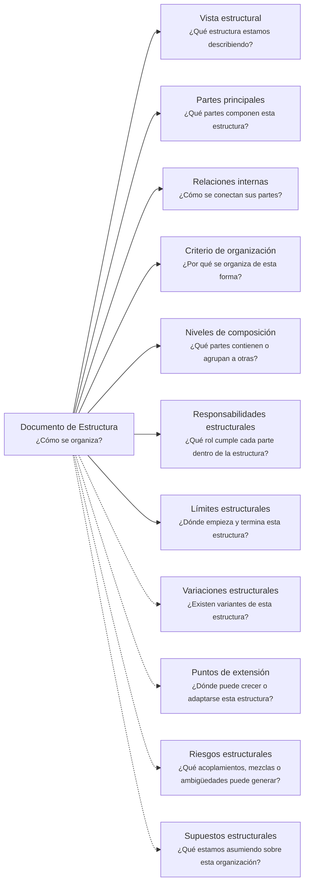

# Documento de Estructura - <tema>

## Organización

## Vista estructural

<!--
¿Qué estructura estamos describiendo?

Explicar qué estructura será observada en este artifact según el scope definido en metadata.
-->

## Partes principales

<!--
¿Qué partes componen esta estructura?

Listar las partes principales sin entrar todavía en comportamiento detallado.
-->

| Parte | Descripción |
| --- | --- |
| <parte> | <qué representa dentro de la estructura> |

## Relaciones internas

<!--
¿Cómo se conectan sus partes?

Describir relaciones internas entre partes de la estructura.
No listar documentos relacionados; eso pertenece a metadata/front matter.
-->

| Parte origen | Relación | Parte destino |
| --- | --- | --- |
| <parte> | <cómo se conecta> | <parte> |

## Criterio de organización

<!--
¿Por qué se organiza de esta forma?

Explicar el criterio usado para separar, agrupar o conectar las partes principales.
-->

## Niveles de composición

<!--
¿Qué partes contienen o agrupan a otras?

Describir niveles, agrupaciones o composición interna cuando la estructura tenga más de una capa.
-->

| Nivel | Parte | Contiene o agrupa |
| --- | --- | --- |
| <nivel> | <parte> | <partes contenidas o agrupadas> |

## Responsabilidades estructurales

<!--
¿Qué rol cumple cada parte dentro de la estructura?

Explicar la responsabilidad estructural de cada parte sin convertir esta sección en comportamiento detallado.
-->

| Parte | Responsabilidad estructural |
| --- | --- |
| <parte> | <rol que cumple dentro de la estructura> |

## Límites estructurales

<!--
¿Dónde empieza y termina esta estructura?

Indicar límites de la estructura sin convertir esta sección en un Documento de Alcance completo.
-->

| Tipo de límite | Descripción |
| --- | --- |
| Incluye | <qué forma parte de esta estructura> |
| No incluye | <qué no forma parte de esta estructura> |

## Variaciones estructurales

<!--
¿Existen variantes de esta estructura?

Registrar variantes conocidas, alternativas o formas válidas de organizar esta estructura.
-->

| Variante | Diferencia estructural |
| --- | --- |
| <variante> | <qué cambia respecto de la estructura base> |

## Puntos de extensión

<!--
¿Dónde puede crecer o adaptarse esta estructura?

Indicar zonas donde la estructura podría extenderse sin asumir todavía que esa extensión debe implementarse.
-->

| Punto de extensión | Posible extensión |
| --- | --- |
| <punto> | <cómo podría crecer o adaptarse> |

## Riesgos estructurales

<!--
¿Qué acoplamientos, mezclas o ambigüedades puede generar esta estructura?
-->

| Riesgo | Consecuencia |
| --- | --- |
| <riesgo estructural> | <qué problema puede causar> |

## Supuestos estructurales

<!--
¿Qué estamos asumiendo sobre esta organización?

Registrar premisas que sostienen esta estructura y que podrían cambiar en el futuro.
-->

| Supuesto | Riesgo si cambia |
| --- | --- |
| <supuesto> | <qué se vería afectado si deja de ser cierto> |
