---
artifact:
  kind: document
  type: structure
  scope: <concept|process|flow|capability|product|service|project|solution|module|artifact-set|organization>
  target: <target-name>
  language: es

metadata:
  status: <draft|candidate|active|deprecated|superseded>
  relates: 
    - relation: <references|referenced-by|complements|depends-on|owned-by|derived-from|updates|supersedes|superseded-by>
      target: <artifact-id>

document:
  question: ¿Cómo se organiza?

tooling:
  schema:
    version: 0.1.0
  template:
    name: structure.document
    version: 0.1.0
---

# Documento de Estructura - <tema>

## Organización

```mermaid
flowchart LR
    R["Documento de Estructura<br/><small>¿Cómo se organiza?</small>"]

    B1["Vista estructural<br/><small>¿Qué estructura estamos describiendo?</small>"]
    B2["Partes principales<br/><small>¿Qué partes componen esta estructura?</small>"]
    B3["Relaciones internas<br/><small>¿Cómo se conectan sus partes?</small>"]
    B4["Criterio de organización<br/><small>¿Por qué se organiza de esta forma?</small>"]
    B5["Niveles de composición<br/><small>¿Qué partes contienen o agrupan a otras?</small>"]
    B6["Responsabilidades estructurales<br/><small>¿Qué rol cumple cada parte dentro de la estructura?</small>"]
    B7["Límites estructurales<br/><small>¿Dónde empieza y termina esta estructura?</small>"]

    B8["Variaciones estructurales<br/><small>¿Existen variantes de esta estructura?</small>"]
    B9["Puntos de extensión<br/><small>¿Dónde puede crecer o adaptarse esta estructura?</small>"]
    B10["Riesgos estructurales<br/><small>¿Qué acoplamientos, mezclas o ambigüedades puede generar?</small>"]
    B11["Supuestos estructurales<br/><small>¿Qué estamos asumiendo sobre esta organización?</small>"]

    B1_1["Tipo de estructura<br/><small>¿Qué clase de estructura es?</small>"]
    B1_2["Escala estructural<br/><small>¿A qué escala se observa según el scope?</small>"]

    B2_1["Identidad de parte<br/><small>¿Qué representa cada parte?</small>"]
    B2_2["Rol estructural<br/><small>¿Qué rol cumple cada parte?</small>"]
    B2_3["Parte obligatoria u opcional<br/><small>¿La parte siempre existe?</small>"]

    B3_1["Tipo de relación<br/><small>¿Qué naturaleza tiene cada conexión?</small>"]
    B3_2["Dirección de relación<br/><small>¿La relación es unidireccional, bidireccional o secuencial?</small>"]
    B3_3["Fuerza de acoplamiento<br/><small>¿Qué tan fuerte es la dependencia?</small>"]

    B4_1["Criterio de separación<br/><small>¿Por qué estas partes están separadas?</small>"]
    B4_2["Criterio de agrupación<br/><small>¿Por qué estas partes están juntas?</small>"]

    B5_1["Contenedor estructural<br/><small>¿Qué parte agrupa a otras?</small>"]
    B5_2["Elemento contenido<br/><small>¿Qué partes viven dentro de otra?</small>"]

    B6_1["Responsabilidad primaria<br/><small>¿Qué responsabilidad no debería perder esta parte?</small>"]
    B6_2["Responsabilidad excluida<br/><small>¿Qué responsabilidad no debería asumir?</small>"]

    B7_1["Incluye<br/><small>¿Qué forma parte de esta estructura?</small>"]
    B7_2["No incluye<br/><small>¿Qué queda fuera de esta estructura?</small>"]

    B8_1["Variante conocida<br/><small>¿Qué alternativa estructural existe?</small>"]
    B8_2["Condición de variante<br/><small>¿Cuándo aplica esa variante?</small>"]

    B9_1["Extensión posible<br/><small>¿Qué podría agregarse después?</small>"]
    B9_2["Restricción de extensión<br/><small>¿Qué no debería romper una extensión?</small>"]

    B10_1["Riesgo de acoplamiento<br/><small>¿Qué partes podrían mezclarse demasiado?</small>"]
    B10_2["Riesgo de ambigüedad<br/><small>¿Qué parte podría tener responsabilidad confusa?</small>"]

    B11_1["Supuesto explícito<br/><small>¿Qué damos por cierto sobre esta estructura?</small>"]
    B11_2["Impacto si cambia<br/><small>¿Qué se afecta si el supuesto deja de ser cierto?</small>"]

    R --> B1 & B2 & B3 & B4 & B5 & B6 & B7
    R -.-> B8 & B9 & B10 & B11

    B1 --> B1_1 & B1_2
    B2 --> B2_1 & B2_2 & B2_3
    B3 --> B3_1 & B3_2 & B3_3
    B4 --> B4_1 & B4_2
    B5 --> B5_1 & B5_2
    B6 --> B6_1 & B6_2
    B7 --> B7_1 & B7_2

    B8 -.-> B8_1 & B8_2
    B9 -.-> B9_1 & B9_2
    B10 -.-> B10_1 & B10_2
    B11 -.-> B11_1 & B11_2
```

## Vista estructural

<!--
¿Qué estructura estamos describiendo?
- ¿Qué clase de estructura es?
- ¿A qué escala se observa según el scope?

Explicar qué estructura será observada en este artifact según el scope definido en metadata.
-->

### Tipo de estructura

<!--
¿Qué clase de estructura es?
-->

### Escala estructural

<!--
¿A qué escala se observa según el scope?
-->

## Partes principales

<!--
¿Qué partes componen esta estructura?
- ¿Qué representa cada parte?
- ¿Qué rol cumple cada parte?
- ¿La parte siempre existe?

Listar las partes principales sin entrar todavía en comportamiento detallado.
-->

| Parte | Rol estructural | Obligatoria | Descripción |
| --- | --- | --- | --- |
| <parte> | <rol que cumple dentro de la estructura> | <sí, no o depende> | <qué representa dentro de la estructura> |

## Relaciones internas

<!--
¿Cómo se conectan sus partes?
- ¿Qué naturaleza tiene cada conexión?
- ¿La relación es unidireccional, bidireccional o secuencial?
- ¿Qué tan fuerte es la dependencia?

Describir relaciones internas entre partes de la estructura.
No listar documentos relacionados; eso pertenece a metadata/front matter.
-->

| Parte origen | Tipo de relación | Dirección | Fuerza de acoplamiento | Parte destino | Descripción |
| --- | --- | --- | --- | --- | --- |
| <parte> | <composición, secuencia, dependencia, agrupación, exposición, etc.> | <unidireccional, bidireccional o secuencial> | <baja, media o alta> | <parte> | <cómo se conecta> |

## Criterio de organización

<!--
¿Por qué se organiza de esta forma?
- ¿Por qué estas partes están separadas?
- ¿Por qué estas partes están juntas?

Explicar el criterio usado para separar, agrupar o conectar las partes principales.
-->

### Criterio de separación

<!--
¿Por qué estas partes están separadas?
-->

### Criterio de agrupación

<!--
¿Por qué estas partes están juntas?
-->

## Niveles de composición

<!--
¿Qué partes contienen o agrupan a otras?
- ¿Qué parte agrupa a otras?
- ¿Qué partes viven dentro de otra?

Describir niveles, agrupaciones o composición interna cuando la estructura tenga más de una capa.
-->

| Contenedor estructural | Elemento contenido |
| --- | --- |
| <parte contenedora> | <parte contenida> |

## Responsabilidades estructurales

<!--
¿Qué rol cumple cada parte dentro de la estructura?
- ¿Qué responsabilidad no debería perder esta parte?
- ¿Qué responsabilidad no debería asumir?

Explicar la responsabilidad estructural de cada parte sin convertir esta sección en comportamiento detallado.
-->

| Parte | Responsabilidad primaria | Responsabilidad excluida |
| --- | --- | --- |
| <parte> | <responsabilidad que no debería perder> | <responsabilidad que no debería asumir> |

## Límites estructurales

<!--
¿Dónde empieza y termina esta estructura?
- ¿Qué forma parte de esta estructura?
- ¿Qué queda fuera de esta estructura?

Indicar límites de la estructura sin convertir esta sección en un Documento de Alcance completo.
-->

| Tipo de límite | Descripción |
| --- | --- |
| Incluye | <qué forma parte de esta estructura> |
| No incluye | <qué no forma parte de esta estructura> |

## Variaciones estructurales

<!--
¿Existen variantes de esta estructura?
- ¿Qué alternativa estructural existe?
- ¿Cuándo aplica esa variante?

Registrar variantes conocidas, alternativas o formas válidas de organizar esta estructura.
-->

| Variante | Condición de variante | Diferencia estructural |
| --- | --- | --- |
| <variante> | <cuándo aplica> | <qué cambia respecto de la estructura base> |

## Puntos de extensión

<!--
¿Dónde puede crecer o adaptarse esta estructura?
- ¿Qué podría agregarse después?
- ¿Qué no debería romper una extensión?

Indicar zonas donde la estructura podría extenderse sin asumir todavía que esa extensión debe implementarse.
-->

| Punto de extensión | Extensión posible | Restricción de extensión |
| --- | --- | --- |
| <punto> | <cómo podría crecer o adaptarse> | <qué no debería romper> |

## Riesgos estructurales

<!--
¿Qué acoplamientos, mezclas o ambigüedades puede generar esta estructura?
- ¿Qué partes podrían mezclarse demasiado?
- ¿Qué parte podría tener responsabilidad confusa?
-->

| Riesgo | Consecuencia |
| --- | --- |
| <riesgo estructural> | <qué problema puede causar> |

## Supuestos estructurales

<!--
¿Qué estamos asumiendo sobre esta organización?
- ¿Qué damos por cierto sobre esta estructura?
- ¿Qué se afecta si el supuesto deja de ser cierto?

Registrar premisas que sostienen esta estructura y que podrían cambiar en el futuro.
-->

| Supuesto | Impacto si cambia |
| --- | --- |
| <supuesto> | <qué se vería afectado si deja de ser cierto> |
