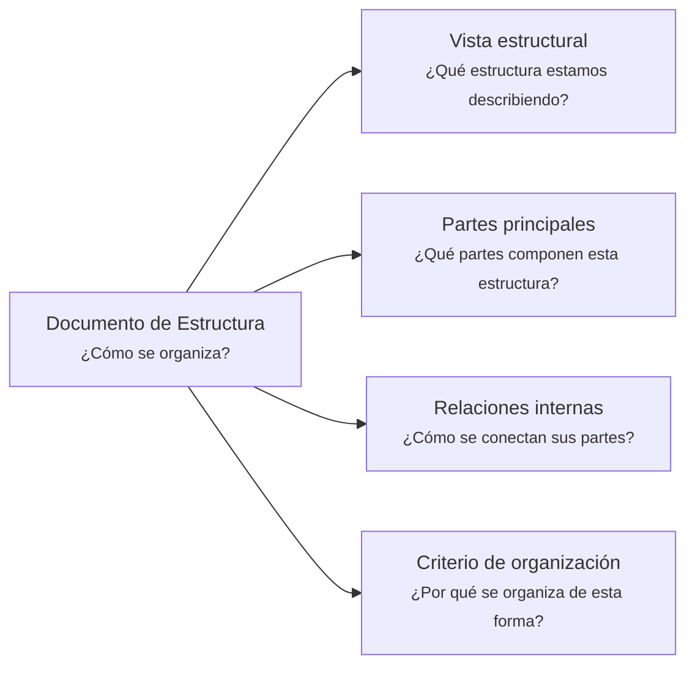

# Documento de Estructura - <tema>

## Organización

## Vista estructural

<!--
¿Qué estructura estamos describiendo?

Explicar qué estructura será observada en este artifact según el scope definido en metadata.
-->

## Partes principales

<!--
¿Qué partes componen esta estructura?

Listar las partes principales sin entrar todavía en comportamiento detallado.
-->

| Parte | Descripción |
| --- | --- |
| <parte> | <qué representa dentro de la estructura> |

## Relaciones internas

<!--
¿Cómo se conectan sus partes?

Describir relaciones internas entre partes de la estructura.
No listar documentos relacionados; eso pertenece a metadata/front matter.
-->

| Parte origen | Relación | Parte destino |
| --- | --- | --- |
| <parte> | <cómo se conecta> | <parte> |

## Criterio de organización

<!--
¿Por qué se organiza de esta forma?

Explicar el criterio usado para separar, agrupar o conectar las partes principales.
-->
