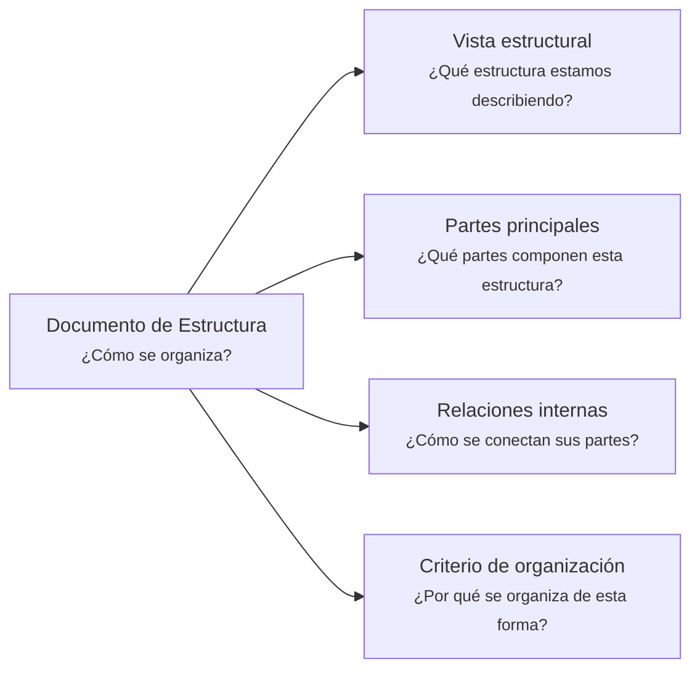

---
artifact:
  kind: document
  type: structure
  scope: <concept|process|flow|capability|product|service|project|solution|module|artifact-set|organization>
  target: <target-name>
  language: es

metadata:
  status: <draft|candidate|active|deprecated|superseded>
  relates: 
    - relation: <references|referenced-by|complements|depends-on|owned-by|derived-from|updates|supersedes|superseded-by>
      target: <artifact-id>

document:
  question: ¿Cómo se organiza?

tooling:
  schema:
    version: 0.1.0
  template:
    name: structure.document
    version: 0.1.0
---

# Documento de Estructura - <tema>

## Organización

## Vista estructural

<!--
¿Qué estructura estamos describiendo?

Explicar qué estructura será observada en este artifact según el scope definido en metadata.
-->

## Partes principales

<!--
¿Qué partes componen esta estructura?

Listar las partes principales sin entrar todavía en comportamiento detallado.
-->

| Parte | Descripción |
| --- | --- |
| <parte> | <qué representa dentro de la estructura> |

## Relaciones internas

<!--
¿Cómo se conectan sus partes?

Describir relaciones internas entre partes de la estructura.
No listar documentos relacionados; eso pertenece a metadata/front matter.
-->

| Parte origen | Relación | Parte destino |
| --- | --- | --- |
| <parte> | <cómo se conecta> | <parte> |

## Criterio de organización

<!--
¿Por qué se organiza de esta forma?

Explicar el criterio usado para separar, agrupar o conectar las partes principales.
-->
