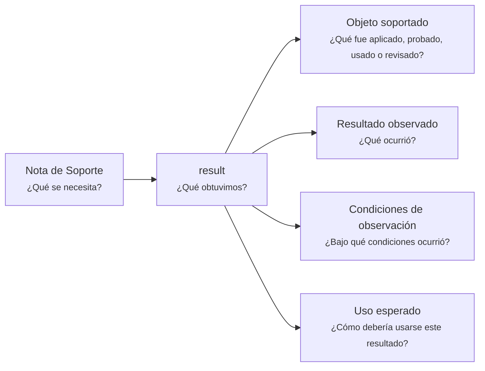

# Nota de Soporte - Resultado - <tema>

## Organización

## Objeto soportado

<!--
¿Qué fue aplicado, probado, usado o revisado?

Indicar el concepto, documento, artifact, comportamiento, decisión o elemento observado.
-->

## Resultado observado

<!--
¿Qué ocurrió?

Registrar el resultado sin interpretarlo todavía frente a un criterio.
-->

## Condiciones de observación

<!--
¿Bajo qué condiciones ocurrió?

Indicar contexto mínimo, datos relevantes, situación o forma en que se obtuvo el resultado.
-->

## Uso esperado

<!--
¿Cómo debería usarse este resultado?

Indicar si este resultado debería alimentar una validación, decisión, actualización documental o iteración futura.
-->