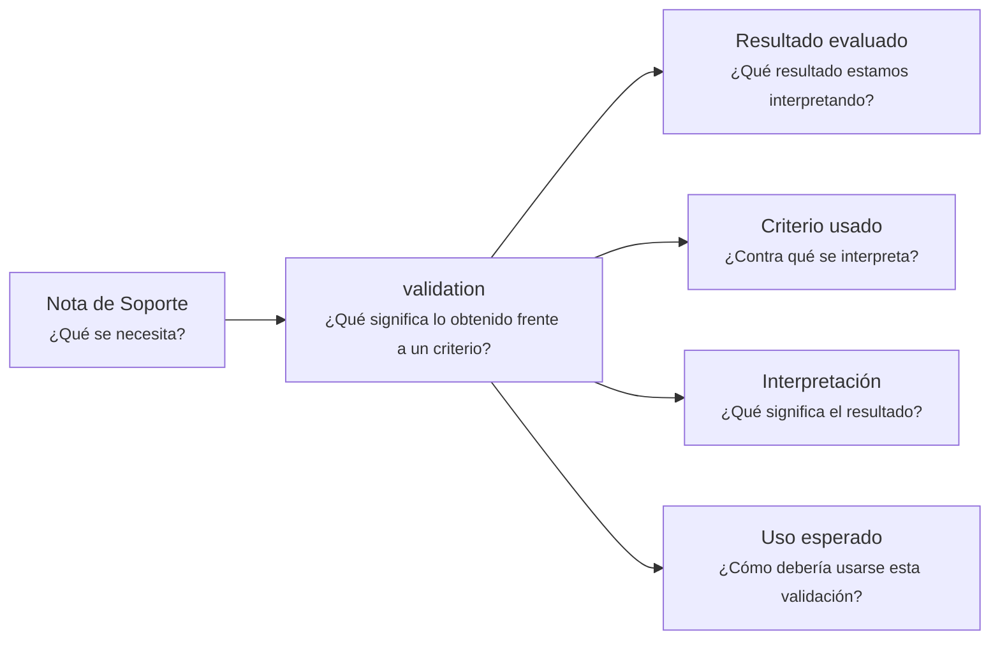

# Nota de Soporte - Validación - <tema>

## Organización

## Resultado evaluado

<!--
¿Qué resultado estamos interpretando?

Referenciar o describir brevemente el resultado observado que será evaluado.
-->

## Criterio usado

<!--
¿Contra qué se interpreta?

Indicar expectativa, criterio, regla, comportamiento esperado o condición usada para interpretar el resultado.
-->

## Interpretación

<!--
¿Qué significa el resultado?

Explicar si el resultado cumple, no cumple, cumple parcialmente o deja dudas frente al criterio usado.
-->

## Uso esperado

<!--
¿Cómo debería usarse esta validación?

Indicar si esta validación debería alimentar una decisión, feedback, actualización documental o nueva iteración.
-->