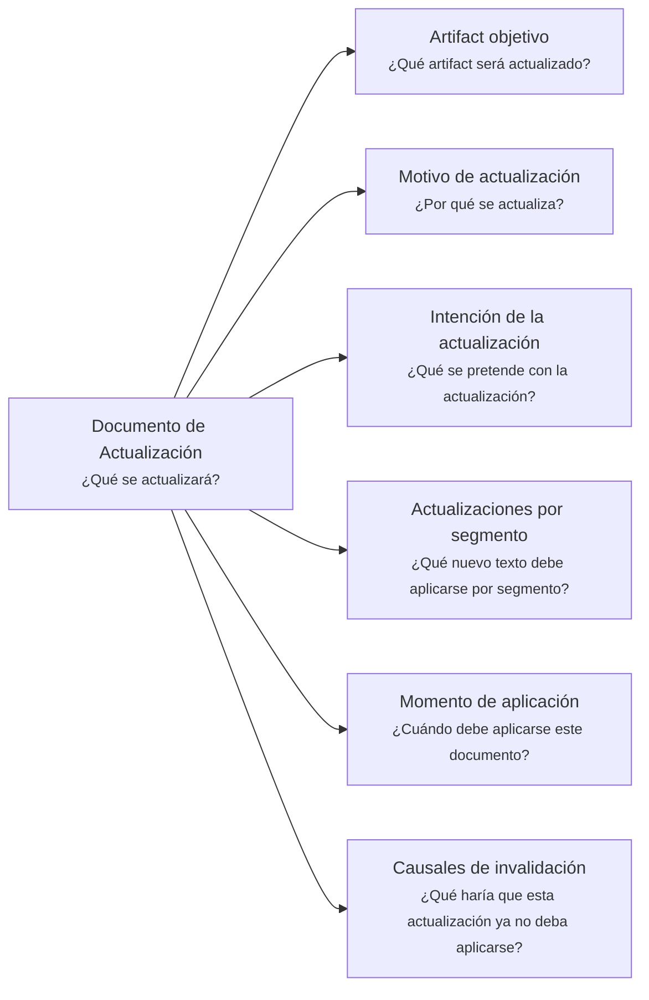

# Documento de Actualización - <tema>

## Organización

## Artifact objetivo

<!--
¿Qué artifact será actualizado?

Indicar el documento, template, diagrama, nota, artifact o segmento documental que recibirá la actualización.
-->

## Motivo de actualización

<!--
¿Por qué se actualiza?

Explicar la razón que hace necesaria esta actualización.
-->

## Intención de la actualización

<!--
¿Qué se pretende con la actualización?

Explicar qué claridad, corrección, alineación o mejora se busca lograr.
-->

## Actualizaciones por segmento

<!--
¿Qué nuevo texto debe aplicarse por segmento?

Indicar cada segmento afectado y el nuevo contenido que debería reemplazarlo o incorporarse.
-->

### <nombre segmento 1>

<contenido nuevo 1>

### <nombre segmento 2>

<contenido nuevo 2>

## Momento de aplicación

<!--
¿Cuándo debe aplicarse este documento?

Indicar si debe aplicarse inmediatamente, al cerrar una iteración, antes de publicar, después de una decisión, durante una revisión documental o bajo alguna condición específica.
-->

## Causales de invalidación

<!--
¿Qué haría que esta actualización ya no deba aplicarse?

Indicar condiciones, decisiones, cambios contextuales o conflictos documentales que invalidarían esta actualización.
-->

- <causal de invalidación>
