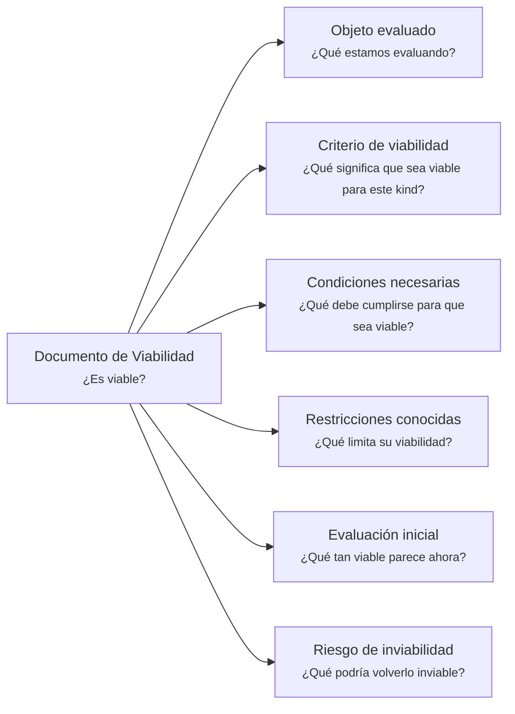

---
artifact:
  kind: document
  type: viability
  scope: <concept|feature|capability|initiative|product|service|project|change|decision|handoff|experiment|artifact>
  target: <target-name>
  language: <es|en>

metadata:
  status: <draft|candidate|active|deprecated|superseded>
  relates: 
    - relation: <references/referenced-by|complements|depends-on|owned-by|derived-from|updates|supersedes/superseded-by>
      target: <artifact-id>

document:
  question: ¿Es viable?
  kind: <economic|technical|operational|temporal|organizational|adoption>

tooling:
  schema:
    version: 0.1.0
  template:
    name: viability.document
    version: 0.1.0
---

# Documento de Viabilidad - <tema>

## Organización

## Objeto evaluado

<!--
¿Qué estamos evaluando?

Indicar el concepto, iniciativa, cambio, feature, capability, servicio, producto, experimento, decisión o artifact cuya viabilidad será evaluada.

La escala debe interpretarse según el scope definido en metadata.
-->

## Criterio de viabilidad

<!--
¿Qué significa que sea viable para este kind?

Explicar qué condiciones mínimas permitirían considerar viable este elemento según la dimensión de viabilidad indicada en metadata.

Ejemplos de kind:
- economic
- technical
- operational
- temporal
- organizational
- adoption
-->

## Condiciones necesarias

<!--
¿Qué debe cumplirse para que sea viable?

Listar condiciones necesarias para sostener esta viabilidad según el kind evaluado.
-->

- <condición necesaria>

## Restricciones conocidas

<!--
¿Qué limita su viabilidad?

Registrar restricciones conocidas sin convertir esta sección en planificación completa.
-->

| Restricción | Cómo limita la viabilidad |
| --- | --- |
| <restricción> | <impacto sobre la viabilidad> |

## Evaluación inicial

<!--
¿Qué tan viable parece ahora?

Indicar una evaluación inicial y breve de viabilidad según la información disponible.
-->

## Riesgo de inviabilidad

<!--
¿Qué podría volverlo inviable?

Registrar riesgos o condiciones que podrían hacer que este elemento deje de ser viable.
-->

- <riesgo de inviabilidad>
  