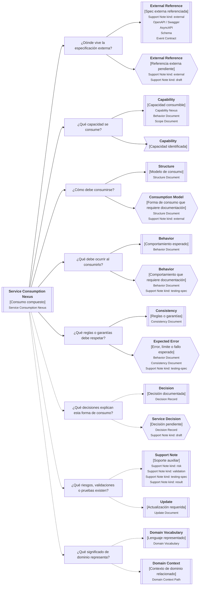

---
artifact:
  kind: nexus
  type: service-consumption
  scope: service
  target: <service-or-operation-name>
  language: <es>

metadata:
  status: <draft|candidate|active|deprecated|superseded>
  relates: 
    - relation: <references/referenced-by|complements|depends-on|owned-by|derived-from|updates|supersedes/superseded-by>
      target: <artifact-id>

composition:
  composes:
    - artifact: <artifact-id>
      role: <external-reference|capability|consumption-model|expected-behavior|rules|boundary|decision|testing|validation|result|risk|vocabulary|update>

tooling:
  schema:
    version: 0.1.0
  template:
    name: service-consumption.nexus
    version: 0.1.0
---

# Nexus artifact "Service Consumption" de <tema>

## Propósito del nexus

<!--
¿Para qué necesitamos este nexus?

Explicar qué continuidad se busca preservar alrededor del consumo de un servicio sin crear un Service Contract Document monolítico.
-->

Este nexus busca preservar continuidad alrededor de la forma en que un servicio consumible debe ser entendido, referenciado, consumido y complementado documentalmente.

Ayuda a responder:

> ¿Qué artifacts explican juntos cómo se consume este servicio?

Un servicio consumible puede tener una especificación externa, como OpenAPI, Swagger, AsyncAPI, schema, contrato de evento, protobuf o colección técnica equivalente.

Sin embargo, esa especificación no siempre explica correctamente:

* intención del servicio
* contexto de consumo
* comportamiento esperado
* reglas o garantías de dominio
* decisiones de diseño
* riesgos de consumo
* criterios de validación
* límites de uso
* significado de los elementos expuestos

Este nexus no intenta duplicar el contrato técnico ni reemplazar la especificación externa.

Intenta componer los artifacts que, juntos, permiten entender cómo consumir el servicio sin perder intención documental.

Es especialmente útil cuando una especificación externa existe, pero necesita ser leída junto con documentos de estructura, comportamiento, consistencia, decisiones, notas de soporte o vocabulario de dominio.

## Punto de entrada

<!--
¿Por dónde empieza este nexus?

Indicar el servicio, operación, endpoint, integración, evento, comando, query, job o contrato consumible que necesita ser explicado mediante varios artifacts.
-->

## Diagrama de composición

<!--
¿Qué composición vamos a recorrer?

Incluir el Diagrama de Nexus asociado a Service Consumption.
El diagrama debe mostrar artifacts relacionados y el rol que cumplen dentro de la composición.
-->



## Recorrido recomendado

<!--
¿Qué ruta conviene seguir primero?

Describir el recorrido principal recomendado para entender el consumo del servicio sin duplicar el contenido de los artifacts compuestos.
-->

| Orden | Nodo, artifact o concepto | Por qué revisarlo                                                                   |
| ----- | ------------------------- | ----------------------------------------------------------------------------------- |
| 1     | Servicio consumible       | Permite identificar qué servicio, operación o contrato estamos intentando entender  |
| 2     | Referencia externa        | Permite ubicar dónde vive la especificación consumible vigente                      |
| 3     | Capacidad consumible      | Permite entender qué capacidad ofrece el servicio                                   |
| 4     | Modelo de consumo         | Permite entender cómo debe consumirse sin duplicar la spec externa                  |
| 5     | Comportamiento esperado   | Permite entender qué debe ocurrir cuando el servicio se consume                     |
| 6     | Reglas o garantías        | Permite reconocer qué condiciones deben preservarse                                 |
| 7     | Errores esperados         | Permite entender límites, fallos conocidos o respuestas esperadas                   |
| 8     | Decisiones                | Permite entender por qué el consumo se definió de esa forma                         |
| 9     | Notas de soporte          | Permite revisar riesgos, validaciones, testing, resultados o referencias auxiliares |
| 10    | Lenguaje de dominio       | Permite entender qué significado representa el servicio                             |

## Service Consumption, documentos y composición

<!--
¿Cómo se distingue Service Consumption Nexus de Service Contract Document?

Usar esta sección para evitar que el nexus se convierta en un documento monolítico.
-->

| Concepto                    | Cómo se interpreta                                                              | Cuándo usarlo                                                                                                |
| --------------------------- | ------------------------------------------------------------------------------- | ------------------------------------------------------------------------------------------------------------ |
| Consumable Service          | Servicio, operación, evento, comando, query, integración o capacidad consumible | Cuando otro producto, sistema, servicio o actor técnico necesita consumirlo                                  |
| Service Consumption Nexus   | Composición de artifacts que explican cómo consumir un servicio                 | Cuando el consumo requiere entender varias perspectivas documentales                                         |
| Support Note kind: external | Referencia liviana a una especificación o artifact externo                      | Cuando el contrato vive fuera de los documentos VSlices                                                      |
| Structure Document          | Organización del modelo de consumo                                              | Cuando necesitamos explicar entradas, salidas, modo de consumo o forma de exposición                         |
| Behavior Document           | Comportamiento esperado al consumir el servicio                                 | Cuando necesitamos explicar qué debe ocurrir                                                                 |
| Consistency Document        | Reglas, invariantes o garantías del consumo                                     | Cuando el servicio debe respetar condiciones fuertes                                                         |
| Scope Document              | Límite de consumo soportado                                                     | Cuando necesitamos definir qué casos, consumidores o modos están soportados                                  |
| Decision Record             | Decisiones que explican la forma de consumo                                     | Cuando necesitamos preservar por qué se eligió esa exposición, contrato o garantía                           |
| Support Note                | Apoyo liviano                                                                   | Cuando existe conocimiento auxiliar, incompleto, validación, testing, resultado, riesgo o referencia externa |
| Domain Vocabulary           | Lenguaje de dominio representado                                                | Cuando el servicio expone términos, conceptos o errores con significado de dominio                           |
| Update Document             | Actualización requerida                                                         | Cuando cambia la spec, el consumo, la documentación o una decisión asociada                                  |

## Roles de composición

<!--
¿Qué rol cumple cada artifact dentro del nexus?

Usar esta sección para orientar metadata, tooling o lectura humana.
-->

| Role               | Artifact habitual                    | Qué preserva                                              |
| ------------------ | ------------------------------------ | --------------------------------------------------------- |
| external-reference | Support Note kind: external          | Referencia a especificación externa o artifact consumible |
| capability         | Capability Nexus / Behavior Document | Capacidad ofrecida o consumida                            |
| consumption-model  | Structure Document                   | Forma de consumo, entradas, salidas y modo                |
| expected-behavior  | Behavior Document                    | Comportamiento esperado al consumir                       |
| rules              | Consistency Document                 | Reglas, invariantes y garantías                           |
| boundary           | Scope Document                       | Casos, consumidores o modos soportados y excluidos        |
| decision           | Decision Record                      | Decisiones que justifican la forma de consumo             |
| testing            | Support Note kind: testing-spec      | Escenarios o criterios de prueba del consumo              |
| validation         | Support Note kind: validation        | Interpretación frente a criterio                          |
| result             | Support Note kind: result            | Resultado observado al consumir o probar                  |
| risk               | Support Note kind: risk              | Riesgos de consumo, compatibilidad o representación       |
| vocabulary         | Domain Vocabulary                    | Lenguaje de dominio expuesto                              |
| update             | Update Document                      | Cambios requeridos sobre artifacts relacionados           |

## Front matter mínimo sugerido

<!--
La composición vive principalmente en metadata porque conecta artifacts.
No duplicar en el cuerpo contenido que pertenece a los documentos compuestos.
-->

```yaml
---
artifact: nexus
kind: service-consumption
status: candidate
target: <service-or-operation-name>
scope: service
language: es
composes:
  - artifact: <support-note-external-id>
    role: external-reference
  - artifact: <structure-document-id>
    role: consumption-model
  - artifact: <behavior-document-id>
    role: expected-behavior
  - artifact: <consistency-document-id>
    role: rules
  - artifact: <scope-document-id>
    role: boundary
  - artifact: <decision-record-id>
    role: decision
  - artifact: <support-note-testing-spec-id>
    role: testing
  - artifact: <support-note-risk-id>
    role: risk
---
```

## Reglas de uso

<!--
¿Qué reglas evitan que el nexus agregue ceremonia innecesaria?
-->

* Un Service Consumption Nexus compone artifacts.
* Un Service Consumption Nexus no reemplaza la especificación externa.
* Un Service Consumption Nexus no reemplaza los documentos compuestos.
* Un Service Consumption Nexus no duplica contenido de OpenAPI, Swagger, AsyncAPI, schemas o contratos externos.
* Un Service Consumption Nexus puede partir incompleto.
* Un Service Consumption Nexus no obliga a crear todos los artifacts listados.
* Si la spec externa basta para entender el consumo, no crear Nexus.
* Si una Support Note kind: external basta para preservar continuidad, no crear Nexus.
* Si varios artifacts explican el consumo y quedan dispersos, usar Nexus.
* Si la composición no reduce fragmentación, no usar Nexus.

## Señales de sobreingeniería

<!--
¿Cuándo este nexus está resolviendo un problema futuro en vez de uno actual?
-->

Un Service Consumption Nexus probablemente agrega complejidad prematura si:

* existe solo porque hay un endpoint o archivo Swagger
* repite contenido que ya vive en una especificación externa
* obliga a crear Structure, Behavior, Consistency, Scope y Decision desde el inicio
* intenta convertirse en Service Contract Document
* reemplaza una Support Note kind: external que ya era suficiente
* documenta entradas, salidas o schemas que ya están claros en la spec externa
* exige mantener una composición perfecta antes de tener consumidores reales
* crea una capa de navegación que nadie necesita para consumir el servicio

## Conceptos complementarios

<!--
¿Qué elementos relacionados ayudan a entender el consumo sin pertenecer necesariamente a la composición principal?

Usar esta sección solo cuando existan elementos relevantes para preservar continuidad.
No convertirla en lista exhaustiva.
-->

| Concepto complementario | Relación con el consumo | Path, artifact o nexus sugerido |
| ----------------------- | ----------------------- | ------------------------------- |
| <concepto>              | <relación>              | <path, artifact o nexus>        |
