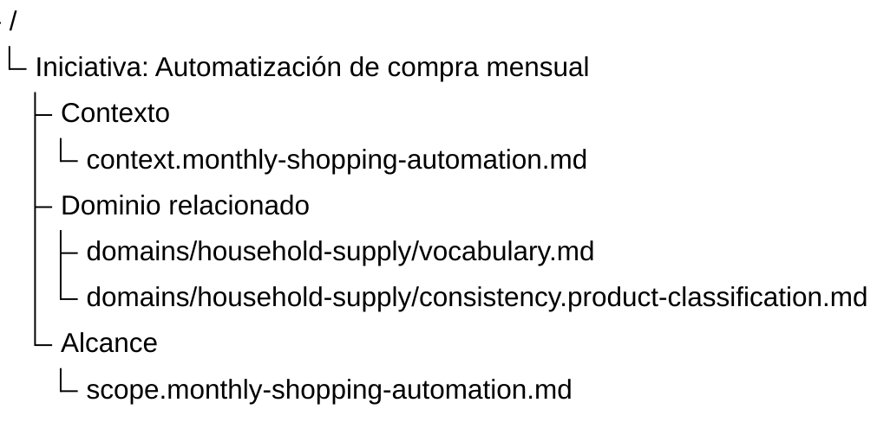
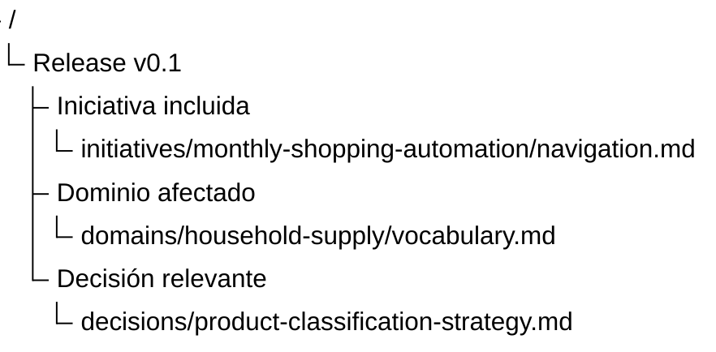

# Fuente de verdad por pertenencia primaria

## Propósito

Este documento define el modelo de fuente de verdad por pertenencia primaria.

Este modelo ocurre cuando un artifact documental vive en la organización donde tiene mayor pertenencia conceptual, semántica o narrativa, mientras otras organizaciones pueden referenciarlo mediante proyecciones navegables.

Su objetivo es equilibrar:

* claridad humana
* baja duplicación
* pertenencia conceptual
* navegación transversal
* flexibilidad organizacional

## Definición

La fuente de verdad por pertenencia primaria es un modelo donde el contenido canónico de un artifact vive en el lugar que mejor representa su pertenencia principal.

La pertenencia primaria puede estar dada por:

* un dominio
* un bounded context
* una iniciativa
* un proyecto
* un producto
* una capability
* un servicio consumible
* una superficie de producto
* una iteración
* una colección documental estable

Otras organizaciones pueden referenciar ese artifact sin copiarlo.

Por ejemplo:

```text
domains/
  docs-standard/
    vocabulary.md
    consistency.document-artifacts.md

initiatives/
  organization-documents/
    navigation.md
    organization.tree.md
```

En este caso, el vocabulario vive con el dominio porque su pertenencia principal es semántica.

La iniciativa puede referenciarlo, pero no lo posee.

## Qué pretende resolver

Este modelo ayuda cuando un artifact tiene una pertenencia principal clara, pero también es relevante desde otras organizaciones.

Responde:

> ¿Dónde debería vivir este artifact si puede ser recorrido desde varias perspectivas?

En vez de centralizar todo o encerrar el artifact en la primera organización que lo usa, este modelo intenta ubicarlo donde su significado se preserva mejor.

## Cómo se ve

Un artifact puede vivir en su lugar de pertenencia primaria.

```text
domains/
  household-supply/
    vocabulary.md
    consistency.product-classification.md
```

Una iniciativa puede referenciarlo desde una proyección.

```text
initiatives/
  monthly-shopping-automation/
    navigation.md
    organization.tree.md
```

La proyección puede verse así:



La iniciativa muestra que esos artifacts importan para el recorrido.

Pero su fuente de verdad sigue viviendo en el dominio.

## Ventajas

* Mantiene el artifact cerca de su contexto principal.
* Evita duplicar contenido en varias organizaciones.
* Es más natural para humanos que una centralización completamente plana.
* Permite recorridos transversales mediante referencias.
* Preserva mejor el significado del artifact.
* Reduce la necesidad de mover documentos cuando aparecen nuevas vistas.
* Funciona bien cuando existen dominios, productos, iniciativas o proyectos cruzados.
* Permite combinar organización física y proyecciones navegables.

## Desventajas

* Requiere criterio para decidir pertenencia primaria.
* Puede generar discusiones sobre dónde debería vivir un artifact.
* Puede ser menos obvio para personas nuevas.
* Necesita referencias claras para no perder artifacts importantes.
* Puede requerir Navigation Documents cuando los recorridos cruzan muchas organizaciones.
* Puede volverse inconsistente si cada equipo decide pertenencia de forma distinta.

## Riesgos

| Riesgo                                                   | Consecuencia                                                                     |
| -------------------------------------------------------- | -------------------------------------------------------------------------------- |
| Discutir ubicación antes que intención                   | Se pierde tiempo ordenando antes de entender qué continuidad se quiere preservar |
| Elegir pertenencia primaria por conveniencia temporal    | El artifact queda en un lugar que no preserva bien su significado                |
| Referenciar sin explicar el recorrido                    | El artifact existe, pero no queda claro por qué aparece en otra organización     |
| Mover artifacts cada vez que cambia el foco              | Se rompe continuidad histórica y enlaces                                         |
| Confundir pertenencia primaria con pertenencia exclusiva | Se invisibilizan otras perspectivas válidas                                      |
| Usar demasiados criterios distintos                      | La organización se vuelve impredecible                                           |

## Criterios de pertenencia primaria

La pertenencia primaria debería elegirse preguntando:

* ¿Dónde se entiende mejor este artifact?
* ¿Qué organización sufriría mayor pérdida de continuidad si este artifact no vive ahí?
* ¿Qué perspectiva define mejor la identidad del artifact?
* ¿Dónde será mantenido con mayor claridad?
* ¿Qué ubicación reduce duplicación sin volver abstracta la navegación?
* ¿Qué organización representa mejor su razón de existir?

No siempre existe una respuesta perfecta.

La decisión debería favorecer continuidad y bajo costo documental.

## Relación con proyecciones navegables

Este modelo depende naturalmente de proyecciones navegables.

Un artifact puede vivir en su pertenencia primaria y aparecer referenciado desde otras organizaciones.



La proyección no cambia la fuente de verdad.

Solo muestra que el artifact es relevante para ese recorrido.

## Relación con Navigation Documents

Cuando una organización referencia artifacts que viven en varios lugares, un Navigation Document puede explicar:

* por dónde empezar
* qué artifacts son principales
* qué artifacts son de apoyo
* por qué aparecen en la proyección
* qué recorrido preserva mejor continuidad
* cuándo conviene cambiar de perspectiva

La proyección muestra orden.

El Navigation Document explica recorrido.

## Relación con metadata

Este modelo puede apoyarse en metadata para declarar o derivar pertenencia primaria.

Por ejemplo:

```yaml
type: context-document
scope: initiative
target: monthly-shopping-automation
primary_organization: initiative.monthly-shopping-automation
```

O también puede derivarse por convención de nombres y ubicación.

No es necesario definir una metadata obligatoria desde el inicio.

Lo importante es que el criterio de pertenencia sea entendible.

## Comparación con otros modelos

| Modelo               | Diferencia                                                                                               |
| -------------------- | -------------------------------------------------------------------------------------------------------- |
| Organización física  | El artifact vive dentro de la organización que lo contiene físicamente.                                  |
| Centralizada         | El artifact vive en una zona común independiente de organizaciones específicas.                          |
| Pertenencia primaria | El artifact vive donde su significado principal se preserva mejor y otras organizaciones lo referencian. |

## Límites del modelo

Este modelo no debería convertirse en una búsqueda obsesiva de la ubicación perfecta.

Si el equipo no puede decidir pertenencia primaria con claridad, puede usar una fuente centralizada o una organización física simple mientras el conocimiento madura.

La pertenencia primaria debe ayudar a preservar continuidad.

No debe transformarse en una discusión arquitectónica documental permanente.

## Cuándo puede ser suficiente

Este modelo puede ser suficiente cuando:

* existen artifacts relevantes para varias organizaciones
* una pertenencia principal puede identificarse razonablemente
* el equipo quiere evitar centralización excesiva
* las organizaciones cruzan dominios, iniciativas, proyectos o releases
* se necesita balancear navegación humana y referencias transversales
* el volumen documental empieza a crecer

## Reglas recomendadas

* Elegir pertenencia primaria por continuidad, no por comodidad momentánea.
* Evitar mover artifacts sin una razón clara.
* Referenciar artifacts desde otras organizaciones en vez de copiarlos.
* Usar Navigation Documents cuando el recorrido cruce varias pertenencias.
* No asumir que pertenencia primaria significa pertenencia exclusiva.
* Mantener criterios de pertenencia simples y explicables.
* Preferir una solución imperfecta y clara sobre una ubicación teóricamente perfecta pero confusa.

## Anti-patrón

Este modelo se usa mal cuando el equipo convierte la elección de pertenencia primaria en una discusión permanente.

Por ejemplo:

```text
¿Este documento vive en dominio, iniciativa, proyecto, release o feature?
```

Si la discusión consume más energía que la continuidad que intenta preservar, la organización está agregando complejidad accidental.

En ese caso, puede ser mejor usar una fuente centralizada o una organización física simple hasta que el patrón real aparezca.

## Regla de cierre

La fuente de verdad por pertenencia primaria favorece balance.

Permite que un artifact viva donde su significado principal se preserva mejor, mientras otras organizaciones lo recorren mediante referencias.

Debe evitar convertirse en una búsqueda de ubicación perfecta.
