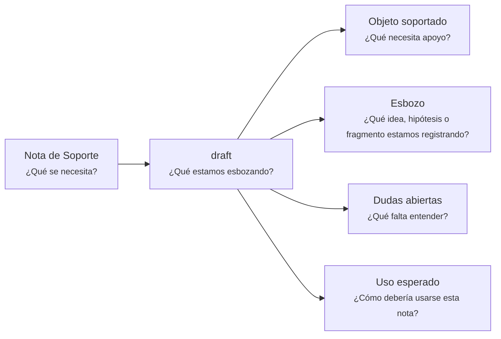

---
artifact:
  kind: support-note
  type: draft
  scope: <concept|artifact|document|decision|behavior|capability|initiative|product|service|project|handoff|change>
  target: <supported-object-name>
  language: <es>

metadata:
  status: <draft|candidate|active|deprecated|superseded>
  relates: 
    - relation: <references/referenced-by|complements|depends-on|owned-by|derived-from|updates|supersedes/superseded-by>
      target: <artifact-id>

support:
  question: ¿Qué estamos esbozando?
  supports: <artifact-id>

tooling:
  schema:
    version: 0.1.0
  template:
    name: support-note.draft
    version: 0.1.0
---

# Nota de Soporte - Borrador - <tema>

## Organización

## Objeto soportado

<!--
¿Qué necesita apoyo?

Indicar qué concepto, documento, artifact, decisión, comportamiento o línea de trabajo recibe apoyo de esta nota.
-->

## Esbozo

<!--
¿Qué idea, hipótesis o fragmento estamos registrando?

Registrar conocimiento incompleto sin forzarlo todavía a convertirse en documento estable.
-->

## Dudas abiertas

<!--
¿Qué falta entender?
-->

- <duda abierta>

## Uso esperado

<!--
¿Cómo debería usarse esta nota?

Indicar si esta nota debería alimentar un documento, una decisión, una iteración futura o una conversación posterior.
-->