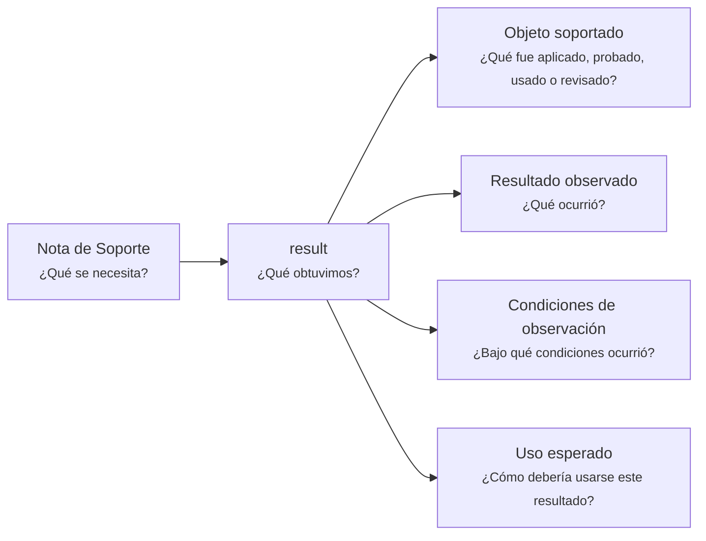

---
artifact:
  kind: support-note
  type: result
  scope: <concept|artifact|document|behavior|decision|experiment|test|validation|product|service|project|handoff|iteration>
  target: <observed-object-name>
  language: <es>

metadata:
  status: <draft|candidate|active|deprecated|superseded>
  relates: 
    - relation: <references/referenced-by|complements|depends-on|owned-by|derived-from|updates|supersedes/superseded-by>
      target: <artifact-id>

support:
  question: ¿Qué obtuvimos?
  supports: <artifact-id>

tooling:
  schema:
    version: 0.1.0
  template:
    name: support-note.result
    version: 0.1.0
---

# Nota de Soporte - Resultado - <tema>

## Organización

## Objeto soportado

<!--
¿Qué fue aplicado, probado, usado o revisado?

Indicar el concepto, documento, artifact, comportamiento, decisión o elemento observado.
-->

## Resultado observado

<!--
¿Qué ocurrió?

Registrar el resultado sin interpretarlo todavía frente a un criterio.
-->

## Condiciones de observación

<!--
¿Bajo qué condiciones ocurrió?

Indicar contexto mínimo, datos relevantes, situación o forma en que se obtuvo el resultado.
-->

## Uso esperado

<!--
¿Cómo debería usarse este resultado?

Indicar si este resultado debería alimentar una validación, decisión, actualización documental o iteración futura.
-->