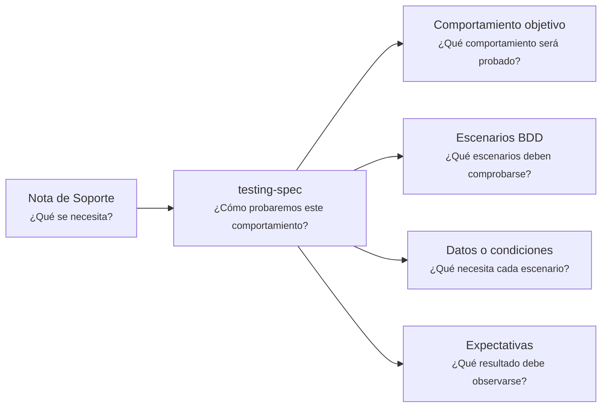

---
artifact:
  kind: support-note
  type: testing-spec
  scope: <behavior|feature|capability|service|product|flow|integration|operation|rule|expected-error>
  target: <behavior-to-test-name>
  language: <es>

metadata:
  status: <draft|candidate|active|deprecated|superseded>
  relates: 
    - relation: <references/referenced-by|complements|depends-on|owned-by|derived-from|updates|supersedes/superseded-by>
      target: <artifact-id>

support:
  question: ¿Cómo probaremos este comportamiento?
  supports: <artifact-id>

tooling:
  schema:
    version: 0.1.0
  template:
    name: support-note.testing-spec
    version: 0.1.0
---

# Nota de Soporte - Especificación de Testing - <tema>

## Organización



## Comportamiento objetivo

<!--
¿Qué comportamiento será probado?

Referenciar o describir brevemente el comportamiento esperado que esta especificación deriva.
-->

## Escenarios BDD

<!--
¿Qué escenarios deben comprobarse?

Describir escenarios en formato BDD cuando aporte claridad.
-->

```gherkin
Scenario: <nombre del escenario>
  Given <situación inicial>
  When <ocurre el comportamiento>
  Then <resultado esperado>
```

## Datos o condiciones

<!--
¿Qué necesita cada escenario?
-->

| Escenario | Datos o condiciones |
| --- | --- |
| <escenario> | <datos o condiciones necesarias> |

## Expectativas

<!--
¿Qué resultado debe observarse?

Indicar resultados esperados, errores esperados o criterios verificables.
-->

| Escenario | Expectativa |
| --- | --- |
| <escenario> | <resultado, error o criterio esperado> |