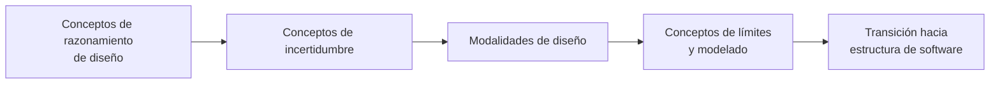

# Glosario de VSlices Design

Este glosario define términos usados por VSlices Design.

VSlices Design se enfoca en razonamiento, modelado, incertidumbre, límites y entendimiento progresivo antes de comprometerse demasiado pronto con arquitectura o implementación.

Estos términos ayudan a describir cómo el trabajo de diseño puede comenzar desde distintos tipos de conocimiento disponible.

## Cómo leer este glosario

Este glosario está organizado como una ruta de razonamiento, no como una lista alfabética.

Los términos comienzan desde el material que el equipo intenta entender, pasan por la incertidumbre que afecta la siguiente decisión y llegan a la modalidad de diseño que puede ayudar al equipo a avanzar.

Ruta de lectura para los términos de VSlices Design

Este diagrama muestra una forma útil de leer los términos. No representa una secuencia obligatoria de trabajo.

Un equipo puede comenzar desde contexto, problema, slice, límite, modelo o implementación existente. Lo importante es que el diseño responda a la incertidumbre real del trabajo actual.

## Conceptos de razonamiento de diseño

* **Material de negocio**: información, lenguaje, reglas, restricciones, procesos, decisiones, problemas, expectativas o señales del dominio antes de convertirse en estructura de software.

* **Razonamiento de diseño**: el proceso de entender por qué una estructura, límite, comportamiento, documento o dirección de implementación puede ser apropiada para el contexto actual.

* **Heurística de modelado**: una ayuda práctica de razonamiento usada para hacer que conocimiento de dominio, incertidumbre, responsabilidades o límites sean más fáciles de observar y discutir.

* **Entendimiento progresivo**: la mejora gradual del conocimiento de dominio y sistema mediante descubrimiento, documentación, modelado, implementación, validación y feedback.

## Conceptos de incertidumbre

* **Incertidumbre**: falta de entendimiento confiable sobre el dominio, problema, comportamiento, responsabilidad, riesgo o resultado esperado.

* **Incertidumbre dominante**: la incertidumbre más importante para la siguiente decisión de diseño, documentación o implementación.

* **Riesgo de diseño**: una posibilidad de tomar una decisión de diseño incorrecta, prematura o demasiado costosa porque el equipo todavía no entiende suficiente del contexto, problema o comportamiento esperado.

## Modalidades de diseño

* **Modalidad de diseño**: una forma de abordar el trabajo de diseño dependiendo de la incertidumbre actual, el conocimiento disponible y el siguiente paso más seguro.

* **Context-First**: una modalidad de diseño que comienza entendiendo el contexto de negocio, operacional, organizacional o de sistema que rodea el trabajo antes de estrecharse hacia un problema o implementación específica.

* **Problem-First**: una modalidad de diseño que comienza desde una tensión, necesidad, riesgo, pregunta o falla concreta que debe entenderse antes de decidir qué construir.

* **Slice-First**: una modalidad de diseño que comienza desde una pequeña slice útil de trabajo para aprender desde implementación, validación o uso real.

* **Cambio de modalidad**: el ajuste del enfoque de diseño cuando cambia la incertidumbre dominante o cuando la modalidad actual deja de ayudar al equipo a avanzar con claridad.

## Conceptos de límites y modelado

* **Razonamiento de límites**: el acto de usar límites como objetos de razonamiento para identificar dónde deberían separarse conceptos, responsabilidades, decisiones, sistemas, actores o áreas de propiedad.

* **Límite conceptual**: una separación entre conceptos, responsabilidades o significados que ayuda al equipo a evitar mezclar conocimiento que debería razonarse por separado.

* **Modelo de dominio**: una representación del conocimiento del dominio que ayuda a explicar conceptos, reglas, comportamientos, límites o decisiones relevantes para el trabajo de software.

## Transición hacia estructura de software

Estos conceptos ayudan a describir cómo el entendimiento de dominio empieza a convertirse en decisiones, formas y artefactos de software.

* **Estructura de software**: la forma que toma el conocimiento de negocio cuando se expresa como límites, modelos, comportamientos, capacidades, flujos, contratos, componentes o implementación.

* **Artefacto de software**: una representación concreta usada para diseñar, documentar, construir, validar o mantener software, como una historia de usuario, documento, diagrama, API, modelo, prueba, componente o slice.

* **Trazabilidad de intención**: la capacidad de seguir una decisión, estructura, comportamiento o implementación hasta la intención de negocio que la justifica.

* **Feedback de implementación**: conocimiento que aparece al construir, probar, usar o revisar software y que puede cambiar el entendimiento previo del dominio, problema, modelo o solución.

## Relación entre modalidades de diseño

Las modalidades de diseño describen distintos puntos de partida para el trabajo de diseño.

* **[Context-First](modalities/context-first/index.md)** parte desde la situación circundante
* **[Problem-First](modalities/problem-first/index.md)** parte desde una tensión o necesidad concreta
* **[Slice-First](modalities/slice-first/index.md)** parte desde una pequeña implementación o slice de validación útil

No son niveles de madurez y no son una secuencia fija.

Un equipo puede comenzar con Context-First cuando el entorno es poco claro, con Problem-First cuando una tensión específica es visible o con Slice-First cuando construir una pieza pequeña es la forma más segura de aprender.

Lo importante es elegir la modalidad que coincide con la incertidumbre del trabajo actual.
