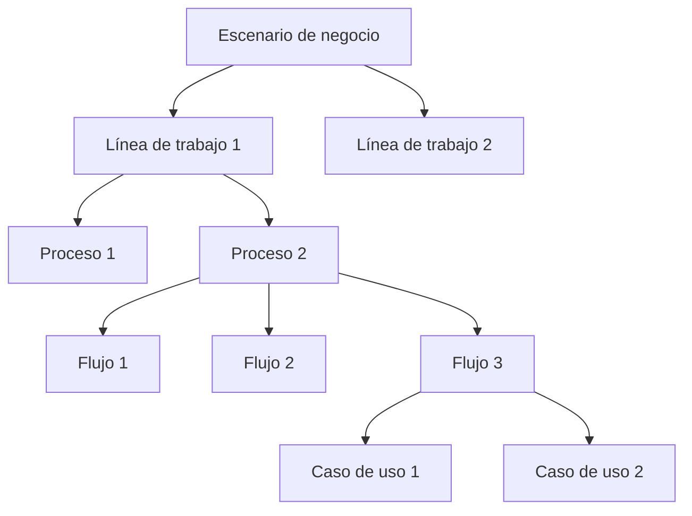

# Perspectiva "Escenario de negocio"

La perspectiva "Escenario de negocio" organiza la documentación desde la pregunta: **¿Dónde estoy trabajando?**, observada desde una mirada de análisis de procesos.

Esta perspectiva ayuda a entender el contexto operativo donde ocurre el trabajo antes de enfocarse en proyectos, productos, servicios o decisiones específicas.

Se centra en reconocer líneas de trabajo, procesos, flujos, actores, responsabilidades, reglas operativas y conocimiento necesario para comprender cómo funciona una parte del negocio.

Un escenario de negocio puede representar una operación, una organización, un ecosistema, un área de trabajo, una línea de negocio o una situación operativa que necesita ser entendida.

## A qué orienta esta perspectiva

La perspectiva "Escenario de negocio" orienta hacia el contexto operativo donde aparece el conocimiento.

Ayuda a ver:

* qué situación de negocio rodea el trabajo
* qué líneas de trabajo existen dentro del escenario
* qué procesos o flujos forman parte del contexto
* qué actores, responsabilidades o áreas participan
* qué partes están dentro o fuera del alcance actual
* qué conocimiento ya está documentado
* qué conocimiento todavía necesita más profundidad

Esta perspectiva es útil cuando el equipo necesita entender el territorio operativo antes de decidir dónde intervenir.

## Qué ayuda a responder

La perspectiva "Escenario de negocio" ayuda a responder preguntas como:

* ¿Dónde ocurre este trabajo dentro del negocio?
* ¿Qué situación operativa estamos intentando entender?
* ¿Qué líneas de trabajo existen dentro del escenario?
* ¿Qué procesos o flujos explican cómo opera este escenario?
* ¿Qué actores, responsabilidades o áreas participan?
* ¿Qué parte del escenario está siendo documentada, validada o modificada?
* ¿Qué conocimiento falta para entender mejor el contexto operativo?

## Documentos útiles

Estos documentos suelen ser útiles dentro de una perspectiva de escenario de negocio:

| Documento                                                       | Uso dentro de la perspectiva                                                                       |
| --------------------------------------------------------------- | -------------------------------------------------------------------------------------------------- |
| [Documento de contexto](../../taxonomy/context-document.md)     | Explica el escenario de negocio, sus límites, actores, condiciones y líneas de trabajo relevantes. |
| [Vocabulario de dominio](../../taxonomy/domain-vocabulary.md)   | Preserva el lenguaje necesario para entender el escenario.                                         |
| [Documento de proceso](../../taxonomy/process-document.md)      | Explica cómo se organiza y ejecuta parte del trabajo dentro del escenario.                         |
| [Documento de caso de uso](../../taxonomy/use-case-document.md) | Describe comportamientos específicos que aparecen dentro de procesos o flujos.                     |
| [Documento de capacidad](../../taxonomy/capability-document.md) | Identifica capacidades estables que el escenario requiere.                                         |
| [Registro de decisión](../../taxonomy/decision-record.md)       | Preserva decisiones que afectan cómo se entiende o se interviene el escenario.                     |
| [Nota de validación](../../taxonomy/validation-note.md)         | Captura aprendizaje que cambia la comprensión del escenario.                                       |
| [Nota de soporte](../../taxonomy/support-note.md)               | Preserva conocimiento temprano, incierto o local antes de darle estructura formal.                 |

No todos estos documentos son obligatorios.

La perspectiva solo ayuda a decidir qué documentación puede explicar mejor el escenario de negocio.

## Camino típico

Un camino desde escenario de negocio suele comenzar amplio y volverse más específico.

Camino de continuidad desde la perspectiva de escenario de negocio

Este camino no significa que el equipo deba documentar todos los niveles.

Significa que el escenario de negocio puede recorrerse desde contexto operativo amplio hacia conocimiento más específico.

## Paradas comunes

Una parada es un punto del camino donde puede existir documentación con distinta profundidad.

| Parada               | Qué permite observar                                                          |
| -------------------- | ----------------------------------------------------------------------------- |
| Escenario de negocio | El contexto operativo donde ocurre el trabajo.                                |
| Línea de trabajo     | Una oferta, operación, responsabilidad o flujo de valor dentro del escenario. |
| Proceso              | La forma en que el trabajo se organiza para producir un resultado.            |
| Flujo                | La secuencia concreta de pasos, decisiones, transferencias o participantes.   |
| Caso de uso          | El significado esperado de un comportamiento específico dentro del escenario. |

## Profundidad documental

La perspectiva "Escenario de negocio" también ayuda a ver qué tan documentada está cada parte del contexto operativo.

| Profundidad  | Significado                                                                   |
| ------------ | ----------------------------------------------------------------------------- |
| Identificada | La parte del escenario fue reconocida, pero tiene poca estructura documental. |
| Mínima       | Hay documentación suficiente para apoyar trabajo cercano.                     |
| Ampliada     | Hay detalle porque existe complejidad, riesgo, coordinación o ambigüedad.     |
| Referencia   | El conocimiento es estable e importante para trabajo futuro.                  |

No todo el escenario necesita la misma profundidad.

Una línea de trabajo puede estar bien documentada, otra puede estar apenas identificada y otra puede quedar fuera del alcance actual.

## Riesgos a evitar

!!! risk "Riesgo a evitar"

    No conviertas la perspectiva de escenario de negocio en una obligación de documentar toda la organización.

La perspectiva "Escenario de negocio" debería ayudar a entender dónde ocurre el trabajo.

No debería convertirse en un mapa exhaustivo de toda la empresa, ecosistema o sistema.

También conviene evitar:

* documentar líneas de trabajo que no afectan el trabajo actual o futuro
* describir procesos con más detalle del necesario
* mezclar contexto operativo con decisiones de implementación demasiado específicas
* asumir que todo escenario debe llegar a documento de referencia
* usar el escenario como excusa para retrasar aprendizaje desde validación o implementación

## Principio de continuidad

!!! principle "Principio de Continuidad"

    La perspectiva de escenario de negocio debería ayudar a entender dónde aparece el conocimiento operativo antes de decidir qué parte necesita más profundidad documental.

