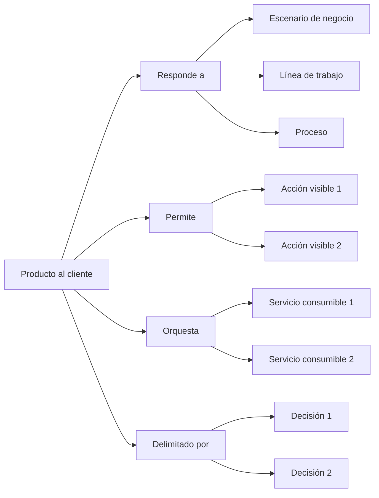

# Perspectiva "Producto al cliente"

La perspectiva "Producto al cliente" organiza la documentación desde la pregunta: **¿Qué puede hacer el usuario con este sistema?**, observada desde una mirada de experiencia, uso y coordinación de software.

En esta perspectiva, "cliente" no se refiere únicamente a un cliente externo.

Puede representar una persona usuaria, un operador, un área interna, un equipo de negocio o cualquier actor que interactúa con un sistema de software para realizar acciones dentro de un escenario de negocio.

Esta perspectiva ayuda a entender qué experiencia ofrece un producto, qué acciones permite realizar, qué parte del escenario de negocio responde y qué servicios consumibles, capacidades o procesos necesita coordinar para hacerlo.

Un producto al cliente puede representar una aplicación web, una aplicación móvil, un portal interno, un panel operativo, una interfaz administrativa o cualquier sistema de software usado directamente por personas para ejecutar parte del trabajo.

## A qué orienta esta perspectiva

La perspectiva "Producto al cliente" orienta hacia la experiencia visible que permite a una persona realizar acciones dentro de un escenario de negocio.

Ayuda a ver:

* qué parte del escenario de negocio responde el producto
* qué usuarios, actores o áreas interactúan con el producto
* qué acciones visibles permite realizar
* qué procesos o flujos ayuda a ejecutar
* qué servicios consumibles necesita orquestar
* qué capacidades usa, combina o expone a través de la experiencia
* qué decisiones explican su alcance, experiencia o límites
* qué validaciones confirman o cambian su comportamiento esperado

Esta perspectiva es útil cuando el equipo necesita entender cómo una parte del trabajo se vuelve usable mediante software.

## Qué ayuda a responder

La perspectiva "Producto al cliente" ayuda a responder preguntas como:

* ¿Qué puede hacer el usuario con este sistema?
* ¿Qué parte del escenario de negocio cubre el producto?
* ¿Qué proceso, flujo o línea de trabajo ayuda a ejecutar?
* ¿Qué acciones visibles ofrece?
* ¿Qué servicios consumibles necesita coordinar?
* ¿Qué capacidades usa para responder al usuario?
* ¿Qué queda fuera de la experiencia del producto?
* ¿Qué decisiones explican su alcance o experiencia?
* ¿Qué validaciones cambiaron la comprensión del producto?

## Documentos útiles

Estos documentos suelen ser útiles dentro de una perspectiva de producto al cliente:

| Documento                                                       | Uso dentro de la perspectiva                                                                    |
| --------------------------------------------------------------- | ----------------------------------------------------------------------------------------------- |
| [Documento de contexto](../../taxonomy/context-document.md)     | Explica el escenario de negocio o parte del escenario que el producto responde.                 |
| [Vocabulario de dominio](../../taxonomy/domain-vocabulary.md)   | Preserva el lenguaje necesario para nombrar acciones, usuarios, estados, procesos y resultados. |
| [Documento de proceso](../../taxonomy/process-document.md)      | Explica los procesos o flujos que el producto ayuda a ejecutar.                                 |
| [Documento de caso de uso](../../taxonomy/use-case-document.md) | Describe comportamientos visibles o esperados que el producto debe permitir.                    |
| [Documento de capacidad](../../taxonomy/capability-document.md) | Identifica capacidades que el producto usa, combina o expone a través de la experiencia.        |
| [Registro de decisión](../../taxonomy/decision-record.md)       | Preserva decisiones sobre alcance, experiencia, orquestación, límites o responsabilidades.      |
| [Nota de validación](../../taxonomy/validation-note.md)         | Captura evidencia que confirma o cambia el comportamiento esperado del producto.                |
| [Nota de soporte](../../taxonomy/support-note.md)               | Preserva conocimiento temprano, incierto o local antes de darle estructura formal.              |

No todos estos documentos son obligatorios.

La perspectiva solo ayuda a observar qué documentación explica mejor el producto al cliente.

## Camino típico

Un camino desde producto al cliente suele mostrar qué parte del escenario responde el producto, qué acciones visibles ofrece y qué servicios consumibles necesita orquestar.

Camino de continuidad desde la perspectiva de producto al cliente

Este camino no significa que todo producto deba tener todos esos elementos.

Significa que la perspectiva de producto al cliente ayuda a mostrar qué parte del negocio responde, qué acciones ofrece, qué casos de uso expresa, qué servicios coordina y qué decisiones explican su alcance.

## Paradas comunes

Una parada es un punto del camino donde puede existir documentación con distinta profundidad.

| Parada               | Qué permite observar                                                                                      |
| -------------------- | --------------------------------------------------------------------------------------------------------- |
| Producto al cliente  | El sistema de software usado por personas para realizar acciones dentro de un escenario de negocio.       |
| Usuario o actor      | La persona, rol, área o participante que interactúa con el producto.                                      |
| Escenario de negocio | El contexto operativo al que responde el producto.                                                        |
| Línea de trabajo     | La parte del trabajo que el producto ayuda a ejecutar o coordinar.                                        |
| Proceso              | La forma de trabajo que el producto soporta.                                                              |
| Acción visible       | Algo que el usuario puede hacer directamente dentro del producto.                                         |
| Caso de uso          | El comportamiento esperado que da sentido a una acción visible.                                           |
| Servicio consumible  | Una pieza de software que el producto usa para ejecutar, consultar, coordinar o persistir comportamiento. |
| Capacidad            | Algo estable que el producto necesita usar, combinar o hacer disponible.                                  |
| Decisión             | Una elección que explica alcance, experiencia, límites u orquestación.                                    |
| Validación           | Evidencia que confirma, corrige o cambia el comportamiento esperado del producto.                         |

## Profundidad documental

La perspectiva de producto al cliente ayuda a ver qué tan clara está cada parte de la experiencia y su relación con el escenario de negocio.

| Profundidad  | Significado                                                                                        |
| ------------ | -------------------------------------------------------------------------------------------------- |
| Identificada | La acción, proceso o dependencia existe, pero todavía tiene poca documentación.                    |
| Mínima       | Hay documentación suficiente para apoyar diseño, implementación o validación cercana.              |
| Ampliada     | Hay más detalle porque existe riesgo, coordinación, ambigüedad, dependencia o impacto en usuarios. |
| Referencia   | El conocimiento es estable y relevante para evolución futura, soporte o decisiones posteriores.    |

No todo dentro de un producto necesita la misma profundidad.

Una acción visible puede estar claramente definida, un servicio consumible puede estar en exploración y una parte del proceso puede quedar fuera del alcance del producto.

## Riesgos a evitar

!!! risk "Riesgo a evitar"

    No confundas producto al cliente con todo el proyecto ni con todos los servicios que lo sostienen.

La perspectiva "Producto al cliente" debería ayudar a entender qué experiencia ofrece un sistema de software y qué parte del escenario de negocio permite ejecutar.

No debería convertirse en una lista de pantallas, componentes visuales o funcionalidades aisladas sin relación con procesos, servicios o casos de uso.

También conviene evitar:

* documentar pantallas sin explicar qué acciones o casos de uso sostienen
* asumir que todo lo que ocurre en backend pertenece al producto
* ocultar qué servicios consumibles sostienen la experiencia
* mezclar experiencia de usuario con responsabilidades internas de servicios
* confundir producto con proyecto de software completo
* tratar al usuario como detalle secundario
* diseñar acciones visibles sin preservar el escenario de negocio que les da sentido

## Principio de continuidad

!!! principle "Principio de Continuidad"

    La perspectiva de producto al cliente debería ayudar a entender qué experiencia ofrece un sistema de software, qué parte del escenario de negocio responde y qué servicios necesita coordinar.

