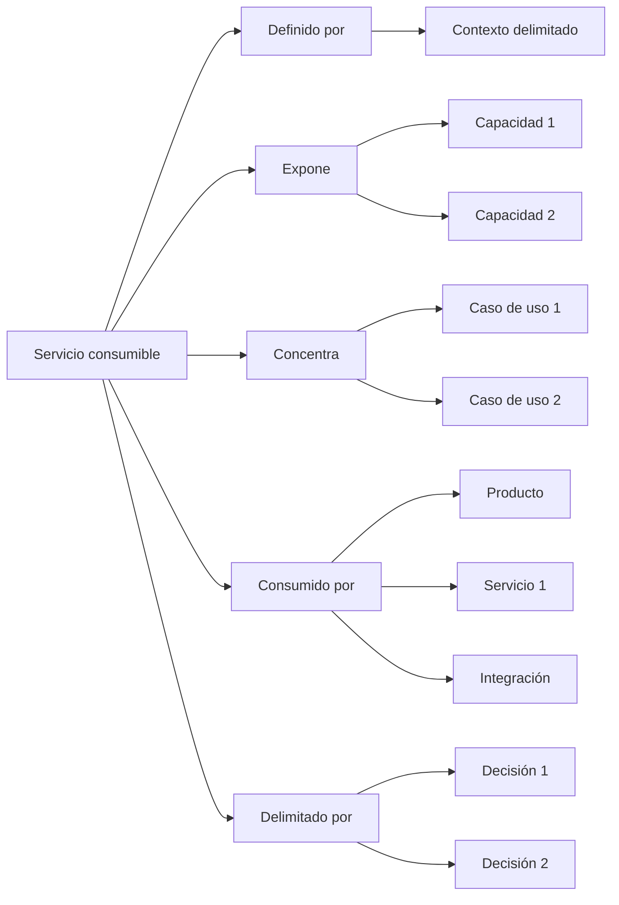

# Perspectiva "Servicio consumible"

La perspectiva "Servicio consumible" organiza la documentación desde la pregunta: **¿Qué capacidades ofrece este sistema para ser usado por otros?**, observada desde una mirada de diseño de software.

Esta perspectiva ayuda a entender qué acciones, capacidades o comportamientos expone un servicio dentro de un contexto delimitado.

Un servicio consumible puede representar un microservicio, una API, un backend, un módulo de aplicación o un segmento de software que concentra casos de uso específicos para responder a una parte del dominio.

En esta perspectiva, el servicio no se entiende solo como infraestructura técnica.

Se entiende como una pieza de software que ofrece capacidades consumibles por productos, otros servicios, automatizaciones, integraciones o procesos.

## A qué orienta esta perspectiva

La perspectiva "Servicio consumible" orienta hacia las capacidades que un sistema expone dentro de un contexto delimitado.

Ayuda a ver:

* qué contexto delimita el servicio
* qué capacidades ofrece el servicio
* qué casos de uso concentra
* qué productos, servicios o procesos consumen sus capacidades
* qué lenguaje de dominio necesita preservar
* qué reglas, invariantes o errores esperados gobiernan su comportamiento
* qué decisiones explican sus límites técnicos y conceptuales
* qué validaciones confirman o cambian su comportamiento esperado

Esta perspectiva es útil cuando el equipo necesita entender qué puede ser consumido desde una pieza de software y bajo qué intención de dominio.

## Qué ayuda a responder

La perspectiva "Servicio consumible" ayuda a responder preguntas como:

* ¿Qué contexto delimita este servicio?
* ¿Qué capacidades ofrece?
* ¿Qué casos de uso pertenecen a este servicio?
* ¿Qué productos, servicios o integraciones consumen estas capacidades?
* ¿Qué reglas de negocio debe proteger?
* ¿Qué errores esperados forman parte de su comportamiento?
* ¿Qué datos, contratos o eventos necesita exponer?
* ¿Qué decisiones explican sus límites?
* ¿Qué validaciones cambiaron la comprensión del servicio?

## Documentos útiles

Estos documentos suelen ser útiles dentro de una perspectiva de servicio consumible:

| Documento                                                       | Uso dentro de la perspectiva                                                                   |
| --------------------------------------------------------------- | ---------------------------------------------------------------------------------------------- |
| [Documento de contexto](../../taxonomy/context-document.md)     | Explica el contexto delimitado donde el servicio tiene sentido.                                |
| [Vocabulario de dominio](../../taxonomy/domain-vocabulary.md)   | Preserva el lenguaje necesario para nombrar capacidades, reglas, entidades, eventos y errores. |
| [Documento de proceso](../../taxonomy/process-document.md)      | Explica qué procesos o flujos son soportados por el servicio.                                  |
| [Documento de caso de uso](../../taxonomy/use-case-document.md) | Describe los comportamientos específicos que el servicio expone o ejecuta.                     |
| [Documento de capacidad](../../taxonomy/capability-document.md) | Identifica capacidades estables que el servicio ofrece, usa o preserva.                        |
| [Registro de decisión](../../taxonomy/decision-record.md)       | Preserva decisiones sobre límites, contratos, arquitectura, integración o responsabilidades.   |
| [Nota de validación](../../taxonomy/validation-note.md)         | Captura evidencia que confirma o cambia el comportamiento esperado del servicio.               |
| [Nota de soporte](../../taxonomy/support-note.md)               | Preserva conocimiento temprano, incierto o local antes de darle estructura formal.             |

No todos estos documentos son obligatorios.

La perspectiva solo ayuda a observar qué documentación explica mejor el servicio consumible.

## Camino típico

Un camino desde servicio consumible suele mostrar qué contexto delimita el servicio, qué capacidades expone y qué casos de uso pertenecen a su responsabilidad.

Camino de continuidad desde la perspectiva de servicio consumible

Este camino no significa que todo servicio deba tener todos esos elementos.

Significa que la perspectiva de servicio consumible ayuda a mostrar qué contexto lo delimita, qué capacidades expone, qué casos de uso concentra, quién lo consume y qué decisiones explican sus límites.

## Paradas comunes

Una parada es un punto del camino donde puede existir documentación con distinta profundidad.

| Parada              | Qué permite observar                                                                       |
| ------------------- | ------------------------------------------------------------------------------------------ |
| Servicio consumible | La pieza de software que ofrece capacidades para ser usadas por otros.                     |
| Contexto delimitado | El límite conceptual donde el servicio tiene sentido y responsabilidad.                    |
| Capacidad           | Algo estable que el servicio puede ofrecer, usar o preservar.                              |
| Caso de uso         | Un comportamiento específico que el servicio debe ejecutar o habilitar.                    |
| Producto consumidor | Una experiencia visible que usa capacidades del servicio.                                  |
| Servicio consumidor | Otro servicio que depende de capacidades expuestas.                                        |
| Integración         | Un sistema, proceso o actor técnico que consume o intercambia información con el servicio. |
| Contrato            | La forma en que el servicio expone una capacidad, dato, comando, consulta o evento.        |
| Decisión            | Una elección que explica límites, responsabilidades, arquitectura o integración.           |
| Validación          | Evidencia que confirma, corrige o cambia el comportamiento esperado del servicio.          |

## Profundidad documental

La perspectiva de servicio consumible ayuda a ver qué tan clara está cada parte de la responsabilidad del servicio.

| Profundidad  | Significado                                                                              |
| ------------ | ---------------------------------------------------------------------------------------- |
| Identificada | La capacidad o comportamiento existe, pero todavía tiene poca documentación.             |
| Mínima       | Hay documentación suficiente para apoyar implementación o consumo cercano.               |
| Ampliada     | Hay más detalle porque existe riesgo, integración, ambigüedad o dependencia.             |
| Referencia   | El conocimiento es estable y relevante para consumidores, decisiones o evolución futura. |

No todo dentro de un servicio necesita la misma profundidad.

Una capacidad puede estar estable, un caso de uso puede estar en exploración y un contrato puede estar pendiente de validación.

## Riesgos a evitar

!!! risk "Riesgo a evitar"

    No confundas servicio consumible con una simple capa técnica sin intención de dominio.

La perspectiva "Servicio consumible" debería ayudar a entender qué capacidades ofrece una pieza de software dentro de un contexto delimitado.

No debería convertirse en una lista de endpoints, clases, controladores o detalles de infraestructura sin relación con el dominio.

También conviene evitar:

* definir servicios sin explicar el contexto que los delimita
* mezclar capacidades de varios contextos en un mismo servicio
* documentar endpoints sin explicar los casos de uso que sostienen
* confundir contrato técnico con intención de dominio
* ocultar quién consume el servicio
* tratar errores esperados como detalles secundarios
* asumir que todo servicio consumible debe ser un microservicio desplegado de forma independiente

## Principio de continuidad

!!! principle "Principio de Continuidad"

    La perspectiva de servicio consumible debería ayudar a entender qué capacidades ofrece una pieza de software, dentro de qué contexto delimitado y para qué consumidores.
