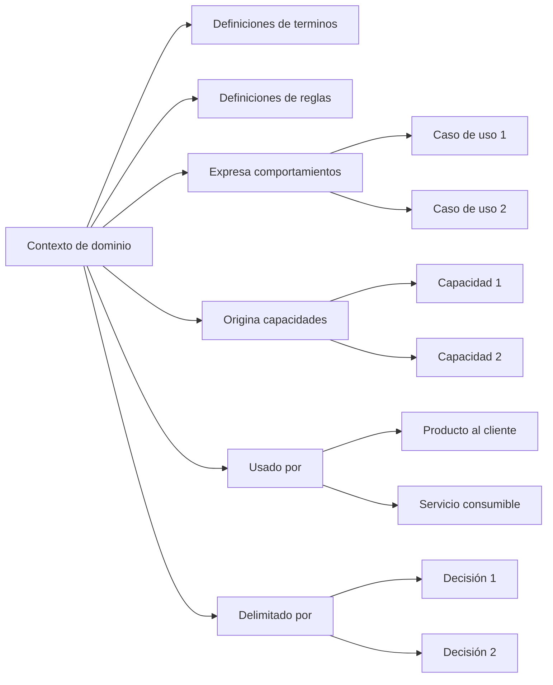

# Perspectiva "Contexto de dominio"

La perspectiva "Contexto de dominio" organiza la documentación desde la pregunta: **¿Qué lenguaje, reglas y límites pertenecen a esta parte del negocio?**, observada desde una mirada de modelado de dominio.

Esta perspectiva ayuda a entender cómo se organiza semánticamente una parte del negocio antes de convertirla en productos, servicios, capacidades o decisiones de software.

Un contexto de dominio puede representar una zona conceptual del negocio donde ciertos términos, reglas, comportamientos y responsabilidades tienen un significado específico.

No todo escenario de negocio necesita ser un único contexto de dominio.

Un mismo escenario puede contener varios contextos de dominio, y un mismo término puede cambiar de significado entre contextos distintos.

## A qué orienta esta perspectiva

La perspectiva "Contexto de dominio" orienta hacia los límites semánticos del negocio.

Ayuda a ver:

* qué parte del negocio necesita un lenguaje propio
* qué conceptos pertenecen juntos
* qué términos tienen significado específico dentro del contexto
* qué reglas o invariantes pertenecen a esta parte del negocio
* qué comportamientos son propios del contexto
* qué capacidades podrían surgir desde este dominio
* qué productos o servicios usan conceptos de este contexto
* qué decisiones explican sus límites conceptuales

Esta perspectiva es útil cuando el equipo necesita proteger el significado del negocio antes de diseñar productos, servicios o estructuras técnicas.

## Qué ayuda a responder

La perspectiva "Contexto de dominio" ayuda a responder preguntas como:

* ¿Qué parte del negocio estamos modelando?
* ¿Qué lenguaje pertenece a este contexto?
* ¿Qué conceptos deberían mantenerse juntos?
* ¿Qué términos cambian de significado fuera de este contexto?
* ¿Qué reglas o invariantes deben protegerse?
* ¿Qué comportamientos pertenecen realmente a este contexto?
* ¿Qué capacidades nacen desde este dominio?
* ¿Qué productos o servicios consumen o exponen este conocimiento?
* ¿Qué decisiones explican los límites del contexto?

## Documentos útiles

Estos documentos suelen ser útiles dentro de una perspectiva de contexto de dominio:

| Documento                                                       | Uso dentro de la perspectiva                                                                         |
| --------------------------------------------------------------- | ---------------------------------------------------------------------------------------------------- |
| [Vocabulario de dominio](../../taxonomy/domain-vocabulary.md)   | Preserva el lenguaje, conceptos, términos ambiguos y significados propios del contexto.              |
| [Documento de contexto](../../taxonomy/context-document.md)     | Explica el contexto donde el dominio aparece, sus límites y su relación con el escenario de negocio. |
| [Documento de proceso](../../taxonomy/process-document.md)      | Muestra cómo las reglas y conceptos del dominio aparecen dentro del trabajo operativo.               |
| [Documento de caso de uso](../../taxonomy/use-case-document.md) | Describe comportamientos específicos que expresan reglas o intención del dominio.                    |
| [Documento de capacidad](../../taxonomy/capability-document.md) | Identifica capacidades estables que nacen del dominio o dependen de sus reglas.                      |
| [Registro de decisión](../../taxonomy/decision-record.md)       | Preserva decisiones sobre límites, nombres, responsabilidades, separación de contextos o modelado.   |
| [Nota de validación](../../taxonomy/validation-note.md)         | Captura evidencia que confirma, corrige o cambia la comprensión del dominio.                         |
| [Nota de soporte](../../taxonomy/support-note.md)               | Preserva observaciones tempranas, dudas semánticas o conocimiento local antes de formalizarlo.       |

No todos estos documentos son obligatorios.

La perspectiva solo ayuda a observar qué documentación explica mejor el significado y los límites de una parte del negocio.

## Camino típico

Un camino desde contexto de dominio suele mostrar qué lenguaje pertenece al contexto, qué reglas protege y qué capacidades o comportamientos nacen desde ese significado.

Camino de continuidad desde la perspectiva de contexto de dominio

Este camino no significa que todo contexto de dominio deba tener todos esos elementos.

Significa que la perspectiva de contexto de dominio ayuda a mostrar qué lenguaje, reglas, comportamientos y capacidades pertenecen a una parte del negocio, y qué productos o servicios dependen de ese significado.

## Paradas comunes

Una parada es un punto del camino donde puede existir documentación con distinta profundidad.

| Parada              | Qué permite observar                                                                            |
| ------------------- | ----------------------------------------------------------------------------------------------- |
| Contexto de dominio | La zona conceptual del negocio donde el lenguaje y las reglas tienen un significado específico. |
| Definición de lenguage | Las palabras o conceptos cuyo significado debe preservarse dentro del contexto.              |
| Definición de reglas   | Las condiciones, restricciones o criterios que debe respetarse dentro del contexto.          |
| Invariante          | Una regla que debe mantenerse verdadera para preservar la consistencia del dominio.             |
| Caso de uso         | Un comportamiento específico que expresa intención o reglas del contexto.                       |
| Capacidad           | Algo estable que nace del dominio o depende de sus reglas.                                      |
| Producto al cliente | Un sistema visible que usa conceptos o comportamientos de este contexto.                        |
| Servicio consumible | Una pieza de software que expone capacidades relacionadas con este contexto.                    |
| Decisión            | Una elección que explica límites, nombres, responsabilidades o separación de contextos.         |
| Validación          | Evidencia que confirma, corrige o cambia la comprensión del dominio.                            |

## Profundidad documental

La perspectiva de contexto de dominio ayuda a ver qué tan clara está la organización semántica del negocio.

| Profundidad  | Significado                                                                                 |
| ------------ | ------------------------------------------------------------------------------------------- |
| Identificada | El concepto, regla o límite existe, pero todavía tiene poca documentación.                  |
| Mínima       | Hay documentación suficiente para evitar confusión cercana.                                 |
| Ampliada     | Hay más detalle porque existe ambigüedad, riesgo, dependencia o diferencia entre contextos. |
| Referencia   | El conocimiento es estable y relevante para diseño, implementación o evolución futura.      |

No todo dentro de un contexto de dominio necesita la misma profundidad.

Un término puede estar bien definido, una regla puede estar en discusión y una frontera con otro contexto puede estar apenas identificada.

## Riesgos a evitar

!!! risk "Riesgo a evitar"

    No confundas contexto de dominio con estructura técnica, módulo o servicio desplegable.

La perspectiva "Contexto de dominio" debería ayudar a entender el significado de una parte del negocio.

No debería convertirse automáticamente en arquitectura, carpetas, microservicios o límites de despliegue.

También conviene evitar:

* usar nombres técnicos antes de entender el lenguaje del negocio
* mezclar términos que significan cosas distintas en contextos distintos
* asumir que todo escenario de negocio es un único contexto de dominio
* convertir cada concepto en un servicio separado
* documentar reglas sin explicar dónde aplican
* ocultar ambigüedades semánticas detrás de nombres genéricos
* tratar el vocabulario como glosario decorativo y no como límite de significado

## Principio de continuidad

!!! principle "Principio de Continuidad"

    La perspectiva de contexto de dominio debería ayudar a preservar el lenguaje, las reglas y los límites conceptuales del negocio antes de convertirlos en software.
