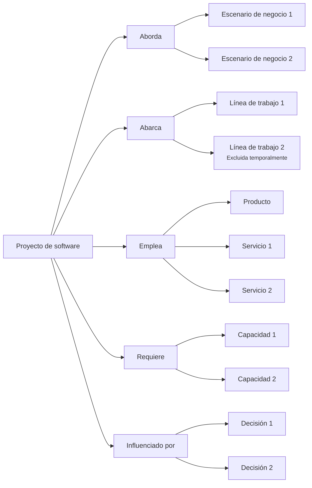

# Perspectiva "Proyecto de software"

La perspectiva "Proyecto de software" organiza la documentación desde la pregunta: **¿Qué herramientas tengo para abordar esta parte del trabajo?**, observada desde una mirada de análisis de software.

En esta perspectiva, "herramientas" no se refiere solo a tooling técnico.

Se refiere a los productos, servicios, capacidades, procesos soportados, decisiones y límites que permiten intervenir una parte del escenario de negocio mediante software.

Esta perspectiva ayuda a entender qué intenta cubrir un proyecto de software, qué productos o servicios participan, qué líneas de trabajo abarca y qué procesos o flujos quedan dentro o fuera del alcance.

Un proyecto de software puede representar una modernización, una automatización, una migración, una integración, una mejora operativa o cualquier esfuerzo organizado para construir, modificar o estabilizar software dentro de un escenario de negocio.

## A qué orienta esta perspectiva

La perspectiva "Proyecto de software" orienta hacia el alcance técnico y funcional de una iniciativa.

Ayuda a ver:

* qué parte del escenario de negocio intenta abordar el proyecto
* qué productos forman parte del proyecto
* qué servicios sostienen o habilitan el trabajo
* qué capacidades necesita construir, usar o estabilizar
* qué líneas de trabajo, procesos o flujos están incluidos
* qué partes quedan excluidas, pendientes o solo mencionadas
* qué decisiones explican el alcance del proyecto
* qué documentos explican la cobertura del proyecto

Esta perspectiva es útil cuando el equipo necesita entender qué piezas de software tiene disponibles, cuáles debe construir y qué parte del escenario intenta intervenir.

## Qué ayuda a responder

La perspectiva "Proyecto de software" ayuda a responder preguntas como:

* ¿Qué intenta resolver, habilitar o estabilizar este proyecto?
* ¿Qué parte del escenario de negocio cubre?
* ¿Qué productos participan?
* ¿Qué servicios participan?
* ¿Qué capacidades necesita el proyecto?
* ¿Qué líneas de trabajo, procesos o flujos están incluidos?
* ¿Qué queda fuera del alcance actual?
* ¿Qué partes están digitalizadas, en proceso, pendientes o excluidas?
* ¿Qué decisiones explican el alcance del proyecto?
* ¿Qué validaciones cambiaron la comprensión del proyecto?

## Documentos útiles

Estos documentos suelen ser útiles dentro de una perspectiva de proyecto de software:

| Documento                                                       | Uso dentro de la perspectiva                                                                              |
| --------------------------------------------------------------- | --------------------------------------------------------------------------------------------------------- |
| [Documento de contexto](../../taxonomy/context-document.md)     | Explica el contexto del proyecto, su alcance, sus límites y la parte del escenario de negocio que aborda. |
| [Vocabulario de dominio](../../taxonomy/domain-vocabulary.md)   | Preserva el lenguaje necesario para entender el proyecto y sus límites.                                   |
| [Documento de proceso](../../taxonomy/process-document.md)      | Describe los procesos o flujos que el proyecto debe soportar, modificar o preservar.                      |
| [Documento de caso de uso](../../taxonomy/use-case-document.md) | Explica comportamientos específicos que el proyecto debe habilitar, cambiar o preservar.                  |
| [Documento de capacidad](../../taxonomy/capability-document.md) | Identifica capacidades que el proyecto necesita construir, usar o estabilizar.                            |
| [Registro de decisión](../../taxonomy/decision-record.md)       | Preserva decisiones sobre alcance, límites, inclusión, exclusión, priorización o arquitectura.            |
| [Nota de validación](../../taxonomy/validation-note.md)         | Captura evidencia que confirma o cambia la dirección del proyecto.                                        |
| [Nota de soporte](../../taxonomy/support-note.md)               | Preserva conocimiento temprano, incierto o local antes de darle estructura formal.                        |

No todos estos documentos son obligatorios.

La perspectiva solo ayuda a observar qué documentación explica mejor el proyecto de software.

## Camino típico

Un camino desde proyecto de software suele mostrar qué parte del escenario aborda una iniciativa, qué piezas de software emplea y qué decisiones delimitan su alcance.

Camino de continuidad desde la perspectiva de proyecto de software

Este camino no significa que un proyecto deba tener todos esos elementos.

Significa que la perspectiva de proyecto de software ayuda a mostrar qué cubre la iniciativa, qué excluye, qué productos o servicios participan, qué capacidades requiere y qué decisiones justifican ese alcance.

## Paradas comunes

Una parada es un punto del camino donde puede existir documentación con distinta profundidad.

| Parada               | Qué permite observar                                                                        |
| -------------------- | ------------------------------------------------------------------------------------------- |
| Proyecto de software | La iniciativa técnica organizada que intenta intervenir una parte del escenario de negocio. |
| Escenario de negocio | El contexto operativo que el proyecto intenta modificar, sostener o entender.               |
| Línea de trabajo     | Una parte del trabajo que el proyecto cubre, menciona o excluye explícitamente.             |
| Producto             | Una experiencia o sistema visible para usuarios dentro del proyecto.                        |
| Servicio             | Una capacidad, operación o backend que sostiene parte del proyecto.                         |
| Capacidad            | Algo que el proyecto necesita construir, usar, estabilizar o preservar.                     |
| Decisión             | Una elección que explica alcance, prioridad, límites o dirección técnica.                   |

## Profundidad documental

La perspectiva de proyecto de software ayuda a ver qué tan clara está cada parte del alcance.

| Profundidad  | Significado                                                                   |
| ------------ | ----------------------------------------------------------------------------- |
| Identificada | La parte existe en el proyecto, pero todavía tiene poca documentación.        |
| Mínima       | Hay documentación suficiente para apoyar trabajo cercano.                     |
| Ampliada     | Hay más detalle porque existe riesgo, coordinación, ambigüedad o dependencia. |
| Referencia   | El conocimiento es estable y relevante para varias decisiones futuras.        |

No todo dentro de un proyecto necesita la misma profundidad.

Un producto puede estar claramente definido, un servicio puede estar en exploración y una línea de trabajo puede estar mencionada, pero excluida.

## Riesgos a evitar

!!! risk "Riesgo a evitar"

    No confundas proyecto de software con escenario de negocio completo ni producto con proyecto completo.

La perspectiva "Proyecto de software" debería ayudar a entender la cobertura técnica y funcional de una iniciativa.

No debería convertir el proyecto en una explicación total de la organización ni reducirlo solo a una interfaz de usuario.

También conviene evitar:

* documentar todo el escenario de negocio como si fuera parte del proyecto
* ocultar qué queda fuera del alcance
* mezclar productos y servicios sin explicar su relación
* tratar exclusiones como conocimiento inexistente
* avanzar con implementación sin preservar decisiones de alcance
* asumir que todo proyecto debe terminar en un único producto o servicio
* confundir capacidades necesarias con funcionalidades visibles para el usuario

## Principio de continuidad

!!! principle "Principio de Continuidad"

    La perspectiva de proyecto de software debería ayudar a entender qué parte del escenario de negocio aborda una iniciativa, qué piezas de software usa o necesita y qué decisiones explican su alcance.
