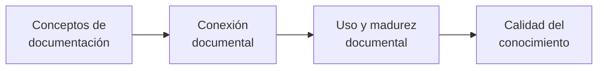
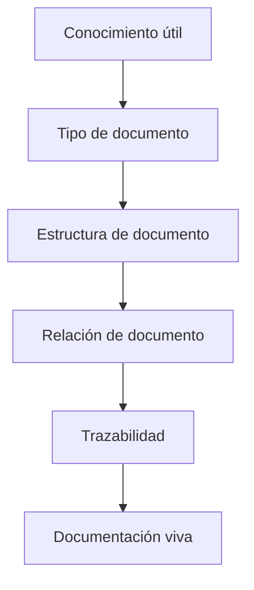

# Glosario de VSlices Docs Standard

Este glosario define conceptos usados por VSlices Docs Standard.

VSlices Docs Standard se enfoca en preservar conocimiento útil mediante estructuras de documentación viva.

Este glosario no redefine cada tipo de documento. Los tipos de documento específicos se explican en la taxonomía de Docs Standard y en sus propias páginas.

Estos términos ayudan a describir qué tipo de conocimiento debe documentarse, por qué importa y cómo los documentos pueden seguir conectados con el trabajo real.

## Cómo leer este glosario

Este glosario está organizado alrededor del conocimiento que la documentación debe preservar.

Primero define conceptos básicos de documentación, luego conceptos de conexión entre documentos, después conceptos de uso documental y finalmente conceptos de calidad del conocimiento.

Ruta de lectura para los términos de VSlices Docs Standard

Este diagrama muestra una forma útil de leer los términos. No representa una secuencia obligatoria de trabajo.

## Conceptos de documentación

* **Documentación viva**: documentación que evoluciona junto con el sistema, las decisiones, la comprensión del dominio, la implementación, la validación y el feedback.

* **Estructura de documento**: la forma esperada de un documento, incluyendo su propósito, secciones, relaciones y uso previsto.

* **Tipo de documento**: una forma reutilizable de documentación usada para preservar un tipo específico de conocimiento, como contexto, proceso, comportamiento, capacidad, decisión o validación.

* **Artefacto de conocimiento**: una pieza de conocimiento preservada de la que el trabajo futuro puede depender, como un documento, una nota, un diagrama, una decisión, un ejemplo o un resultado de validación.

* **Límite de documentación**: el límite que define qué debe explicar un documento y qué debe dejarse a otro documento.

## Conexión documental

* **Relación de documento**: una conexión entre documentos que ayuda a preservar trazabilidad entre contexto, decisiones, procesos, comportamientos, capacidades, validación e implementación.

* **Referencia**: un enlace explícito desde un documento hacia otro documento, concepto, decisión, comportamiento o artefacto.

* **Trazabilidad**: la capacidad de seguir cómo el conocimiento se mueve entre descubrimiento, documentación, diseño, arquitectura, implementación, validación y evolución.

## Uso y madurez documental

* **Etapa de documento**: el nivel de madurez, estabilidad o confianza que representa actualmente un documento.

* **Afinidad de documento**: la relación natural entre un tipo de documento y el tipo de trabajo, conocimiento, incertidumbre o etapa del ciclo de vida que mejor apoya.

## Calidad del conocimiento

* **Conocimiento útil**: conocimiento que ayuda al trabajo futuro a entender, decidir, implementar, validar, mantener o evolucionar algo con más seguridad.

* **Intención preservada**: el razonamiento, significado, propósito y restricciones que deberían seguir siendo comprensibles después de que la discusión o decisión original haya pasado.

* **Deriva de documentación**: la distancia que aparece cuando la documentación y el comportamiento real del sistema evolucionan por separado.

* **Conocimiento desactualizado**: conocimiento documentado que ya no refleja la comprensión, el comportamiento, la decisión o la implementación actuales.

* **Deuda de documentación**: brechas de documentación acumuladas, explicaciones desactualizadas, decisiones faltantes o conocimiento desconectado que hacen más difícil el trabajo futuro.

## Relación entre los términos

VSlices Docs Standard ayuda a los equipos a preservar conocimiento usando la estructura de documento más pequeña útil.

Relación entre conocimiento útil, estructura documental y documentación viva

Esto no es un requisito para documentarlo todo.

Un equipo debe documentar el conocimiento del que depende el trabajo futuro, usando la estructura más pequeña que preserve suficiente significado, contexto e intención.

El objetivo no es más documentación. El objetivo es menos pérdida de conocimiento.
