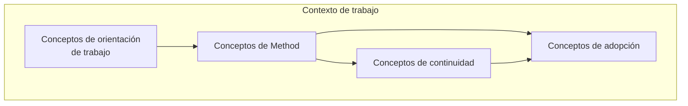
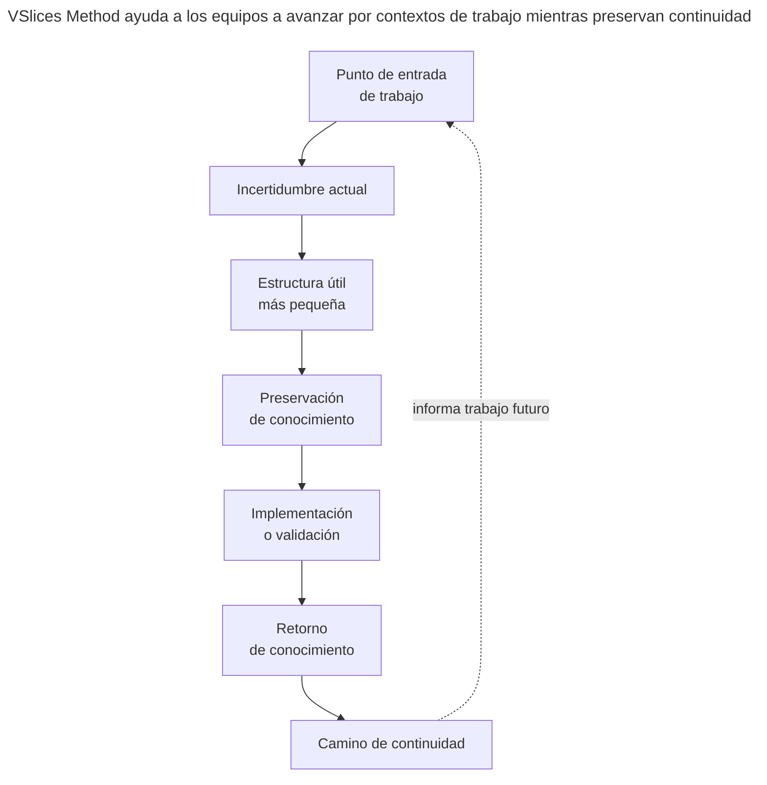

# Glosario de VSlices Method

Este glosario define términos usados por VSlices Method.

VSlices Method se enfoca en cómo VSlices Design, VSlices Docs Standard y VSlices Framework pueden usarse durante trabajo real para preservar continuidad a través de descubrimiento, documentación, diseño, arquitectura, implementación, validación y evolución.

Estos términos ayudan a describir cómo los equipos avanzan a través de incertidumbre sin forzar un proceso rígido.

## Cómo leer este glosario

Relación entre familias de términos

 

Este diagrama muestra una ruta de lectura, no un proceso obligatorio.

* **[Conceptos de Method](#conceptos-de-method)**: describen cómo el trabajo avanza a través de incertidumbre.
* **[Conceptos de orientación de trabajo](#conceptos-de-orientacion-de-trabajo)**: describen desde dónde puede comenzar el trabajo.
* **[Conceptos de continuidad](#conceptos-de-continuidad)**: describen cómo el conocimiento permanece conectado en el tiempo.
* **[Conceptos de adopción](#conceptos-de-adopcion)**: describen cuánta estructura es útil en un contexto determinado.

Un equipo puede comenzar desde un contexto, un problema, una slice, un resultado de validación, una implementación existente o una preocupación de adopción. Lo importante es que el trabajo permanezca conectado al conocimiento que explica por qué existe y cómo debería evolucionar.

## Conceptos de Method

Estos conceptos ayudan a los equipos a decidir cómo avanzar dentro de un contexto de trabajo sin depender de un proceso rígido.

* **Camino de continuidad**: el camino conectado que sigue una pieza de trabajo a través de descubrimiento, razonamiento de diseño, documentación, arquitectura, implementación, validación y evolución.

* **Punto de entrada de trabajo**: el lugar donde un equipo comienza una pieza de trabajo, como un escenario, problema, workflow, caso de uso, documento, decisión, slice de implementación o resultado de validación.

* **Incertidumbre actual**: la falta de entendimiento más importante que hace riesgosa la siguiente decisión, documento, diseño o implementación.

* **Estructura útil más pequeña**: la cantidad mínima de estructura de proceso, documentación, diseño o implementación necesaria para preservar el conocimiento del que depende el trabajo futuro.

* **Guía de Method**: orientación práctica para decidir cómo usar los productos de VSlices en un contexto de trabajo específico sin imponer un proceso universal.

## Conceptos de orientación de trabajo

Estos conceptos ayudan a identificar desde dónde comienza el trabajo y establecen una orientación para el equipo.

* **Trabajo orientado al contexto**: trabajo que comienza entendiendo el escenario circundante, ambiente de negocio, organización, operación, sistema o restricciones antes de acotarse hacia un problema o implementación específica.

* **Trabajo orientado al problema**: trabajo que comienza desde una tensión, necesidad, riesgo, pregunta, falla u oportunidad visible que necesita entenderse antes de decidir qué construir.

* **Trabajo orientado a slice**: trabajo que comienza desde una slice pequeña y útil de implementación, documentación, validación o entrega para aprender de forma segura desde feedback real.

* **Trabajo orientado a validación**: trabajo que comienza desde la necesidad de confirmar, rechazar o refinar un supuesto, decisión, documento, comportamiento, implementación o idea de producto.

* **Trabajo orientado a evolución**: trabajo que comienza desde cambiar, extender, corregir, reemplazar o mejorar conocimiento, documentación, arquitectura o implementación existente.

## Conceptos de continuidad

Estos conceptos ayudan a preservar y reconectar conocimiento del dominio, haciendo que el trabajo siga siendo entendible después de decisiones, implementación o validación.

* **Preservación de conocimiento**: el acto de mantener entendimiento importante disponible para trabajo futuro, especialmente cuando decisiones, comportamientos, límites, riesgos o validaciones podrían olvidarse.

* **Retorno de conocimiento**: el acto de traer aprendizaje desde implementación, validación, uso, revisión o feedback de vuelta hacia documentación, razonamiento de diseño, decisiones y trabajo futuro.

* **Ruptura de continuidad**: un punto donde descubrimiento, documentación, razonamiento de diseño, arquitectura, implementación, validación o evolución se desconectan entre sí.

* **Ciclo de continuidad**: el movimiento recurrente desde entendimiento hacia documentación, diseño, implementación, validación, aprendizaje y entendimiento mejorado.

* **Trabajo trazable**: trabajo cuyo contexto, decisiones, comportamiento, documentación, implementación, validación y cambios futuros todavía pueden seguirse después de que el trabajo se completa.

## Conceptos de adopción

Estos conceptos ayudan a ajustar la cantidad de estructura sin agregar ceremonia innecesaria.

* **Adopción progresiva**: adoptar productos, documentos, patrones o prácticas de VSlices gradualmente según necesidad real, en vez de intentar usar toda la suite de una vez.

* **Utilidad local**: el valor que un concepto, documento, método o patrón de implementación de VSlices entrega en el contexto actual antes de tratarse como generalmente útil.

* **Estructura suficiente**: la cantidad de estructura necesaria para reducir confusión, preservar intención, apoyar decisiones o habilitar evolución segura sin agregar ceremonia innecesaria.

* **Sobreestructuración**: agregar más estructura de proceso, documentación, abstracción, arquitectura o framework de la que justifica la incertidumbre actual o necesidad del dominio.

* **Subestructuración**: usar muy poca estructura para preservar conocimiento importante, causando que el trabajo futuro dependa de memoria, explicaciones repetidas o supuestos frágiles.

## Relación entre los términos

Esta no es una secuencia obligatoria.

Un equipo puede comenzar desde contexto, un problema, una slice, un documento, una implementación existente, una decisión o feedback de validación.

Lo importante es que el trabajo permanezca conectado al conocimiento que explica por qué existe, cómo debería evolucionar y de qué depende el trabajo futuro.
