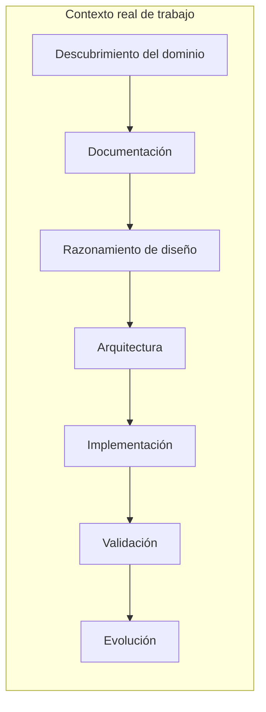

# VSlices Method

VSlices Method explica cómo aplicar VSlices Design y VSlices Docs Standard dentro de contextos reales de trabajo.

No define un proceso rígido.

Ayuda a los equipos a decidir cómo moverse a través de la incertidumbre, qué modo de trabajo encaja con el contexto actual y qué conocimiento debería preservarse antes de avanzar.

!!! principle "Principio de Method"

    Usa la estructura mínima útil para preservar continuidad durante el trabajo real.

## Propósito

VSlices Method existe para guiar cómo los equipos trabajan con contextos cambiantes.

Ayuda a responder preguntas como:

* ¿Qué tipo de contexto estamos abordando?
* ¿Qué modalidad de diseño debería guiar esta iteración?
* ¿Qué conocimiento necesitamos antes de construir?
* ¿Qué conocimiento debería preservarse mientras construimos?
* ¿Cómo vuelve el feedback a la siguiente iteración?

Method conecta razonamiento, documentación, colaboración y aprendizaje. No reemplaza el juicio.

## Idea central

VSlices Method preserva continuidad entre etapas del trabajo.

VSlices Method preserva continuidad entre etapas

Esto no significa que Method obligue a pasar por etapas fijas.

Significa que el conocimiento descubierto, documentado, diseñado, implementado, validado y aprendido debería mantenerse conectado.

La pregunta no es: **¿Qué documentos son requeridos por esta etapa?**, sino: **¿Qué conocimiento necesitamos preservar para tomar la siguiente decisión responsable?**

## Qué proporciona

VSlices Method proporciona:

* **guías de trabajo** para aplicar VSlices en contextos reales sin imponer un proceso universal
* **criterios de modalidad** para decidir cuándo trabajar desde contexto, problema, slice, validación o evolución
* **patrones de continuidad** para mantener conectado el conocimiento entre decisiones, documentación, implementación y aprendizaje
* **orientación de adopción** para introducir VSlices de forma progresiva y útil

## Relación con la VSlices Suite

VSlices Method conecta los productos de la suite durante el trabajo real.

| Producto                                               | Relación con VSlices Method                                           |
| ------------------------------------------------------ | --------------------------------------------------------------------- |
| **[VSlices Design](../design/index.md)**               | Define modalidades de diseño y herramientas de razonamiento.          |
| **[VSlices Docs Standard](../docs-standard/index.md)** | Define tipos de documento para preservar conocimiento.                |
| **[VSlices Framework](../framework/index.md)**         | Puede reflejar algunas ideas en código, pero Method no depende de él. |

Method debería seguir siendo útil incluso cuando no hay código de VSlices Framework involucrado.

## Estructura

VSlices Method está organizado alrededor de:

* **[patrones](patterns/index.md)**, para decisiones recurrentes de Method como colaboración, selección de modalidad y ciclos de aprendizaje
* **[guías de integración](context-guides/index.md)**, para aplicar Method en distintos contextos de trabajo

Estas secciones son guías, no pasos obligatorios de proceso. Usa solo lo que ayude a preservar continuidad para el trabajo en curso.
