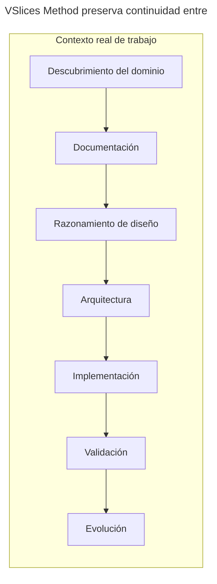

# VSlices Method

VSlices Method explica cómo aplicar VSlices Design y VSlices Docs Standard dentro de contextos reales de trabajo.

 

VSlices Method no define un proceso rígido.

Ayuda a los equipos a decidir cómo moverse a través de la incertidumbre, qué modo de trabajo encaja con el contexto actual y qué conocimiento debería preservarse antes de avanzar.

## Propósito

VSlices Method existe para guiar cómo los equipos trabajan con contextos cambiantes. Ayuda a responder preguntas como:

* ¿Qué tipo de contexto estamos abordando?
* ¿Qué modalidad de diseño debería guiar esta iteración?
* ¿Qué conocimiento necesitamos antes de construir?
* ¿Qué conocimiento debería preservarse mientras construimos?
* ¿Cómo vuelve el feedback a la siguiente iteración?

Method conecta razonamiento, documentación, colaboración y aprendizaje. No reemplaza el juicio.

## Idea central

VSlices Method sigue un principio de trabajo: **Usar la estructura de trabajo más pequeña que preserve el conocimiento del que dependerá el trabajo futuro**.

Esto significa que Method no debería pedir a los equipos que documenten todo. Debería ayudarles a notar qué conocimiento podría perderse si avanzan sin preservarlo.

La pregunta no es: **¿Qué documentos son requeridos por esta etapa?**

La mejor pregunta es: **¿Qué conocimiento necesitamos preservar para tomar la siguiente decisión responsable?**

## Relación con otros productos de VSlices

VSlices Method depende conceptualmente de:

* **VSlices Design**, que define modalidades de diseño y el flujo compartido de iteración.
* **VSlices Docs Standard**, que define tipos de documento para preservar conocimiento.

VSlices Framework puede implementar algunas ideas en código más adelante, pero Method no depende de él. Method debería seguir siendo útil incluso cuando no hay código de VSlices Framework involucrado.

## Estructura

VSlices Method está organizado alrededor de:

* **afinidad documento-etapa**, para entender cómo los documentos pueden apoyar cada etapa de trabajo.
* **patrones**, para decisiones recurrentes de Method como colaboración, selección de modalidad y ciclos de aprendizaje.
* **guías de integración**, para aplicar Method en distintos contextos de trabajo.

Estas secciones son guías, no pasos obligatorios de proceso. Usa solo lo que ayude a preservar continuidad para el trabajo en curso.
