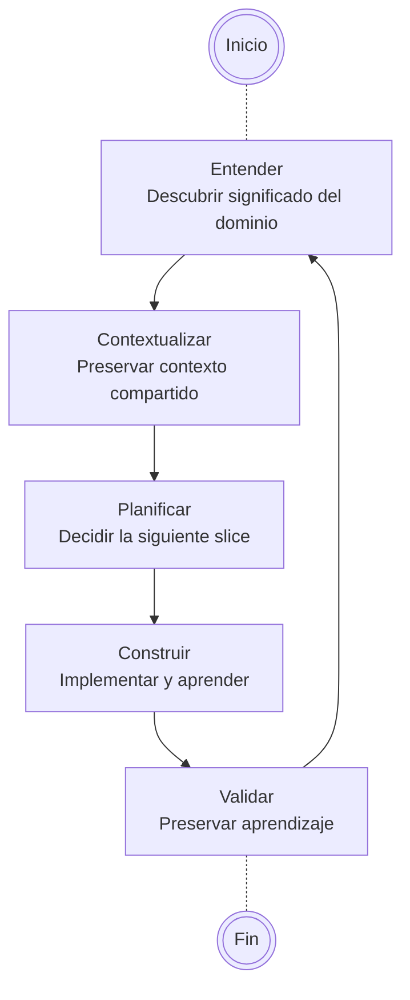

```mermaid
graph TD

  S(((Inicio)))

  understanding["Entender<br/>Descubrir significado del dominio"]
  contextualizing["Contextualizar<br/>Preservar contexto compartido"]
  planning["Planificar<br/>Decidir la siguiente slice"]

  building["Construir<br/>Implementar y aprender"]
  validation["Validar<br/>Preservar aprendizaje"]

  F(((Fin)))

  S -.- understanding

  understanding --> contextualizing
  contextualizing --> planning
  planning --> building
  building --> validation
  validation --> understanding

  validation -.- F

```
 
