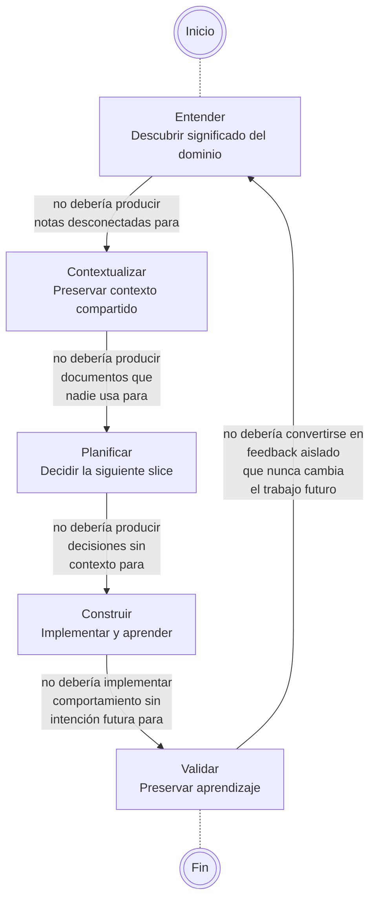

```mermaid
graph TD

  S(((Inicio)))

  understanding["Entender<br/>Descubrir significado del dominio"]
  contextualizing["Contextualizar<br/>Preservar contexto compartido"]
  planning["Planificar<br/>Decidir la siguiente slice"]

  building["Construir<br/>Implementar y aprender"]
  validation["Validar<br/>Preservar aprendizaje"]

  F(((Fin)))

  S -.- understanding

  understanding -- no debería producir<br/>notas desconectadas para --> contextualizing
  contextualizing -- no debería producir<br/>documentos que<br/>nadie usa para --> planning
  planning -- no debería producir<br/>decisiones sin<br/>contexto para --> building
  building -- no debería implementar<br/>comportamiento sin<br/>intención futura para --> validation
  validation -- no debería convertirse en<br/>feedback aislado<br/>que nunca cambia<br/>el trabajo futuro --> understanding

  validation -.- F

```

 
