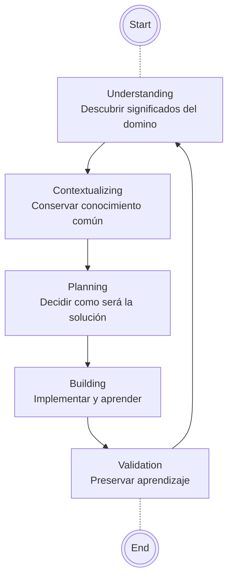

```mermaid
graph TD

  S(((Start)))

  understanding["Understanding<br/>Descubrir significados del domino"]
  contextualizing["Contextualizing<br/>Conservar conocimiento común"]
  planning["Planning<br/>Decidir como será la solución"]

  building["Building<br/>Implementar y aprender"]
  validation["Validation<br/>Preservar aprendizaje"]

  F(((End)))

  S -.- understanding

  understanding --> contextualizing
  contextualizing --> planning
  planning --> building
  building --> validation
  validation --> understanding 

  validation -.- F

```
 