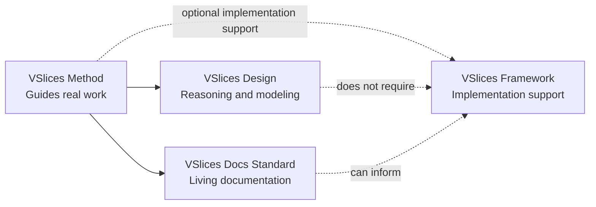

# Vista general de la suite

VSlices es una suite de ingeniería de software compuesta por cuatro productos conectados:

- VSlices Method
- VSlices Design
- VSlices Docs Standard
- VSlices Framework

Cada producto puede usarse de forma independiente, pero están diseñados para trabajar juntos alrededor del mismo modelo de continuidad.

El propósito de la suite es reducir la distancia entre lo que un equipo descubre, documenta, diseña, implementa, valida y evoluciona.

## El modelo de continuidad

VSlices está organizado alrededor de una idea central:

> La comprensión del dominio debe permanecer visible en la documentación, la arquitectura, la implementación y la evolución.

Los sistemas de software suelen perder claridad cuando estas actividades evolucionan por separado. Un equipo puede descubrir el dominio en un lugar, documentar decisiones en otro, discutir arquitectura en reuniones e implementar comportamiento en código que ya no preserva el razonamiento original.

VSlices intenta reducir esa fragmentación manteniendo el conocimiento importante conectado entre:

- descubrimiento
- razonamiento de diseño
- documentación
- arquitectura
- implementación
- validación
- evolución

Los cuatro productos apoyan distintas partes de esa continuidad.

## Cómo se conecta la suite

La suite está compuesta por cuatro productos conectados.

VSlices Method proporciona la guía general de continuidad. VSlices Design ayuda a los equipos a razonar sobre sistemas, incertidumbre, límites y comportamiento de negocio. VSlices Docs Standard ayuda a preservar conocimiento mediante estructuras de documentación viva. VSlices Framework puede apoyar la implementación cuando se necesita software ejecutable, pero no es necesario para usar el resto de la suite.



Esta relación es intencionalmente ligera. La suite está conectada por un modelo de continuidad compartido, no por una estructura rígida de dependencias.

Un equipo puede usar VSlices Design sin VSlices Framework. Un equipo puede usar VSlices Docs Standard sin adoptar una arquitectura específica. VSlices Method puede guiar trabajo real incluso cuando la implementación usa .NET puro, otro framework o ningún framework de software.

## El ciclo de continuidad

VSlices también puede entenderse como un ciclo de continuidad.

```text
Discovery
  -> Design reasoning
  -> Living documentation
  -> Implementation
  -> Validation
  -> Evolution
  -> Better understanding
  -> More Discovery
```

Esto no es una secuencia rígida. Un equipo puede comenzar desde un contexto de negocio, un problema, un documento, una slice de implementación, una decisión o una pieza de feedback de validación.

La parte importante no es dónde comienza el equipo. Es que el conocimiento no se desconecte a medida que el sistema evoluciona.

## Roles de producto

### VSlices Design

VSlices Design ayuda a los equipos a entender el material de negocio antes de comprometerse demasiado pronto con la estructura del software.

Proporciona modalidades de diseño, herramientas de razonamiento y heurísticas de modelado para trabajar con distintos tipos de incertidumbre. Design ayuda a responder preguntas como:

* ¿En qué contexto de negocio estamos trabajando?
* ¿Qué problema estamos resolviendo realmente?
* ¿Entendemos lo suficiente para construir con seguridad?
* ¿Debemos explorar ampliamente, analizar un problema específico o construir una pequeña slice para aprender?

Design es intencionalmente independiente de VSlices Framework, Docs Standard y Method. Un equipo puede usar VSlices Design incluso si nunca usa el resto de la suite.

### VSlices Docs Standard

VSlices Docs Standard ayuda a preservar conocimiento importante mediante estructuras de documentación viva.

Define tipos de documento para conocimiento como:

* lenguaje del dominio
* contextos
* procesos
* casos de uso
* capacidades
* decisiones
* validación
* notas de soporte

Docs Standard no existe para hacer que los equipos produzcan más documentos. Existe para ayudar a los equipos a preservar el conocimiento del que dependerá el trabajo futuro.

### VSlices Method

VSlices Method explica cómo Design y Docs Standard pueden usarse durante el trabajo real. Ayuda a los equipos a decidir:

* qué tipo de contexto están abordando
* qué modalidad de diseño encaja con la incertidumbre actual
* qué conocimiento debe preservarse
* cómo la documentación apoya las decisiones
* cómo el feedback de la implementación vuelve al entendimiento

Method no es un proceso rígido. Proporciona guía para preservar la continuidad mientras el equipo avanza a través de la incertidumbre.

### VSlices Framework

VSlices Framework es el producto de implementación en .NET. Proporciona bibliotecas, primitivas y patrones para reflejar conocimiento orientado al dominio en software ejecutable.

Framework puede incluir conceptos como:

* flows
* features
* explicit errors
* runtime requirements
* domain types
* traits
* capabilities
* functional composition

Framework no debería ocultar los conceptos de ingeniería. Debería hacer más fáciles de componer, estandarizar, probar y evolucionar los patrones útiles.

> VSlices Framework actualmente es experimental, y su documentación pública está intencionalmente limitada durante v0.1-beta.

## Un ejemplo simplificado

Un equipo puede comenzar con un proceso de negocio poco claro.

* VSlices Design ayuda al equipo a entender el contexto, las responsabilidades, el lenguaje y la incertidumbre.
* VSlices Docs Standard ayuda a preservar ese entendimiento mediante documentos de contexto, documentos de proceso, documentos de caso de uso, registros de decisión o notas de validación.
* VSlices Method ayuda al equipo a decidir cuánta estructura es útil para la iteración actual.
* VSlices Framework puede ayudar más adelante a implementar el comportamiento con flows explícitos, expected errors, domain types y capabilities.

Después de la implementación, la validación puede revelar que el entendimiento original era incompleto. Ese aprendizaje debe volver a los documentos, a las decisiones, al modelo de diseño y a la implementación futura.

Este es el ciclo de continuidad.

## Adopción independiente

Un equipo no necesita adoptar toda la suite a la vez. Un equipo puede usar:

* VSlices Design para mejorar el descubrimiento y el modelado.
* VSlices Docs Standard para mejorar la estructura de documentación.
* VSlices Method para guiar la colaboración y el aprendizaje.
* VSlices Framework para implementar software .NET orientado al dominio.

La suite es progresiva y componible. La adopción debe seguir la necesidad real, no la completitud del producto.

## Principio central

Los cuatro productos comparten un principio:

> Usa la estructura más pequeña útil que preserve el conocimiento del que depende el trabajo futuro.

VSlices no intenta hacer que todos los equipos sigan el mismo flujo de trabajo, arquitectura o proceso de documentación.

Intenta ayudar a los equipos a mantener conectados la intención del dominio, las decisiones, la documentación, la implementación y el aprendizaje a medida que el sistema cambia.
