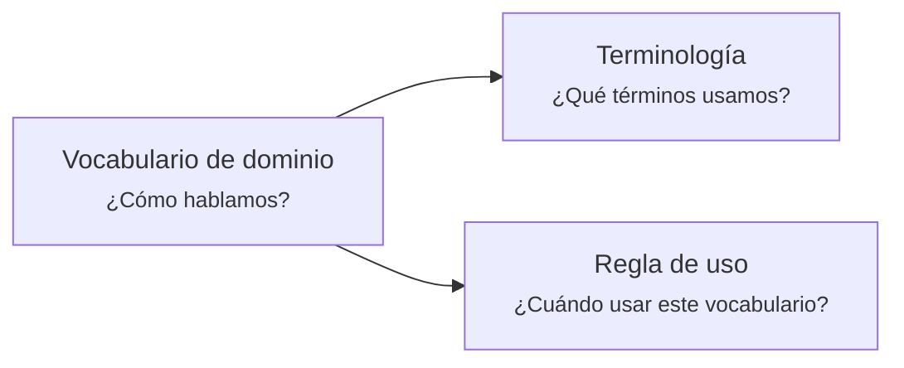
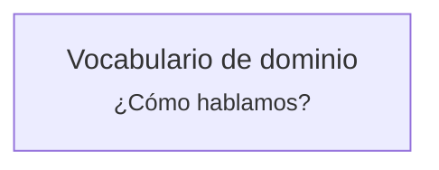
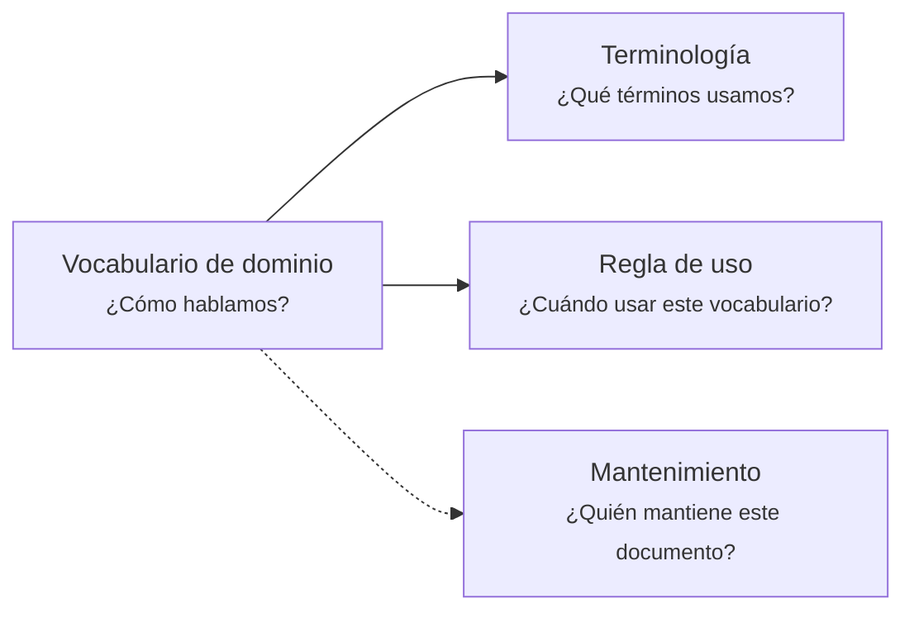

# Diagrama de ramificación de consultas

## Propósito

Un "Diagrama de ramificación de consultas" es una estructura visual usada para organizar preguntas derivadas desde una pregunta documental principal.

Su objetivo es orientar cómo organizar un artifact, no definir obligatoriamente cómo debe verse.

El diagrama ayuda a responder:

* qué preguntas debe cubrir el artifact
* qué ramas son principales
* qué ramas son de apoyo
* qué tan costoso parece incorporar una rama
* qué partes conviene documentar ahora
* qué partes pueden quedar identificadas para una evolución futura

## Idea central

Una pregunta documental principal puede abrirse en preguntas derivadas.

Estas preguntas derivadas orientan la organización del artifact.

La ramificación no prescribe una forma concreta de materialización.

Una rama puede terminar representada como:

* heading
* tabla
* lista
* metadata
* diagrama
* nota
* callout
* ejemplo
* sección narrativa
* cualquier otra forma que preserve mejor el conocimiento

La regla importante es:

> La ramificación organiza el conocimiento.
> No impone el formato del documento.

## Lectura de los nodos

Cada nodo representa una rama de organización.

Un nodo puede contener:

* el nombre conceptual de la rama
* la pregunta que esa rama responde

Ejemplo:



En este caso:

* `Vocabulario de dominio` representa el artifact o estructura principal
* `¿Cómo hablamos?` representa la pregunta documental principal
* `Terminología` representa una rama de organización
* `¿Qué términos usamos?` representa la pregunta que esa rama responde
* `Regla de uso` representa otra rama de organización
* `¿Cuándo usar este vocabulario?` representa la pregunta que esa rama responde

## Reglas iniciales

### 1. La pregunta principal define la identidad del artifact

La raíz del diagrama representa la pregunta documental principal.

Ejemplo:



La pregunta principal no obliga a documentar todo en profundidad.

Solo define la intención central del artifact.

### 2. Las ramificaciones organizan preguntas derivadas

Cada rama responde una pregunta derivada de la pregunta principal.

Ejemplo:


La rama `Terminología` existe porque ayuda a responder cómo hablamos desde una pregunta más específica:

> ¿Qué términos usamos?

### 3. Las líneas expresan relevancia o naturaleza de la relación

La relevancia entre ramificaciones se marca mediante diferencias en la línea que conecta los nodos.

Semántica inicial:

| Línea  | Significado                                                  |
| ------ | ------------------------------------------------------------ |
| `-->`  | Rama principal del contenido                                 |
| `-.->` | Rama de apoyo, mantenimiento, gobernanza o contexto auxiliar |

Ejemplo:



Lectura:

* `Terminología` y `Regla de uso` son ramas principales del contenido
* `Mantenimiento` es una rama de apoyo o gobernanza del artifact

### 4. Las formas de los nodos expresan esfuerzo

La forma del nodo puede usarse para comunicar cuánto esfuerzo implica incorporar o mantener una rama.

Esto permite separar importancia de costo.

Una rama puede ser importante, pero demasiado costosa para incorporarse en la iteración actual.

Semántica inicial candidata:

| Forma              | Significado                                            |
| ------------------ | ------------------------------------------------------ |
| Rectángulo         | Esfuerzo bajo                                          |
| Bordes redondeados | Esfuerzo medio                                         |
| Forma destacada    | Esfuerzo alto                                          |
| Forma alternativa  | Esfuerzo variable o dependiente de información externa |

La forma exacta puede cambiar según las limitaciones visuales de Mermaid o las convenciones que adopte Docs Standard.

Lo importante es la regla:

> La línea expresa relevancia o naturaleza.
> La forma expresa esfuerzo o costo de incorporación.

### 5. Importancia no significa incorporación inmediata

Una rama puede ser:

* importante pero costosa
* simple pero secundaria
* principal pero postergable
* auxiliar pero necesaria para mantener continuidad

El diagrama ayuda a decidir qué documentar ahora y qué dejar como evolución futura.

### 6. El diagrama no reemplaza el contenido

El Diagrama de ramificación orienta la organización del artifact.

No reemplaza la explicación, evidencia, reglas, vocabulario, decisiones o contenido que el artifact debe preservar.

## Ejemplo actual


Este diagrama indica que el artifact `Vocabulario de dominio` se organiza inicialmente alrededor de tres preguntas:

* ¿Qué términos usamos?
* ¿Cuándo usar este vocabulario?
* ¿Quién mantiene este documento?

Las dos primeras preguntas forman parte del contenido principal.

La tercera pregunta corresponde a mantenimiento o gobernanza del artifact.


## Witness de presión semántica — Context Document

La revisión de `context.full-v2.md` produjo un witness más profundo para observar cómo un Documento de Contexto puede ejercer presión semántica sin convertirse en una descripción exhaustiva del target.

La pregunta raíz se mantiene:

> ¿Dónde existe?

La responsabilidad del documento continúa siendo contextual: hacer explícito el entorno necesario para interpretar correctamente un target.

El siguiente árbol es una hipótesis de trabajo. No implica que todas sus preguntas deban responderse, ni que cada nivel semántico deba materializarse como un heading.

```mermaid
flowchart LR
    R["Contexto<br/><small>¿Dónde existe?</small>"]

    B1["Situación<br/><small>¿En qué situación aparece?</small>"]
    B2["Importancia contextual<br/><small>¿Por qué importa entender este contexto?</small>"]
    B3["Situación actual<br/><small>¿Cuál es la situación actual?</small>"]
    B4["Elementos relevantes<br/><small>¿Qué elementos del contexto son relevantes?</small>"]
    B5["Perspectiva<br/><small>¿Desde qué perspectiva observamos este contexto?</small>"]
    B6["Aplicabilidad contextual<br/><small>¿En qué condiciones este contexto es aplicable?</small>"]
    B7["Antecedentes<br/><small>¿Qué antecedentes explican el contexto actual?</small>"]
    B8["Base de conocimiento<br/><small>¿En qué conocimiento se basa este contexto?</small>"]
    B9["Supuestos<br/><small>¿Qué estamos asumiendo como cierto?</small>"]
    B10["Contexto no resuelto<br/><small>¿Qué todavía no entendemos?</small>"]
    B11["Obsolescencia contextual<br/><small>¿Qué condiciones volverían obsoleto este contexto?</small>"]

    B1_1["Situación concreta<br/><small>¿Qué situación concreta estamos observando?</small>"]
    B1_2["Circunstancias<br/><small>¿Bajo qué circunstancias aparece?</small>"]
    B1_3["Momento o etapa<br/><small>¿Existe en un momento o etapa particular?</small>"]

    B2_1["Interpretación preservada<br/><small>¿Qué necesitamos poder interpretar correctamente?</small>"]
    B2_2["Malinterpretación posible<br/><small>¿Qué podría malinterpretarse sin este contexto?</small>"]
    B2_3["Consecuencia<br/><small>¿Qué consecuencias tendría esa interpretación incorrecta?</small>"]
    B2_4["Decisiones dependientes<br/><small>¿Qué decisiones dependen de entenderlo correctamente?</small>"]

    B3_1["Condiciones actuales<br/><small>¿Qué condiciones existen actualmente?</small>"]
    B3_2["Tensiones o fricciones<br/><small>¿Qué tensiones o fricciones existen?</small>"]
    B3_3["Cambios recientes<br/><small>¿Qué ha cambiado recientemente?</small>"]
    B3_4["Estabilidad<br/><small>¿Qué permanece estable?</small>"]

    B4_1["Actores<br/><small>¿Qué actores participan o se ven afectados?</small>"]
    B4_2["Sistemas o herramientas<br/><small>¿Qué sistemas o herramientas intervienen?</small>"]
    B4_3["Procesos o actividades<br/><small>¿Qué procesos o actividades intervienen?</small>"]
    B4_4["Artifacts o fuentes<br/><small>¿Qué artifacts o fuentes de información intervienen?</small>"]
    B4_5["Entorno relevante<br/><small>¿Qué entorno físico, organizacional o técnico importa?</small>"]

    B5_1["Observador<br/><small>¿Quién está observando o interpretando?</small>"]
    B5_2["Visibilidad<br/><small>¿Qué parte del contexto puede observar?</small>"]
    B5_3["Desconocimiento<br/><small>¿Qué parte puede desconocer?</small>"]
    B5_4["Perspectivas alternativas<br/><small>¿Qué otras perspectivas podrían describirlo de forma distinta?</small>"]

    B6_1["Representatividad<br/><small>¿Dónde es representativo?</small>"]
    B6_2["Límite de representatividad<br/><small>¿Dónde deja de ser representativo?</small>"]
    B6_3["Excepciones<br/><small>¿Qué excepciones conocidas existen?</small>"]
    B6_4["Fronteras inciertas<br/><small>¿Qué fronteras siguen siendo inciertas?</small>"]

    B7_1["Hechos previos<br/><small>¿Qué hechos previos siguen siendo relevantes?</small>"]
    B7_2["Cambios previos<br/><small>¿Qué cambios llevaron a la situación actual?</small>"]
    B7_3["Decisiones previas<br/><small>¿Qué decisiones previas condicionan este contexto?</small>"]
    B7_4["Antecedentes irrelevantes<br/><small>¿Qué antecedentes ya no son relevantes?</small>"]

    B8_1["Observaciones<br/><small>¿Qué observaciones lo sostienen?</small>"]
    B8_2["Fuentes<br/><small>¿Qué fuentes lo sostienen?</small>"]
    B8_3["Interpretación<br/><small>¿Qué parte proviene de interpretación?</small>"]
    B8_4["Corroboración pendiente<br/><small>¿Qué parte todavía no está corroborada?</small>"]

    B9_1["Supuesto explícito<br/><small>¿Qué supuesto estamos haciendo?</small>"]
    B9_2["Justificación actual<br/><small>¿Por qué lo estamos aceptando?</small>"]
    B9_3["Confiabilidad<br/><small>¿Qué tan confiable es?</small>"]
    B9_4["Dependencias del supuesto<br/><small>¿Qué depende de este supuesto?</small>"]
    B9_5["Falsedad del supuesto<br/><small>¿Qué cambiaría si fuera falso?</small>"]

    B10_1["Pregunta abierta<br/><small>¿Qué pregunta permanece abierta?</small>"]
    B10_2["Razón de incertidumbre<br/><small>¿Por qué todavía no podemos responderla?</small>"]
    B10_3["Evidencia faltante<br/><small>¿Qué evidencia faltaría?</small>"]
    B10_4["Dependencia de resolución<br/><small>¿Qué depende de resolverla?</small>"]
    B10_5["Riesgo de actuar<br/><small>¿Qué riesgo existe si actuamos sin resolverla?</small>"]

    B11_1["Condición de cambio<br/><small>¿Qué condiciones podrían cambiar?</small>"]
    B11_2["Señal de obsolescencia<br/><small>¿Qué señales indicarían que dejó de ser representativo?</small>"]

    R --> B1 & B2 & B3 & B4 & B5 & B6 & B7 & B8 & B9 & B10 & B11

    B1 --> B1_1 & B1_2 & B1_3
    B2 --> B2_1 & B2_2 & B2_3 & B2_4
    B3 --> B3_1 & B3_2 & B3_3 & B3_4
    B4 --> B4_1 & B4_2 & B4_3 & B4_4 & B4_5
    B5 --> B5_1 & B5_2 & B5_3 & B5_4
    B6 --> B6_1 & B6_2 & B6_3 & B6_4
    B7 --> B7_1 & B7_2 & B7_3 & B7_4
    B8 --> B8_1 & B8_2 & B8_3 & B8_4
    B9 --> B9_1 & B9_2 & B9_3 & B9_4 & B9_5
    B10 --> B10_1 & B10_2 & B10_3 & B10_4 & B10_5
    B11 --> B11_1 & B11_2
```



### Lectura del witness

Este árbol conserva varias distinciones descubiertas durante la revisión:

* **situación** distingue la aparición del target de sus circunstancias particulares;
* **importancia contextual** presiona qué interpretación se intenta preservar y qué podría perderse sin contexto;
* **situación actual** distingue condiciones presentes, tensiones, cambio y estabilidad;
* **elementos relevantes** amplía el contexto más allá de actores y sistemas;
* **perspectiva** hace visible que una descripción contextual puede depender de quién observa y de qué puede conocer;
* **aplicabilidad contextual** pregunta cuándo el contexto continúa siendo representativo, sin convertir la rama en un Scope Document;
* **antecedentes** separa el estado actual de la trayectoria que ayuda a explicarlo;
* **base de conocimiento** distingue observación, fuente, interpretación y corroboración pendiente;
* **supuestos** fuerza a identificar qué depende de aquello que todavía aceptamos como cierto;
* **contexto no resuelto** preserva incertidumbre sin convertirla silenciosamente en conocimiento;
* **obsolescencia contextual** pregunta explícitamente qué condiciones volverían obsoleto el contexto y qué señales permitirían reconocerlo.

Por ahora todas las relaciones del witness usan una relación padre-hijo uniforme.

No se clasifica todavía qué ramas son principales, auxiliares, de mantenimiento o de gobernanza. Esa distinción debe justificarse semánticamente antes de codificarse mediante tipos de línea.

### Scope candidato observado

La revisión histórica partió desde:

```text
concept
process
flow
feature
capability
initiative
product
service
project
organization
domain-context
handoff
```

La aplicabilidad candidata del Context Document parece poder incluir también:

```text
decision
artifact
system
operation
integration
change
```

`handoff` queda cuestionado como scope directo: puede representar mejor una composición o nexo documental que un target contextual independiente.

La lista de scopes continúa siendo evidencia en revisión y puede expandirse o reducirse con casos reales.


## Puntos que pueden cambiar

Esta definición todavía es candidata.

Pueden cambiar:

* el nombre final de `Diagrama de ramificación`
* la semántica exacta de cada tipo de línea
* la semántica exacta de cada forma de nodo
* la cantidad de niveles de ramificación recomendados
* si las ramas de mantenimiento deberían aparecer siempre o solo cuando aporten valor
* si algunas preguntas deberían materializarse como metadata en vez de contenido visible
* si los diagramas deberían usar siempre `flowchart LR` o permitir otras direcciones
* si Docs Standard define una leyenda común para todos los diagramas de ramificación
* si Tooling debería validar estas convenciones en el futuro

## Regla de prudencia

El Diagrama de ramificación debe ayudar a reducir complejidad, no aumentarla.

Si el diagrama exige más esfuerzo que el artifact que intenta organizar, probablemente está agregando ceremonia prematura.

Primero debe servir para pensar.

Después, si el uso real lo justifica, puede convertirse en convención, plantilla o regla validable por tooling.
