# Diagrama de ramificación — Context Document

## Pregunta raíz

> ¿Dónde existe?

Este diagrama representa una hipótesis de ramificación semántica para `Context Document`.

Su objetivo es ejercer presión semántica sobre el contexto necesario para interpretar correctamente un target.

No implica que todas las preguntas deban responderse ni prescribe cómo deben materializarse visualmente.

```mermaid
flowchart LR
    R["Contexto<br/><small>¿Dónde existe?</small>"]

    B1["Situación<br/><small>¿En qué situación aparece?</small>"]
    B2["Importancia contextual<br/><small>¿Por qué importa entender este contexto?</small>"]
    B3["Situación actual<br/><small>¿Cuál es la situación actual?</small>"]
    B4["Elementos relevantes<br/><small>¿Qué elementos del contexto son relevantes?</small>"]
    B5["Perspectiva<br/><small>¿Desde qué perspectiva observamos este contexto?</small>"]
    B6["Aplicabilidad contextual<br/><small>¿En qué condiciones este contexto es aplicable?</small>"]
    B7["Antecedentes<br/><small>¿Qué antecedentes explican el contexto actual?</small>"]
    B8["Base de conocimiento<br/><small>¿En qué conocimiento se basa este contexto?</small>"]
    B9["Supuestos<br/><small>¿Qué estamos asumiendo como cierto?</small>"]
    B10["Contexto no resuelto<br/><small>¿Qué todavía no entendemos?</small>"]
    B11["Obsolescencia contextual<br/><small>¿Qué condiciones volverían obsoleto este contexto?</small>"]

    B1_1["Situación concreta<br/><small>¿Qué situación concreta estamos observando?</small>"]
    B1_2["Circunstancias<br/><small>¿Bajo qué circunstancias aparece?</small>"]
    B1_3["Momento o etapa<br/><small>¿Existe en un momento o etapa particular?</small>"]

    B2_1["Interpretación preservada<br/><small>¿Qué necesitamos poder interpretar correctamente?</small>"]
    B2_2["Malinterpretación posible<br/><small>¿Qué podría malinterpretarse sin este contexto?</small>"]
    B2_3["Consecuencia<br/><small>¿Qué consecuencias tendría esa interpretación incorrecta?</small>"]
    B2_4["Decisiones dependientes<br/><small>¿Qué decisiones dependen de entenderlo correctamente?</small>"]

    B3_1["Condiciones actuales<br/><small>¿Qué condiciones existen actualmente?</small>"]
    B3_2["Tensiones o fricciones<br/><small>¿Qué tensiones o fricciones existen?</small>"]
    B3_3["Cambios recientes<br/><small>¿Qué ha cambiado recientemente?</small>"]
    B3_4["Estabilidad<br/><small>¿Qué permanece estable?</small>"]

    B4_1["Actores<br/><small>¿Qué actores participan o se ven afectados?</small>"]
    B4_2["Sistemas o herramientas<br/><small>¿Qué sistemas o herramientas intervienen?</small>"]
    B4_3["Procesos o actividades<br/><small>¿Qué procesos o actividades intervienen?</small>"]
    B4_4["Artifacts o fuentes<br/><small>¿Qué artifacts o fuentes de información intervienen?</small>"]
    B4_5["Entorno relevante<br/><small>¿Qué entorno físico, organizacional o técnico importa?</small>"]

    B5_1["Observador<br/><small>¿Quién está observando o interpretando?</small>"]
    B5_2["Visibilidad<br/><small>¿Qué parte del contexto puede observar?</small>"]
    B5_3["Desconocimiento<br/><small>¿Qué parte puede desconocer?</small>"]
    B5_4["Perspectivas alternativas<br/><small>¿Qué otras perspectivas podrían describirlo de forma distinta?</small>"]

    B6_1["Representatividad<br/><small>¿Dónde es representativo?</small>"]
    B6_2["Límite de representatividad<br/><small>¿Dónde deja de ser representativo?</small>"]
    B6_3["Excepciones<br/><small>¿Qué excepciones conocidas existen?</small>"]
    B6_4["Fronteras inciertas<br/><small>¿Qué fronteras siguen siendo inciertas?</small>"]

    B7_1["Hechos previos<br/><small>¿Qué hechos previos siguen siendo relevantes?</small>"]
    B7_2["Cambios previos<br/><small>¿Qué cambios llevaron a la situación actual?</small>"]
    B7_3["Decisiones previas<br/><small>¿Qué decisiones previas condicionan este contexto?</small>"]
    B7_4["Antecedentes irrelevantes<br/><small>¿Qué antecedentes ya no son relevantes?</small>"]

    B8_1["Observaciones<br/><small>¿Qué observaciones lo sostienen?</small>"]
    B8_2["Fuentes<br/><small>¿Qué fuentes lo sostienen?</small>"]
    B8_3["Interpretación<br/><small>¿Qué parte proviene de interpretación?</small>"]
    B8_4["Corroboración pendiente<br/><small>¿Qué parte todavía no está corroborada?</small>"]

    B9_1["Supuesto explícito<br/><small>¿Qué supuesto estamos haciendo?</small>"]
    B9_2["Justificación actual<br/><small>¿Por qué lo estamos aceptando?</small>"]
    B9_3["Confiabilidad<br/><small>¿Qué tan confiable es?</small>"]
    B9_4["Dependencias del supuesto<br/><small>¿Qué depende de este supuesto?</small>"]
    B9_5["Falsedad del supuesto<br/><small>¿Qué cambiaría si fuera falso?</small>"]

    B10_1["Pregunta abierta<br/><small>¿Qué pregunta permanece abierta?</small>"]
    B10_2["Razón de incertidumbre<br/><small>¿Por qué todavía no podemos responderla?</small>"]
    B10_3["Evidencia faltante<br/><small>¿Qué evidencia faltaría?</small>"]
    B10_4["Dependencia de resolución<br/><small>¿Qué depende de resolverla?</small>"]
    B10_5["Riesgo de actuar<br/><small>¿Qué riesgo existe si actuamos sin resolverla?</small>"]

    B11_1["Condición de cambio<br/><small>¿Qué condiciones podrían cambiar?</small>"]
    B11_2["Señal de obsolescencia<br/><small>¿Qué señales indicarían que dejó de ser representativo?</small>"]

    R --> B1 & B2 & B3 & B4 & B5 & B6 & B7 & B8 & B9 & B10 & B11

    B1 --> B1_1 & B1_2 & B1_3
    B2 --> B2_1 & B2_2 & B2_3 & B2_4
    B3 --> B3_1 & B3_2 & B3_3 & B3_4
    B4 --> B4_1 & B4_2 & B4_3 & B4_4 & B4_5
    B5 --> B5_1 & B5_2 & B5_3 & B5_4
    B6 --> B6_1 & B6_2 & B6_3 & B6_4
    B7 --> B7_1 & B7_2 & B7_3 & B7_4
    B8 --> B8_1 & B8_2 & B8_3 & B8_4
    B9 --> B9_1 & B9_2 & B9_3 & B9_4 & B9_5
    B10 --> B10_1 & B10_2 & B10_3 & B10_4 & B10_5
    B11 --> B11_1 & B11_2
```



## Scope candidato

Partimos históricamente desde:

```text
concept
process
flow
feature
capability
initiative
product
service
project
organization
domain-context
handoff
```

La revisión sugiere considerar además:

```text
decision
artifact
system
operation
integration
change
```

`handoff` queda en revisión porque puede corresponder mejor a una composición o Nexus documental que a un target contextual directo.

La lista no se considera cerrada.
